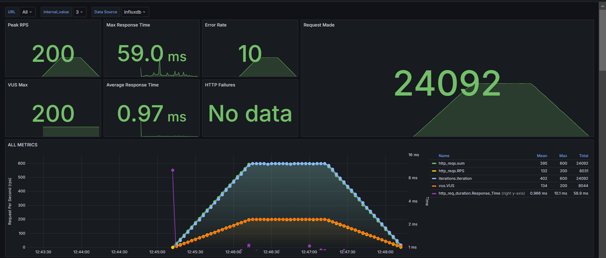
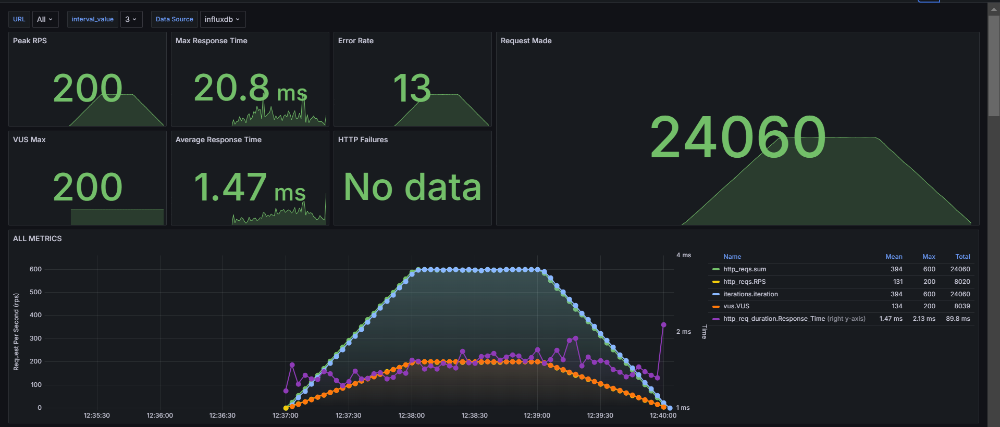
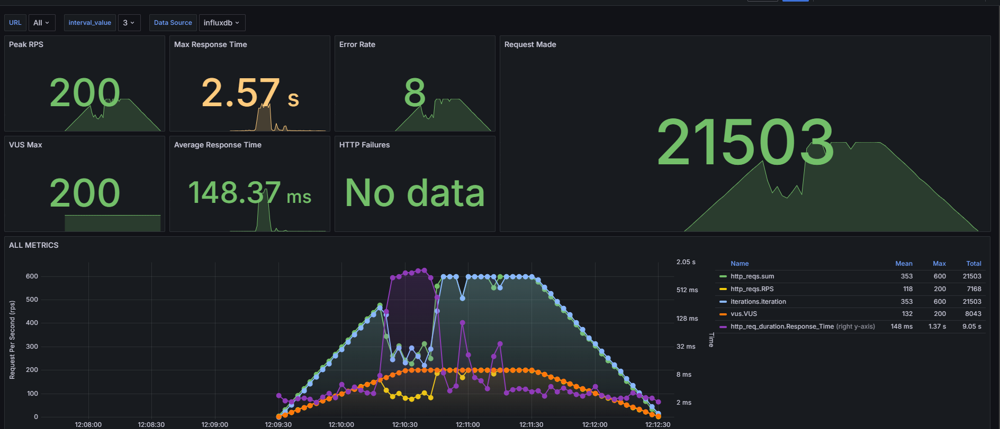
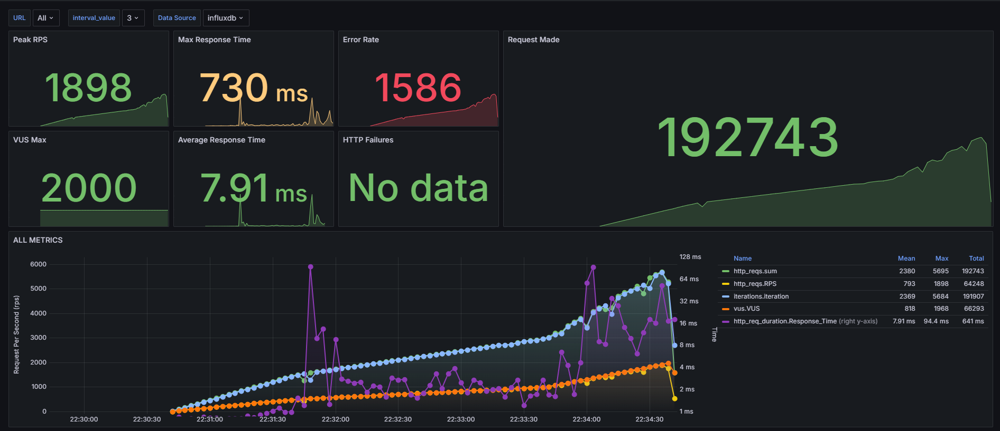
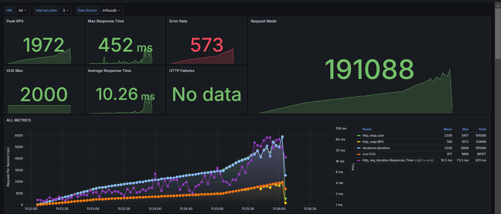
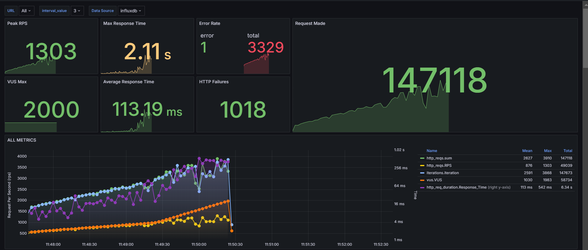
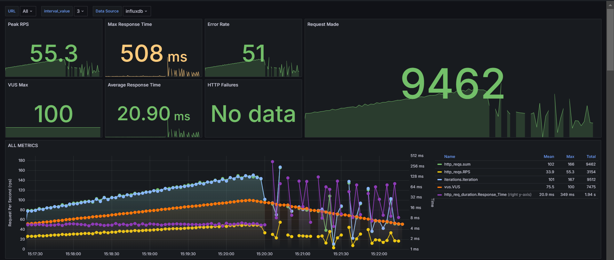

# Aprimoramento dos testes K6
&emsp; Nesta entrega, a equipe buscou aprimorar os testes de carga realizados com o K6, trazendo uma análise mais aprofundada e comparativa em relação aos resultados obtidos na _Sprint_ 3. Através do monitoramento contínuo no _Grafana_, os novos testes visam identificar e corrigir potenciais gargalos de desempenho, além de fornecer uma visão clara da evolução das métricas de _performance_, como tempo de resposta, taxa de erro e requisições por segundo (RPS). Com essas melhorias, espera-se elevar a capacidade de resposta do sistema, garantindo maior eficiência e estabilidade em cenários de alta carga.

&emsp; O foco deste aprimoramento é consolidar o aprendizado adquirido e aplicar novas configurações e estratégias de teste, de forma a evidenciar melhorias concretas e, ao mesmo tempo, alinhar o desempenho do sistema com os parâmetros estabelecidos de qualidade. Nos próximos tópicos, serão detalhadas a evolução das métricas e os resultados obtidos através do _Grafana_.

# Análise de Teste de _Performance_ na Rota GET /products

## Introdução
Os testes de _performance_ foram realizados para avaliar a estabilidade e eficiência de três implementações distintas da rota `GET /products` sob carga constante, com o objetivo de identificar gargalos de desempenho e comparar a capacidade de resposta. As três implementações avaliadas são: **Monolito Golang**, **Monolito Quarkus** e **Microsserviço Golang**. Os resultados foram monitorados através do _Grafana_, o que permitiu uma análise detalhada das métricas coletadas.

## Cenário de Teste e Configuração
Os testes de _performance_ utilizaram uma carga constante de **200 VUs** (_Virtual_ _Users_) para avaliar a resposta sob um volume elevado de requisições. As principais métricas coletadas foram:
- **Requisições por Segundo (RPS)**
- **Tempo de Resposta Máximo e Médio**
- **Taxa de Erros**
- **Falhas HTTP**
- **Quantidade de Requisições Realizadas**

### Limites de Desempenho Estabelecidos:
- **Duração de Requisição HTTP (http_req_duration)**: 95% das requisições devem ter uma duração inferior a 1 segundo.
- **Taxa de Falha de Requisição (http_req_failed)**: Menos de 1% das requisições podem falhar.

Esses limites garantem a qualidade do serviço, avaliando a capacidade do sistema de fornecer respostas rápidas e sem falhas sob carga constante.

---

## Análise de Resultados por Implementação

### 1. Monolito Golang

Figura 01: Testes de performance MonoGo

Fonte: Material produzido pelos próprios autores (2024).

**Métricas Principais**:
- **Peak RPS**: 200 RPS
- **VUS Max**: 200 VUs
- **Max Response Time**: 2.57 segundos
- **Average Response Time**: 148.37 ms
- **Error Rate**: 8 erros (0,1%)
- **HTTP Failures**: Não registrado
- **Requests Made**: 21.503 requisições

**Observações**:
- **Pontos positivos**: Baixa taxa de erros e alta capacidade de _throughput_.
- **Pontos a melhorar**: Tempo máximo de resposta de 2.57 segundos, o que indica gargalos em cenários de alta concorrência.

### 2. Monolito Quarkus

Figura 02: Testes de performance MonoQuarkus

Fonte: Material produzido pelos próprios autores (2024).

**Métricas Principais**:
- **Peak RPS**: 200 RPS
- **VUS Max**: 200 VUs
- **Max Response Time**: 20.8 ms
- **Average Response Time**: 1.47 ms
- **Error Rate**: 13 erros (0,1%)
- **HTTP Failures**: Não registrado
- **Requests Made**: 24.060 requisições

**Observações**:
- **Pontos positivos**: Excelente tempo de resposta e a maior quantidade de requisições processadas entre as implementações.
- **Pontos a melhorar**: Taxa de erros levemente maior, mas ainda dentro de limites aceitáveis.

### 3. Microsserviço Golang

Figura 03: Testes de performance MicroGo

Fonte: Material produzido pelos próprios autores (2024).

**Métricas Principais**:
- **Peak RPS**: 200 RPS
- **VUS Max**: 200 VUs
- **Max Response Time**: 59.0 ms
- **Average Response Time**: 0.97 ms
- **Error Rate**: 10 erros (0,1%)
- **HTTP Failures**: Não registrado
- **Requests Made**: 24.092 requisições

**Observações**:
- **Pontos positivos**: Menor tempo médio de resposta, maior volume de requisições processadas.
- **Pontos a melhorar**: O tempo máximo de resposta foi maior que o do Quarkus, indicando a possibilidade de ajustes para melhorar a consistência.

---

## Comparação de Desempenho

| Métrica                   | Monolito Golang | Monolito Quarkus | Microsserviço Golang |
|---------------------------|-----------------|------------------|----------------------|
| **Peak RPS**               | 200             | 200              | 200                  |
| **VUS Max**                | 200             | 200              | 200                  |
| **Max Response Time (ms)** | 2.57 s          | 20.8 ms          | 59.0 ms              |
| **Average Response Time**  | 148.37 ms       | 1.47 ms          | 0.97 ms              |
| **Error Rate**             | 8               | 13               | 10                   |
| **HTTP Failures**          | Não registrado  | Não registrado   | Não registrado       |
| **Requests Made**          | 21.503          | 24.060           | 24.092               |

---

## Análise Detalhada

### Capacidade de Processamento (Peak RPS):
Todas as implementações atingiram um pico de 200 RPS, indicando que o sistema conseguiu manter um _throughput_ elevado sob carga constante.

### Tempo de Resposta:
- **Monolito Quarkus**: Apresentou o melhor desempenho, com um tempo máximo de 20.8 ms e um tempo médio de 1.47 ms.
- **Microsserviço Golang**: O tempo médio foi o mais baixo (0.97 ms), mas o tempo máximo foi maior que o do Quarkus.
- **Monolito Golang**: O tempo máximo de resposta foi significativamente mais alto (2.57 s), sugerindo gargalos em alta concorrência.

### Estabilidade:
- Todas as implementações mantiveram a taxa de erros baixa e nenhuma falha HTTP foi registrada.
- O **Monolito Quarkus** foi o mais estável em termos de latência e _throughput_, enquanto o **Microsserviço Golang** apresentou melhor tempo médio de resposta, mas com variações no tempo máximo.

---

## Conclusão
- O **Monolito Quarkus** foi a implementação mais eficiente em termos de latência e estabilidade, com tempo de resposta consistente e maior volume de requisições processadas.
- O **Microsserviço Golang** teve o melhor tempo médio de resposta, mas apresentou variações no tempo máximo, indicando que ajustes podem ser feitos para melhorar a consistência.
- O **Monolito Golang** apresentou desempenho inferior, com picos de latência e tempo de resposta alto, sugerindo a necessidade de otimizações para melhorar a _performance_ sob alta concorrência.

---
 

# Análise de Testes de Carga para a Rota GET /products

## Introdução
Este relatório apresenta uma análise detalhada dos resultados dos testes de carga para a rota `GET /products`, realizada em três implementações distintas: Monolito Golang, Monolito Quarkus e Microsserviço Golang. O objetivo é comparar o desempenho dos três serviços sob carga elevada, medindo a estabilidade e a eficiência de cada um. As métricas foram coletadas utilizando _Grafana_ e InfluxDB para fornecer uma visão completa do comportamento de cada aplicação.

## Cenário de Teste e Configuração
Os testes foram conduzidos com até **2000 usuários virtuais (VUs)**, simulando picos de tráfego e variabilidade de carga. As métricas monitoradas incluem:
- Requisições por Segundo (RPS)
- Tempo de Resposta Máximo e Médio
- Falhas HTTP
- Taxa de Erros
- Quantidade de Requisições Processadas

### Limites de Desempenho Estabelecidos
- **Duração de Requisição HTTP (http_req_duration):** 95% das requisições devem ter duração inferior a 1,5 segundos.
- **Taxa de Falha de Requisição (http_req_failed):** Menos de 2% das requisições podem falhar durante o teste.

## Análise de Resultados por Implementação

### 1. Monolito Golang

Figura 04: Testes de load MonoGo

Fonte: Material produzido pelos próprios autores (2024).

- **Peak RPS:** 1303 RPS
- **VUS Max:** 2000 VUs
- **Max Response Time:** 2.11 segundos
- **Average Response Time:** 113.19 ms
- **Error Rate:** 3329 erros
- **HTTP Failures:** 1018 falhas
- **Requests Made:** 147.118 requisições

#### Observações:
O Monolito Golang apresentou dificuldades para lidar com a carga máxima de 2000 VUs, com picos de tempo de resposta elevados (2.11 segundos) e uma quantidade significativa de erros e falhas HTTP. Embora o tempo médio de resposta seja bom, a instabilidade sob picos de carga sugere a necessidade de ajustes.

---

### 2. Monolito Quarkus

Figura 05: Testes de load MonoQuarkus

Fonte: Material produzido pelos próprios autores (2024).

- **Peak RPS:** 1972 RPS
- **VUS Max:** 2000 VUs
- **Max Response Time:** 452 ms
- **Average Response Time:** 10.26 ms
- **Error Rate:** 573 erros
- **HTTP Failures:** Nenhuma falha HTTP registrada
- **Requests Made:** 191.088 requisições

#### Observações:
O Monolito Quarkus destacou-se com o melhor desempenho, sendo capaz de processar mais requisições por segundo e com tempos de resposta significativamente menores. A ausência de falhas HTTP e a baixa taxa de erro sugerem uma implementação eficiente e estável, mesmo sob carga máxima.

---

### 3. Microsserviço Golang

Figura 06: Testes de load MonoGo

Fonte: Material produzido pelos próprios autores (2024).

- **Peak RPS:** 1898 RPS
- **VUS Max:** 2000 VUs
- **Max Response Time:** 730 ms
- **Average Response Time:** 7.91 ms
- **Error Rate:** 1586 erros
- **HTTP Failures:** Nenhuma falha HTTP registrada
- **Requests Made:** 192.743 requisições

#### Observações:
O Microsserviço Golang apresentou tempos de resposta médios muito bons e foi capaz de processar um grande volume de requisições. No entanto, o número de erros foi relativamente alto, indicando a necessidade de ajustes para melhorar a estabilidade sob picos de carga.

---

## Comparação de Desempenho

| Métrica                        | Monolito Golang | Monolito Quarkus | Microsserviço Golang |
|---------------------------------|-----------------|------------------|----------------------|
| **Peak RPS**                    | 1303            | 1972             | 1898                 |
| **VUS Max**                     | 2000            | 2000             | 2000                 |
| **Max Response Time (ms)**       | 2110            | 452              | 730                  |
| **Average Response Time (ms)**   | 113.19          | 10.26            | 7.91                 |
| **Error Rate**                  | 3329            | 573              | 1586                 |
| **HTTP Failures**               | 1018            | Nenhum           | Nenhum               |
| **Requests Made**               | 147.118         | 191.088          | 192.743              |

---

## Análise Detalhada

### Capacidade de Processamento (Peak RPS)
- O **Monolito Quarkus** apresentou a maior capacidade de processamento com **1972 RPS**.
- O **Microsserviço Golang** seguiu de perto com **1898 RPS**, mas teve uma taxa de erros mais alta.
- O **Monolito Golang** ficou atrás com **1303 RPS**, refletindo sua dificuldade sob carga elevada.

### Tempo de Resposta (Médio e Máximo)
- O **Monolito Quarkus** foi o mais eficiente, com tempos de resposta médio (**10.26 ms**) e máximo (**452 ms**) extremamente baixos.
- O **Microsserviço Golang** teve o menor tempo médio (**7.91 ms**), mas apresentou um pico mais elevado (**730 ms**), indicando alguma variação sob carga.
- O **Monolito Golang** teve o pior desempenho, com tempos médios altos (**113.19 ms**) e picos de **2.11 segundos**, sugerindo gargalos.

### Estabilidade e Confiabilidade
- O **Monolito Quarkus** foi a implementação mais estável, com o menor número de erros e nenhuma falha HTTP.
- O **Microsserviço Golang** também se mostrou estável, mas apresentou mais erros.
- O **Monolito Golang** teve a maior quantidade de falhas HTTP e erros, demonstrando menor robustez.

---

## Conclusão
- **Monolito Quarkus** foi a implementação com melhor desempenho geral, sendo capaz de lidar com cargas elevadas de forma eficiente e estável.
- **Microsserviço Golang** também mostrou bons resultados, com tempos de resposta rápidos, mas precisa de ajustes para reduzir os erros sob alta carga.
- **Monolito Golang** apresentou o pior desempenho, com instabilidade sob picos de tráfego e alto número de erros, sugerindo a necessidade de melhorias significativas na arquitetura e otimização.

---
 

# Análise de Teste de Carga na Rota POST /purchases - Monolito Quarkus

Figura 07: Testes de purchase MonoQuarkus

Fonte: Material produzido pelos próprios autores (2024).

## Introdução
Este teste foi realizado para avaliar o desempenho da rota `POST /purchases` em um Monolito Quarkus. A carga foi simulada com o objetivo de medir a estabilidade e eficiência do sistema em cenários que incluem aumento e redução gradual de usuários simultâneos, conforme o código fornecido. As métricas de desempenho foram coletadas utilizando a ferramenta _Grafana_, fornecendo uma visão clara do comportamento da aplicação sob diferentes níveis de carga.

## Configuração do Teste
O teste foi dividido em três estágios de carga para simular diferentes cenários de uso:

- **Estágio 1:** 50 usuários simultâneos durante 2 minutos.
- **Estágio 2:** Pico de 100 usuários simultâneos durante 3 minutos.
- **Estágio 3:** Redução para 50 usuários durante 2 minutos.

### Limites de Desempenho Definidos:
- **Duração de Requisição HTTP (http_req_duration):**
  - 95% das requisições devem ter uma duração inferior a 1,5 segundos.
- **Taxa de Falha de Requisição (http_req_failed):**
  - Menos de 2% das requisições podem falhar.

Esses limites garantem que o sistema seja avaliado por sua capacidade de fornecer respostas rápidas e lidar com variações na carga de forma robusta.

## Análise das Métricas Coletadas

### Métricas Principais:
- **Peak RPS (Requisições por Segundo):** 55.3 RPS  
  Valor máximo de requisições processadas por segundo durante o teste. Um valor que está dentro do esperado para um cenário de carga controlada com 100 VUs.

- **VUS Max (Virtual Users):** 100 VUs  
  Reflete o número máximo de usuários simultâneos suportado durante o estágio de pico.

- **Max Response Time (Tempo Máximo de Resposta):** 508 ms  
  O tempo máximo de resposta registrado foi de 508 ms, bem abaixo do limite de 1,5 segundos, indicando um bom desempenho sob carga.

- **Average Response Time (Tempo Médio de Resposta):** 20.90 ms  
  Um tempo médio de resposta muito bom, indicando que a maioria das requisições foi processada rapidamente.

- **Error Rate (Taxa de Erros):** 51 erros  
  O número total de erros foi baixo, considerando o volume total de requisições (9462). Esses erros correspondem a aproximadamente 0,54%, mantendo-se dentro do limite definido de 2%.

- **HTTP Failures:** Não registrado  
  Não foram registradas falhas HTTP significativas, indicando que a aplicação lidou bem com o volume de requisições e manteve a robustez.

- **Requests Made (Requisições Realizadas):** 9462 requisições  
  Volume total de requisições processadas durante todo o teste, indicando que a aplicação foi capaz de lidar com uma carga substancial.

## Análise dos Gráficos

### Padrão de RPS (Requisições por Segundo):
- Observa-se uma evolução gradual de RPS conforme o número de usuários virtuais aumenta e diminui. O valor de pico de 55.3 RPS foi atingido de forma consistente no estágio de pico (100 VUs).
- A estabilidade do RPS sugere que o Monolito Quarkus foi capaz de manter um _throughput_ consistente, com flutuações mínimas.

### Variação de Tempo de Resposta:
- O tempo médio de resposta foi de 20.9 ms durante a maior parte do teste, o que é um excelente valor.
- Houve picos de latência (349 ms) durante o aumento e a redução da carga, o que sugere que o sistema pode ter enfrentado pequenos gargalos em momentos de transição.

### Comportamento de Erros:
- A taxa de erros foi mais pronunciada no estágio de redução, sugerindo que o backend enfrentou dificuldades para equilibrar a quantidade de conexões ativas quando a carga começou a cair.
- Esse comportamento pode ser resultado de um gerenciamento ineficiente de threads ou conexões ociosas.

### Distribuição de Requisições:
- O gráfico de distribuição das requisições mostra que o _throughput_ manteve-se elevado durante todo o teste, com variações mínimas, indicando que o _backend_ foi capaz de manter a qualidade de resposta mesmo sob carga crescente.

## Análise Detalhada de Desempenho

### Capacidade de Processamento (Peak RPS):
- O Monolito Quarkus mostrou uma capacidade moderada de processamento para a rota `POST /purchases`, com um pico de 55.3 RPS.
- Isso indica que, para cargas maiores, a aplicação pode precisar de ajustes adicionais ou um aumento de recursos para suportar um volume mais elevado.

### Tempo de Resposta:
- A aplicação apresentou um tempo de resposta médio extremamente baixo (20.9 ms) e um tempo máximo de 508 ms, o que é um excelente resultado para uma carga de 100 VUs.
- Esses números sugerem que o _backend_ é altamente otimizado para lidar com requisições de compra sob carga moderada.

### Estabilidade e Taxa de Erros:
- Com apenas 51 erros durante todo o teste, a taxa de falha foi de aproximadamente 0,54%, bem abaixo do limite de 2% estabelecido.
- Isso mostra que a aplicação é confiável sob carga moderada, mas os picos de erro observados durante a transição sugerem que há espaço para melhorias no gerenciamento de conexões.

### Impacto do Gerenciamento de Conexões:
- Os picos de latência e os erros durante a transição entre os estágios indicam que a aplicação pode se beneficiar de ajustes na estratégia de gerenciamento de conexões.
- Melhorias nesse aspecto ajudariam a suavizar a transição de carga e a reduzir ainda mais a taxa de erro.

## Importância e Relevância do Teste
Este teste de carga foi fundamental para avaliar a capacidade do Monolito Quarkus de lidar com requisições críticas em um cenário de compras, onde a latência deve ser mínima e a estabilidade máxima. A rota `POST /purchases` é particularmente sensível, pois envolve operações que impactam diretamente a experiência do usuário e a finalização de transações.

Os resultados mostraram que o _backend_ pode lidar bem com um volume moderado de requisições (até 100 VUs), mantendo um tempo de resposta baixo e uma taxa de erro aceitável. No entanto, os picos de latência durante a transição de carga indicam que a aplicação pode enfrentar dificuldades sob cargas mais dinâmicas.

## Pontos para Melhorias

### Otimização de Gerenciamento de Conexões:
- Ajustar a estratégia de gerenciamento de conexões para suavizar a transição entre diferentes estágios de carga.

### Aprimoramento no Balanceamento de Carga:
- Implementar melhorias no balanceamento de _threads_ e gerenciamento de recursos para evitar picos de latência durante o aumento e a redução de carga.

### Monitoramento Adicional:
- Adicionar monitoramento de uso de CPU e memória durante os testes para identificar possíveis gargalos de _hardware_.

## Conclusão
O Monolito Quarkus se mostrou capaz de lidar com a rota `POST /purchases` sob carga moderada com bons resultados de tempo de resposta e baixa taxa de erros. Pequenos ajustes no gerenciamento de conexões e na arquitetura de escalabilidade poderiam tornar o sistema ainda mais robusto e preparado para cargas maiores.

# Análise comparativa: Testes atuais x Testes antigos
&emsp; A documentação atualizada traz melhorias significativas em comparação à versão anterior, apresentando um nível de detalhamento muito mais abrangente e preciso nas análises de _performance_ para diferentes implementações. Na versão antiga, o foco estava principalmente na comparação entre as arquiteturas Monolito Golang e Monolito Quarkus, limitando-se a alguns cenários de teste gerais e enfatizando métricas como taxa de requisições por segundo (RPS), tempo de resposta e falhas HTTP. No entanto, faltava uma análise específica para cada rota e cenário de carga.

&emsp; Com a atualização, houve uma segmentação mais clara entre as três variantes: Monolito Golang, Monolito Quarkus e Microsserviço Golang, além da inclusão de um novo teste focado na rota `POST /purchases` para o Monolito Quarkus. Essa abordagem permitiu um aprofundamento analítico, onde cada rota foi analisada de maneira isolada, fornecendo métricas como tempo médio de resposta, tempo máximo, quantidade de requisições processadas e variação de latência. A documentação atual também adicionou novos testes de carga, elevando o número de VUs (usuários virtuais) para verificar a escalabilidade e a resiliência de cada implementação sob cenários extremos.

&emsp; Outro ponto de destaque é a inclusão de uma análise de transições de carga na rota `POST /purchases`, abordando como o sistema responde a aumentos e reduções de tráfego em um curto espaço de tempo. Isso trouxe uma visão mais aprofundada sobre gargalos de desempenho e o gerenciamento de conexões em momentos críticos de variação de carga, algo que não foi explorado anteriormente. Além disso, a nova documentação se apoia em um conjunto mais robusto de métricas e gráficos gerados pelo _Grafana_, permitindo identificar picos de latência, comportamento de falhas e estabilidade ao longo dos testes com mais clareza.

&emsp; Essas melhorias tornam a nova versão da documentação não apenas mais informativa e técnica, mas também mais estruturada e voltada a casos de uso práticos, destacando com maior precisão pontos de melhoria e sugerindo otimizações mais direcionadas para cada implementação. Assim, a documentação evoluiu de um nível introdutório e comparativo para uma análise minuciosa e focada em detalhes, promovendo uma compreensão mais profunda do desempenho de cada backend sob diferentes cargas e cenários de uso.

