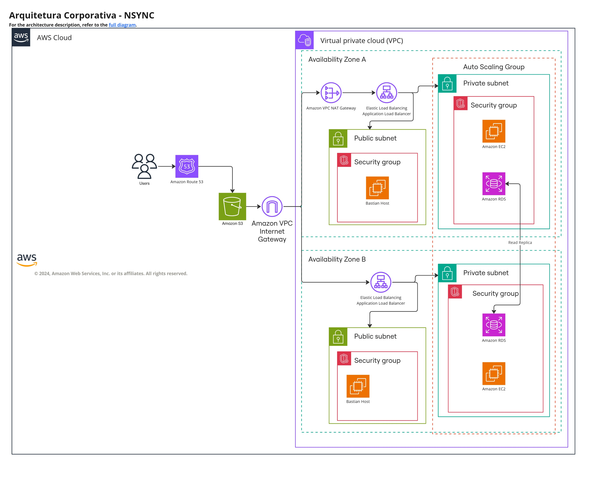

# Arquitetura corporativa

&emsp;A arquitetura corporativa é um framework que descreve a estrutura e o funcionamento de uma organização, abrangendo suas estratégias, processos de negócios, sistemas de informação, infraestrutura de TI e recursos humanos. Ela serve como um mapa ou modelo abrangente que alinha a tecnologia e os processos de negócios com os objetivos e estratégias da empresa.

&emsp;O objetivo principal da arquitetura corporativa é fornecer uma visão holística que ajude a organização a alcançar a eficiência operacional, suportar a tomada de decisões estratégicas, facilitar a transformação digital e garantir que todos os recursos estejam integrados e funcionando de forma coesa.[1]

&emsp;Afim de obter um resultado satisfatório para o entendimento do projeto, além da compreensão do parceiro de projeto com a estrutura localizada na utilização dos diversos serviços da Amazon Web Services (AWS). Torna-se fundamental a implementação de um diagrama que contém uma síntese visual sobre a estruturação da aplicação e dos serviços AWS utilizados pelo grupo. O diagrama apresentado descreve a arquitetura de um sistema baseado em AWS, projetado para garantir alta disponibilidade, segurança e resiliência, características essenciais para o gerenciamento de um inventário distribuído. Essa arquitetura utiliza diversos componentes da AWS para gerenciar a sincronização de estoque em tempo real entre múltiplos centros de distribuição e lojas, suportando grandes volumes de transações. Além disso, ela garante tolerância a falhas, crucial para manter a integridade do sistema mesmo diante de possíveis interrupções.

Figura 01: Diagrama do sistema AWS

Fonte: Material produzido pelos próprios autores (2024).

## Componentes AWS 

- **Amazon Route 53:** É o serviço de DNS (Domain Name System – Sistema de nome de domínio) gerenciado pela AWS que ajuda a conectar as solicitações dos usuários às aplicações implantadas na AWS. Ele pode rotear os usuários para endpoints de aplicação em uma variedade de ambientes da AWS, bem como recursos fora da AWS;

- **Amazon S3:** Amazon Simple Storage Service (S3) é um serviço de armazenamento de objetos que oferece escalabilidade, segurança e performance. Ele é usado para armazenar e proteger qualquer volume de dados para uma ampla gama de casos de uso, como _backup_, análise de _big data_, recuperação de desastres e distribuição de conteúdo. Muito utilizado para armazenar dados críticos, como arquivos estáticos;

- **Amazon VPC Internet Gateway:** É um componente da Virtual Private Cloud (VPC) que permite que a VPC se conecte à Internet. O Internet Gateway é um recurso escalável, redundante e altamente disponível que é utilizado para permitir que instâncias em uma sub-rede pública da VPC enviem e recebam tráfego da internet. Ele suporta o tráfego de saída e de entrada e é uma peça fundamental na configuração de sub-redes públicas dentro de uma VPC.

- **Amazon VPC NAT Gateway:** O NAT Gateway é um serviço gerenciado que permite que instâncias em sub-redes privadas acessem a internet ou outros serviços fora da Virtual Private Cloud (VPC), mas impede que os recursos externos iniciem uma conexão direta com essas instâncias, proporcionando uma camada adicional de segurança;

- **Elastic Load Balancing (Application Load Balancer):** O Load Balancer distribui automaticamente o tráfego de entrada entre múltiplas instâncias do Elastic Compute Cloud (EC2), containers, e IPs, espalhadas por diferentes zonas de disponibilidade (Availability Zones). Isso garante alta disponibilidade e balanceamento de carga, evitando sobrecargas em um único servidor. O Application Load Balancer (ALB) é uma variante que oferece balanceamento de carga para tráfego HTTP/HTTPS, com suporte a balanceamento baseado em conteúdo e regras avançadas de roteamento;

- **Availability Zones (A e B):** As zonas de disponibilidade são data centers fisicamente separados dentro de uma região AWS. Distribuir recursos em múltiplas zonas de disponibilidade aumenta a resiliência e disponibilidade do sistema;

- **Public Subnet:** Uma sub-rede pública é uma sub-rede dentro de uma VPC onde os recursos, como instâncias EC2, possuem IPs públicos e podem se comunicar diretamente com a internet;

- **Private Subnet:** Uma sub-rede privada é uma sub-rede dentro de uma VPC onde os recursos não possuem IPs públicos e não podem se comunicar diretamente com a internet, aumentando a segurança dos recursos críticos;

- **Security Group:** Conjunto de regras de firewall que controlam o tráfego de entrada e saída das instâncias dentro da VPC. Cada grupo pode ter regras que permitem ou bloqueiam o tráfego com base em portas, protocolos e IPs de origem/destino;

- **Bastion Host:** Um servidor em uma sub-rede pública usado para fornecer acesso seguro às instâncias em sub-redes privadas. Ele atua como um ponto de entrada para administradores que precisam gerenciar os recursos privados da VPC;

- **Amazon EC2:** É um serviço de computação que permite criar e gerenciar instâncias virtuais (servidores) na nuvem. Essas instâncias podem ser configuradas para atender às necessidades de processamento de diferentes tipos de aplicações;

- **Amazon RDS:** É um serviço de banco de dados gerenciado que facilita a configuração, operação e escalabilidade de bancos de dados relacionais na nuvem. Ele oferece suporte a vários mecanismos de banco de dados, como PostgreSQL, MySQL, MariaDB, Oracle e SQL Server.

## Integração entre os componentes
&emsp;Todos esses componentes da AWS são integrados para trabalhar de forma coesa, criando uma arquitetura robusta e escalável. A combinação de ALB, Auto Scaling, e instâncias EC2 permite balanceamento de carga e ajuste de capacidade de maneira eficiente. O uso de sub-redes públicas e privadas, juntamente com Internet Gateway e NAT Gateway, proporciona um ambiente de rede seguro, enquanto o Amazon Route 53 gerencia o roteamento de tráfego de forma inteligente. O Amazon RDS e o S3 garantem armazenamento e gerenciamento de dados resilientes, enquanto os Security Groups e o Bastion Host oferecem uma camada adicional de segurança. Essas integrações permitem que o sistema atenda aos requisitos críticos de negócio, como alta disponibilidade, segurança, resiliência e performance.

&emsp;Essa abordagem estruturada e integrada dos serviços AWS assegura que o sistema não apenas atenda às expectativas dos stakeholders, mas também permaneça flexível e adaptável para futuros requisitos e expansões.

## Alinhamento da Arquitetura Corporativa com os Requisitos do Projeto
### Balanceamento de carga

&emsp;A arquitetura atende o requisito de balanceamento de carga capaz de atender demandas de cliente com múltiplas máquinas através do Elastic Load Balancer (ELB), que pode distribuir automaticamente  o tráfego de entrada entre várias instâncias em diferentes zonas de disponibilidade. Isso garante que o tráfego seja distribuído eficientemente e ajuda a melhorar a resiliência e a disponibilidade da sua aplicação.

### Capacidade de Failover e Recuperação de Desastres

&emsp;A arquitetura apresenta duas zonas de disponibilidade (A e B) com recursos replicados em ambas as zonas, contribuindo para a tolerância a falhas. Se uma zona estiver indisponível, os recursos na outra zona podem continuar operando.  O uso de ELB e Auto Scaling Group também auxilia no failover, pois novas instâncias podem ser lançadas automaticamente em outra zona se necessário.

&emsp;Para recuperação de desastres, o Read Replica, que realiza a duplicação do RDS (Relational Database Service) em outra zona de disponibilidade de forma assíncrona, garante uma recuperação eficaz, mantendo a integridade e disponibilidade dos dados.

### Elasticidade

&emsp;O uso de um Auto Scaling Group para as instâncias EC2 mostra que o ambiente pode crescer ou encolher conforme a demanda. Isso atende ao requisito de elasticidade, permitindo que o número de instâncias se ajuste automaticamente conforme as necessidades do negócio.

### Ser passível de avaliação de desempenho

&emsp;O grupo desenvolveu testes de carga utilizando o K6 para avaliar o desempenho da solução e da arquitetura implementada. Os testes foram realizados a partir do Bastion Host, focando na instância EC2 onde a aplicação está hospedada. Através desses testes, foi possível medir indicadores como tempo de resposta, latência e throughput, fornecendo uma visão abrangente da eficiência e robustez do sistema. Os resultados obtidos permitiram identificar pontos de melhoria e validar a capacidade da solução em lidar com cargas elevadas de forma eficiente.

### Conclusão

&emsp;A arquitetura corporativa é uma ferramenta crucial para visualizar a infraestrutura onde a aplicação opera. Através da análise desta arquitetura, é possível identificar claramente os requisitos do projeto que estão sendo atendidos e a maneira como isso ocorre. Por exemplo, o uso de componentes como o Elastic Load Balancer e o Auto Scaling Group demonstra como a arquitetura garante alta disponibilidade e elasticidade, essenciais para lidar com a variabilidade de demanda e assegurar a resiliência do sistema.

&emsp;Atender aos requisitos do projeto é fundamental para o seu sucesso, e a visualização da arquitetura através de um diagrama detalhado facilita o desenvolvimento do projeto e a validação contínua com os stakeholders. Essa validação constante garante que a infraestrutura permanece alinhada com os objetivos do negócio e ajusta-se conforme necessário para atender às expectativas e necessidades dos usuários finais.

# Referências

[1] AMAZON WEB SERVICES. OQUE É DIAGRAMAÇÃO DE ARQUITETURA?. Disponível em: https://aws.amazon.com/pt/what-is/architecture-diagramming/. Acesso em: 30 ago. 2024.

AMAZON WEB SERVICES. Documentação da AWS. Disponível em: https://docs.aws.amazon.com/. Acesso em: 26 ago. 2024.

