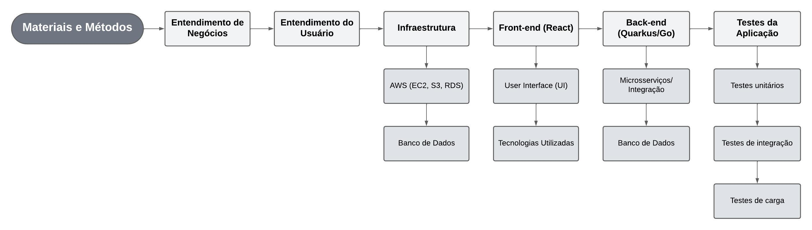

# 1. Introdução

&emsp;Um sistema distribuído consiste em uma rede de computadores independentes que trabalham de forma integrada, apresentando-se ao usuário como uma única entidade funcional. Essa arquitetura permite que diferentes máquinas, com configurações variadas de _hardware_ e _software_, colaborem para atender às demandas específicas de uma aplicação, oferecendo vantagens como escalabilidade e resiliência. Dessa forma, a carga de trabalho pode ser distribuída entre as instâncias ativas, assegurando a continuidade do serviço, mesmo diante de falhas em alguns componentes. (Atlassian, 2024)

&emsp;Aplicações escaláveis têm se tornado cada vez mais essenciais em plataformas que lidam com grandes volumes de dados e interações complexas. Um exemplo notável é o AliExpress, uma plataforma de marketplace da Alibaba, que utiliza um sistema de inventário distribuído para gerenciar milhões de produtos e fornecedores globalmente. A arquitetura do AliExpress é escalável e integra-se a sistemas de logística para otimizar o controle de inventário em tempo real, garantindo uma gestão eficiente mesmo diante de variações significativas na demanda. Esse tipo de solução é particularmente aplicável a marketplaces ou plataformas que envolvem múltiplos vendedores e produtos. (Distributed Inventory Systems in Large Marketplaces: The AliExpress Case Study)

&emsp;No contexto do parceiro de projeto, surge um problema crítico relacionado à sincronização de estoque em sua plataforma de _e-commerce_. O processamento intensivo necessário para validar a confiabilidade das informações de estoque resulta em um alto custo operacional, impactando negativamente na experiência do cliente ao prolongar o tempo de navegação durante sua jornada de compra. Esse desafio é exacerbado pela complexidade de gerenciar múltiplos centros de distribuição e lojas de aparelhos, tornando imperativa a busca por uma solução que possa lidar com essa complexidade e fornecer dados precisos em tempo próximo ao real.

&emsp;Diante desse cenário, propõe-se o desenvolvimento de um sistema de inventário distribuído, projetado para gerenciar de forma eficiente o estoque de múltiplas localidades, sincronizando as informações em tempo real. Essa solução visa aumentar a eficiência operacional e melhorar a experiência do cliente, ao mesmo tempo em que alivia a sobrecarga de processamento na plataforma de _e-commerce_. Além disso, a implementação de um sistema distribuído garante que a solução seja escalável, altamente disponível, tolerante a falhas e confiável, proporcionando ao parceiro uma ferramenta robusta para a gestão de estoque, essencial para a operação segura e eficaz de sua plataforma de comércio eletrônico.

&emsp;Ao alinhar a solução proposta com as necessidades específicas do parceiro, este trabalho contribui diretamente para a mitigação dos problemas atuais, oferecendo uma abordagem inovadora para o gerenciamento de inventário que pode ser aplicada não apenas no parceiro de projeto, mas também em outras empresas que enfrentam desafios semelhantes. A implementação bem-sucedida desse sistema pode servir como um modelo para futuras iniciativas em sistemas de inventário distribuído, destacando os benefícios de uma gestão eficiente e sincronizada em ambientes complexos.

# 2. Trabalhos Relacionados

&emsp;Sendo fundamental para garantir uma base consistente é essencial realizar uma análise de outros trabalhos e estudos, permitindo uma maior compreensão das diversas resoluções e abordagens ao qual o tema proposto pode chegar. A necessidade de sincronização em tempo real de dados de estoque entre essas diferentes localizações pode resultar em um alto custo operacional e em longos tempos de processamento, impactando negativamente a experiência do cliente. Este projeto busca desenvolver uma solução de inventário distribuído confiável que reduza a sobrecarga de processamento da plataforma de _e-commerce_, proporcionando maior visibilidade ao time de logística e melhorando a precisão e a agilidade na sincronização de estoques.

&emsp;O estudo de Aggarwal (2023) analisa a migração para o comércio eletrônico durante a pandemia de COVID-19, destacando a necessidade urgente de integração de processos e a adaptabilidade das empresas para lidar com o aumento exponencial das transações _online_. Durante a pandemia, muitas empresas tiveram que adotar rapidamente soluções digitais para continuar operando, o que trouxe desafios significativos, como a integração de sistemas legados com novas plataformas de _e-commerce_. Uma das estratégias mencionadas por Aggarwal é a implementação de uma arquitetura de microsserviços, que permite uma integração mais flexível e escalável entre sistemas de _back-end_ e _front-end_. Essa abordagem não apenas garante operações de estoque precisas e atualizadas em tempo real, mas também facilita a adaptação rápida a mudanças nas demandas do mercado. Esse aspecto é vital para atender às exigências de um ambiente de comércio eletrônico em rápida expansão, podendo aliviar a sobrecarga de processamento e melhorar os objetivos do projeto em desenvolvimento (AGGARWAL, 2023).

&emsp;No contexto do desafio de sincronização de inventário em tempo real, o artigo de Tuli, Mohammed e Sachani (2023), intitulado "Supply Chain Optimization: Machine Learning Applications in Inventory Management for E-Commerce", explora a aplicação de técnicas de _machine learning_ para otimizar a gestão de inventários, especialmente em cadeias de suprimentos complexas. O estudo destaca o uso de algoritmos preditivos para melhorar a precisão das previsões de demanda, o que é essencial para evitar excessos ou faltas de estoque. Por exemplo, modelos de aprendizado supervisionado podem analisar padrões históricos de vendas e prever futuras necessidades de reabastecimento com maior precisão. Isso é particularmente relevante para o projeto em questão, onde a confiabilidade do estoque é crucial para a experiência do cliente e a eficiência operacional. A aplicação de aprendizado de máquina pode automatizar a validação de estoque, reduzindo a necessidade de processos manuais, diminuindo a sobrecarga na plataforma de comércio eletrônico e melhorando o tempo de resposta na jornada do cliente.

&emsp;O artigo de Wu (2022) destaca a importância da sincronização de dados em tempo real entre diferentes localizações para otimizar a eficiência no gerenciamento de estoques, especialmente em cenários de alta demanda, como o enfrentado pela 3M — grupo econômico multinacional americano de tecnologia diversificada — durante a pandemia de Covid-19. O uso de cloud computing surge como uma estratégia crucial para garantir a alta disponibilidade e redundância dos dados, permitindo que todas as localizações acessem informações atualizadas simultaneamente, reduzindo o risco de inconsistências no estoque. Além disso, a implementação de algoritmos de blockchain oferece uma solução segura e distribuída para o registro e validação das transações de estoque, minimizando a possibilidade de discrepâncias. Essas práticas são fundamentais para evitar problemas comuns no comércio eletrônico, como pedidos de produtos fora de estoque e atrasos no envio, melhorando a experiência do usuário e fortalecendo a confiança dos clientes na plataforma, conforme ressaltam os desafios enfrentados pela 3M em manter uma gestão de estoques eficiente durante a crise (Wu, 2022).

&emsp;Em suma, a integração dos conceitos e práticas discutidos ao longo dos trabalhos previamente citados oferece uma base sólida para o desenvolvimento de uma solução de inventário distribuído adaptada às necessidades do parceiro. Embora esses estudos forneçam direções importantes, o projeto atual também foca em resolver desafios específicos, como a escalabilidade e a sincronização em tempo real em um ambiente de alto volume transacional. A arquitetura proposta, utilizando microsserviços desenvolvidos em Quarkus[^2] e Go[^3], foi projetada para otimizar o processamento e garantir a flexibilidade necessária para lidar com grandes volumes de dados.

&emsp;Além disso, o uso de recursos da AWS[^4], como Kubernetes[^5] e Auto Scaling Groups[^6], é fundamental para garantir alta disponibilidade e confiabilidade, permitindo a sincronização eficiente entre os diferentes pontos de venda e centros de distribuição. Diferentemente de abordagens mais gerais descritas nos trabalhos anteriores, o presente projeto se destaca pela personalização voltada às demandas específicas da Vivo, com uma modelagem de banco de dados otimizada e o uso de tecnologias que garantem um sistema robusto e escalável. Essas soluções visam preencher lacunas observadas nas abordagens anteriores, oferecendo um sistema que responde de maneira eficaz às necessidades da empresa.

# 3. Materiais e Métodos

&emsp;Nesta seção, são apresentados os materiais e métodos utilizados para desenvolver o sistema de inventário distribuído para a Vivo. A seção está dividida em diferentes subtemas, abrangendo desde o entendimento de negócios e do usuário até os aspectos técnicos da infraestrutura e desenvolvimento da aplicação, tanto no _front-end_ quanto no _back-end_. O objetivo é fornecer uma visão clara e detalhada dos processos e ferramentas empregados na resolução do problema proposto. A seguir, é descrito o fluxo de trabalho e os principais componentes de cada etapa, facilitando o entendimento.

**Estrutura da Seção:**
1. **Entendimento de negócios:** Análise estratégica com ferramentas como a Matriz Oceano Azul e análise financeira, para alinhar os objetivos do projeto às necessidades da Vivo.
2. **Entendimento do usuário:** Realizamos imersões e pesquisas qualitativas e quantitativas com os usuários finais, resultando na criação de personas e refinamento de hipóteses.
3. **Infraestrutura:** Descrição da arquitetura tecnológica usada para garantir escalabilidade e segurança, utilizando a AWS como base.
4. **Desenvolvimento do _Front-end_:** Foco na criação de uma interface de teste com React, otimizando a experiência do usuário e a visualização da solução.
5. **Desenvolvimento do _Back-end_ (Quarkus e Go):** Explicação dos motivos para usar Quarkus e Go, além das vantagens de cada um em diferentes aspectos da aplicação.
6. **Testes da aplicação:** Testes de performance e validação das funcionalidades para garantir a robustez e confiabilidade do sistema.

_Abaixo, o fluxograma das seções presentes em "Materiais e Métodos":_

Figura 01: Fluxograma Materiais e Métodos

Fonte: Material produzido pelos próprios autores (2024).

## 3.1. Entendimento de negócios

&emsp;Entendimento de negócios é a capacidade de compreender profundamente o funcionamento de uma organização, seus objetivos, estratégias, processos e o ambiente em que ela opera. Isso inclui a percepção das necessidades e expectativas dos clientes, o conhecimento das tendências do mercado, a análise dos concorrentes e a compreensão dos fatores internos e externos que impactam o sucesso da empresa. Compreender tais aspectos proporciona tomadas de decisão mais estratégicas e alinhadas aos objetivos estabelecidos com o projeto em desenvolvimento, fazendo com que a solução não só considere demandas técnicas, mas também como pode fazer a diferença para todo o funcionamento da corporação.

&emsp;A matriz Oceano Azul é uma ferramenta estratégica que auxilia na identificação de oportunidades de criação de valor ainda inexploradas pela concorrência, por meio das ações de eliminar, reduzir, aumentar e criar. Ao redefinir a curva de valor de uma empresa em comparação com seus concorrentes, ela permite eliminar ou reduzir fatores irrelevantes e introduzir ou ampliar elementos que diferenciem a empresa, criando assim um "oceano azul" onde a concorrência é irrelevante (Hubspot, 2024). No entanto, no mercado de e-commerce de eletrônicos, já bem estabelecido e competitivo, essa análise foi essencial para identificar gaps e oportunidades que a empresa pode aproveitar com a solução desenvolvida, garantindo uma melhor compreensão do mercado.

&emsp;O Canvas Proposta de Valor é uma ferramenta essencial para alinhar a oferta de um produto ou serviço às necessidades dos clientes, ajudando a identificar, comunicar e ajustar o que torna a solução atraente para o público-alvo. Com blocos que exploram benefícios, alívio de dores e geração de ganhos, ele assegura que o desenvolvimento de soluções esteja em sintonia com as prioridades dos clientes, aumentando as chances de sucesso no mercado (Leadster, 2024). No desenvolvimento do sistema de inventário distribuído para a Vivo, o uso do Canvas Proposta de Valor foi crucial para garantir que a solução proposta atenda de forma precisa às necessidades do cliente, fortalecendo a posição competitiva da empresa no mercado do comércio eletrônico.

&emsp;A matriz de riscos é uma ferramenta essencial para identificar, avaliar e priorizar os riscos de um projeto, categorizando-os conforme sua probabilidade e impacto. Para o projeto em questão, o levantamento dessas possibilidades foi utilizado para mapear potenciais dificuldades que poderiam atrasar ou complicar o desenvolvimento, permitindo a criação de planos de contingência eficazes. Ademais, o processo também foi aplicado para identificar possíveis oportunidades, com planos de ação prontos para serem implementados caso elas ocorram. Essa abordagem não apenas protege os recursos da empresa, mas também melhora a tomada de decisões e assegura a continuidade das operações, mesmo em cenários adversos (ATLAS GOV, 2024).

&emsp;A análise financeira avalia os dados econômicos da empresa para determinar sua saúde financeira e estimar os custos associados à realização de suas ações. Para o caso de sistemas distribuídos, é crucial considerar os custos de construção da infraestrutura, a mão de obra necessária, os gastos mensais com _cloud computing_ e as projeções da relação entre custos e ganhos ao implementar novas tecnologias e arquiteturas. Uma análise financeira robusta oferece _insights_ valiosos sobre a viabilidade dos projetos, permitindo que os _stakeholders_ tomem decisões estratégicas informadas e alocando recursos de maneira eficiente para garantir a sustentabilidade do negócio a longo prazo.

## 3.2. Entendimento do usuário

&emsp;O entendimento do usuário envolve a coleta e análise de informações sobre as necessidades, comportamentos e preferências dos usuários finais do sistema. Considerando o caso em questão, a principal persona a ser considerada para o desenvolvimento da solução é da área logística da Vivo, que orquestra o uso de múltiplos estoques integrados com a plataforma de _e-commerce_. Compreender as necessidades do profissional desse setor é, pois, essencial para desenhar uma solução que seja intuitiva, eficiente e personalizada para quem de fato a utilizará.

&emsp;Para alcançar essa compreensão, foi realizada uma imersão preliminar com o cliente, em formato de _workshop_, onde discutiu-se o projeto, os requisitos necessários e questionamentos para garantir a compreensão dos detalhes do que precisaria ser desenvolvido. Ademais, esse espaço também foi utilizado para a elaboração de hipóteses e validação das mesmas com as partes interessadas do projeto, assim garantindo um bom alinhamento de expectativas e atendimento das demandas da área logística da empresa.

&emsp;A criação de personas foi um passo crucial para identificar e entender as necessidades específicas dos usuários finais do sistema. Personas são representações semi-fictícias dos usuários que englobam dados demográficos, comportamentos, motivações e objetivos. Para o projeto em questão, a persona principal inclui gestores de logística da Vivo, responsáveis pela orquestração de múltiplos centros de distribuição. Ao mapear essas características, foi possível alinhar o desenvolvimento da solução com as expectativas e necessidades reais dos usuários, garantindo que a interface e as funcionalidades do sistema fossem desenhadas de forma a maximizar a eficiência e a usabilidade.

&emsp;Em adição ao mencionado, uma pesquisa qualiquantitativa foi organizada para aprofundar o entendimento sobre as necessidades e percepções dos usuários em relação à solução proposta. O método utilizado foi a criação de um questionário para coletar dados que pudessem orientar o desenvolvimento do sistema. Os resultados permitiram identificar áreas de melhoria e aspectos que os usuários consideravam críticos para o sucesso da aplicação. Esse feedback foi essencial para ajustar as funcionalidades e o design do sistema, assegurando que ele atenda de maneira precisa ao que foi solicitado.

&emsp;Ademais, a pesquisa qualiquantitativa revelou os seguintes pontos críticos que influenciaram diretamente o desenvolvimento da solução:

1. **Sincronização e Desempenho do Estoque**: A necessidade de uma sincronização em tempo real entre diferentes centros de distribuição e lojas foi identificada como um ponto crítico. Para abordar isso, a infraestrutura foi projetada para suportar alta disponibilidade e escalabilidade, utilizando uma arquitetura de microsserviços baseada em Kubernetes. A escolha de usar Go com o _framework_ Fiber para um dos _backends_ foi motivada pela sua eficiência em lidar com alta concorrência e pelo seu desempenho superior na sincronização de dados, aproveitando o suporte nativo a goroutines[^1] para processamento paralelo.

2. **Eficiência de Processamento e Uso de Recursos**: A pesquisa destacou a importância de otimizar o tempo de resposta e o uso de recursos. O _backend_ em Go foi escolhido devido à sua eficiência em termos de uso de memória e tempo de execução, o que é crítico para lidar com picos de demanda e garantir a rapidez nas operações. Por outro lado, a versão em Quarkus também foi avaliada para comparação, e suas características como o tempo de inicialização rápido e a eficiência de memória foram levadas em consideração.

3. **Simplicidade e Manutenção do Código**: Outro ponto crítico foi a necessidade de um código simples e fácil de manter. O Fiber foi escolhido no _backend_ em Go por sua simplicidade e modularidade, o que facilita a manutenção e a expansão do sistema. Além disso, a arquitetura modular tanto no Go quanto no Quarkus permite uma organização clara do código e uma integração eficiente de novas funcionalidades conforme necessário.

4. **Experiência do Usuário e _Frontend_**: A pesquisa também apontou a importância de uma interface de usuário intuitiva e responsiva. Para isso, o _frontend_ foi desenvolvido utilizando a biblioteca ShadCN/UI e componentes como `Sheet` e `Tabs`, garantindo que a interface seja não apenas visualmente atraente, mas também funcional e fácil de usar. A integração entre _frontend_ e _backend_ foi projetada para ser fluida, com foco em oferecer uma experiência de usuário sem interrupções.

5. **Validação e Testes**: Finalmente, os testes foram uma parte crucial do desenvolvimento, visando identificar e corrigir possíveis falhas antes do lançamento. O sistema foi testado extensivamente em diferentes cenários para assegurar que ele funcionasse conforme esperado, com especial atenção para a validação dos processos de _upload_ de arquivos CSV e a integração com o _backend_. A utilização de _frameworks_ de teste para Go (como o pacote `testing`, nativo da biblioteca padrão), JUnit para Quarkus e ferramentas de teste para o frontend assegurou uma cobertura abrangente e validação completa de todos os aspectos da aplicação.

&emsp;Portanto, cada um desses pontos críticos foi abordado com soluções específicas nas diferentes camadas da aplicação, assegurando que a solução proposta não apenas atenda às necessidades identificadas na pesquisa, mas também ofereça um desempenho e uma usabilidade superiores. A combinação de uma infraestrutura robusta, um _backend_ eficiente, um _frontend_ intuitivo e uma abordagem rigorosa de testes resultou em uma solução integrada e de alta qualidade.

## 3.3. Infraestrutura

&emsp;A infraestrutura de uma aplicação refere-se a todo o conjunto de recursos, tanto físicos quanto virtuais, que suportam o desenvolvimento, operação e manutenção de sistemas. Isso inclui servidores, redes, armazenamento, e serviços em nuvem que possibilitam o funcionamento das aplicações. A infraestrutura moderna permite que as aplicações sejam escaláveis, seguras e eficientes. No contexto atual, a maioria das empresas utiliza soluções em cloud computing, fornecidas por provedores como AWS, Azure e Google Cloud, que permitem o provisionamento de recursos conforme a demanda, eliminando a necessidade de gerenciar diretamente a infraestrutura física.

&emsp;Antigamente, antes da popularização de soluções de _cloud computing_, as empresas precisavam gerenciar totalmente sua própria infraestrutura por meio de sistemas _on-premise_, o que implicava em construir e manter data centers físicos para armazenar servidores. Esse modelo apresentava grandes desafios, como altos custos operacionais, a necessidade de manutenção constante, e dificuldades em escalar sistemas de forma rápida e eficiente. Ademais, a redundância e a recuperação de desastres eram processos complicados e demorados. O desenvolvimento de _software_ era diretamente impactado por essas limitações, tornando o ciclo de desenvolvimento e implantação de novas funcionalidades muito mais lento.

&emsp;Com o desenvolvimento e adoção de abordagens baseadas em nuvem por meio de provedoras como a AWS e Azure, essas dificuldades começaram a ser superadas, já que muitas empresas deixaram de ter que se preocupar totalmente com a infraestrutura, podendo tê-la provisionada de forma virtual, com uma enorme flexibilidade para escalabilidade e ajustes em tempo real, conforme a demanda. A conteinerização desempenha um papel fundamental nesse processo, ao encapsular aplicações e seus ambientes em contêineres portáteis que podem ser executados em qualquer sistema compatível. Ferramentas como Docker e K8 (Kubernetes) simplificam ainda mais a automação e escalabilidade, permitindo que as empresas gerenciem seus serviços de forma eficiente, garantindo alta disponibilidade e capacidade de resposta a variações de carga.

&emsp;No projeto em questão, foram implementadas e testadas diferentes abordagens de infraestrutura, buscando encontrar a combinação mais adequada de tecnologias para atender às demandas do parceiro. Cada aplicação desenvolvida possui requisitos específicos que demandam ajustes diferenciados na infraestrutura. O desenvolvimento foi conduzido de forma iterativa, onde cada ciclo incluiu a implementação de aplicações, configuração e gerenciamento da infraestrutura correspondente, testes de desempenho e carga, e o retorno dos resultados para ajustar e otimizar as soluções, garantindo, assim, a performance e escalabilidade adequadas.

&emsp;A primeira abordagem selecionada foi o desenvolvimento de um _back-end_ monolito utilizando Java e o Quarkus. O Quarkus é um _framework_ otimizado para rodar em ambientes nativos na nuvem e microsserviços, oferecendo rápido tempo de inicialização e baixo consumo de memória. Para sustentar essa aplicação, foi criada uma infraestrutura simples na AWS, utilizando um RDS (Relational Database Service) para o banco de dados, que facilita a configuração e escalabilidade de bancos relacionais, um S3 (Simple Storage Service) para armazenar o _front-end_ estático, e uma instância EC2 do tipo t2.micro. A EC2 (Elastic Compute Cloud) é um serviço que oferece capacidade computacional escalável, e a t2.micro é uma instância de baixo custo, ideal para protótipos ou aplicações com baixa demanda de recursos. Essa implementação permitiu obter uma primeira versão funcional da aplicação, que mostrou consistência e bom desempenho, apesar da simplicidade da infraestrutura.

&emsp;Após essa fase inicial, houve uma evolução da infraestrutura com a criação de uma VPC (Virtual Private Cloud). A VPC permite isolar a rede da aplicação, separando-a em subredes públicas e privadas para garantir maior segurança e eficiência no tráfego de dados. Também foram configurados grupos de segurança, que funcionam como _firewalls_ virtuais para controlar o tráfego de entrada e saída, e os serviços foram distribuídos entre diferentes zonas de disponibilidade para garantir alta disponibilidade e tolerância a falhas. Foi implementado o Internet Gateway (IGW), que permite que instâncias dentro da VPC se conectem à internet, e um NAT Gateway, que garante que instâncias em subredes privadas possam acessar a internet de forma segura sem expor seus IPs. Além disso, foi implementado um Bastion Host, que oferece um ponto de entrada seguro para a administração dos servidores, reforçando a segurança operacional da aplicação.

&emsp;Em paralelo a isso, foi desenvolvida uma segunda versão do _back-end_ utilizando Go, uma linguagem conhecida por sua eficiência e excelente suporte para concorrência. Go apresenta uma arquitetura mais enxuta, com tempos de compilação e execução rápidos, o que permitiu otimizar a infraestrutura, aproveitando instâncias menores e de melhor desempenho.

&emsp;Na próxima etapa, foram implementados Load Balancers e Auto Scaling Groups para garantir que as aplicações pudessem escalar de forma automática, conforme a demanda aumentasse. O Load Balancer distribui o tráfego entre várias instâncias, garantindo que nenhuma delas fique sobrecarregada. Já os Auto Scaling Groups permitem que novas instâncias sejam criadas ou removidas automaticamente, conforme a carga de trabalho, otimizando o uso de recursos. Embora essa abordagem melhore a escalabilidade, ela pode ser ineficiente em alguns casos, já que cria réplicas completas da aplicação, mesmo que nem todas as funcionalidades sejam utilizadas ao mesmo tempo.

&emsp;Com base nas demandas crescentes da aplicação, foi decidido aprimorar a lógica de monolitos para uma arquitetura de microsserviços, onde a lógica de negócios foi dividida em serviços independentes e menores. Tal arquitetura traz uma série de vantagens, como a capacidade de escalar componentes específicos e a maior modularidade do sistema, mas também introduz desafios de gerenciamento, especialmente em termos de comunicação entre os serviços. Em comparação com o modelo monolítico, essa abordagem permite uma maior agilidade na manutenção e na adição de novas funcionalidades, além de ser mais resiliente a falhas.

&emsp;Para orquestrar esses microsserviços, foi criado um ambiente Kubernetes em uma instância EC2 t3.medium. Ao contrário da t2.micro, a t3.medium oferece mais vCPUs e maior capacidade de memória, tornando-a adequada para cargas mais intensas. Utilizamos o MicroK8s, uma versão simplificada do Kubernetes, para gerenciar os contêineres. No Kubernetes, os serviços são executados em _pods_ (unidades de execução que podem conter um ou mais contêineres) que podem ser escalados horizontalmente. O ambiente completo é gerenciado como um _cluster_, que organiza os recursos computacionais e distribui as tarefas de maneira eficiente. Usamos Docker para conteinerizar os serviços, criando pacotes independentes que incluem código e dependências, facilitando o transporte e a execução uniforme das aplicações. Os _scripts_ de _deployment_ automatizaram a escalabilidade dos _pods_, garantindo alta disponibilidade e alocação eficiente de recursos.

&emsp;Por fim, visando fechar a implementação das principais infraestruturas disponíveis, foi utilizada uma abordagem _serverless_ com o AWS Lambda. No modelo _serverless_, não é necessário gerenciar servidores; ao invés disso, a lógica da aplicação é dividida em funções executadas sob demanda, acionadas por eventos HTTP através do API Gateway. As funções Lambda trazem benefícios como baixo custo e escalabilidade automática, eliminando a necessidade de dimensionar servidores manualmente. Essa abordagem se mostrou extremamente eficiente para determinadas partes da aplicação que exigem processamento rápido e esporádico.

&emsp;Em adição ao que foi apresentado, a infraestrutura está sendo migrada para um modelo baseado em Infraestrutura como Código (IaC) utilizando Terraform. O Terraform permite definir, provisionar e gerenciar a infraestrutura de forma declarativa, automatizando e versionando a configuração dos recursos. Isso traz vantagens como maior controle sobre as mudanças, possibilidade de replicar ambientes e maior agilidade na gestão da infraestrutura.

&emsp;Essas etapas de desenvolvimento e testes de infraestrutura foram essenciais para garantir que a solução seja não apenas eficiente, mas também adaptável às necessidades específicas do desafio proposto. Ao testar diferentes abordagens — como monolitos, microserviços e serverless — foi garantido que a aplicação seja otimizada e personalizada, oferecendo alta performance e escalabilidade ajustada às demandas da Vivo, o que a diferencia no cenário corporativo.

## 3.4. _Front-end_

&emsp;O _front-end_ é a interface do sistema com a qual os usuários interagem diretamente. No desenvolvimento de software, ele é responsável por apresentar as informações ao usuário de forma clara e intuitiva, bem como por coletar as entradas do usuário (Alura, 2024). No contexto do projeto, uma _user interface_ (UI) será majoritariamente utilizada como uma forma de simular o funcionamento do sistema, uma vez que a plataforma de comércio eletrônico já existe, sendo o verdadeiro objetivo a otimização do sistema que garante a lógica para uso dos múltiplos estoques. Todavia, uma visualização de qualidade elevará a compreensão sobre como a aplicação do sistema distribuído poderá gerar benefícios para a empresa, além de fornecer um ambiente semelhante ao real para a equipe de desenvolvimento.

&emsp;Dessa forma, a fim de construir esse ambiente de testes e simulação de maneira a garantir um nível satisfatório de qualidade de usabilidade e facilidade de operacionalização para o usuário sem conhecimento técnico acerca do funcionamento por trás do sistema, optou-se pela aplicação de tecnologias que favorecessem o desenvolvimento rápido de uma interface simples, intuitiva e completa no que tange as funcionalidades requeridas pelo cliente. Para essa escolha de ferramentas e *frameworks* do *front-end*, foram considerados também como fatores decisivos o tempo curto de desenvolvimento que o grupo de desenvolvedores responsáveis têm para finalização do projeto completo (dez semanas) e o maior grau de prioridade no que tange os objetivos principais do projeto voltado à otimização do sistema distribuído de inventário, sendo a camada de interação com o usuário projetada uma *feature* secundária.

&emsp;Consoante às informações supracitadas, como *framework* central do *front-end* utilizou-se o React, uma ferramenta bastante consolidada no mercado e que acelera o desenvolvimento de interfaces a partir da modularização do código em componentes estilizados reutilizáveis, além de oferecer recursos que facilitam a administração dos estados das páginas *web* e a comunicação entre diferentes seções do *site*. Para potencializar as capacidades desse *framework* e construir uma interface de fato intuitiva, foram integrados ao projeto itens da biblioteca de componentes "shadcn/ui", que contam não só com um padrão de estilos profissional e bem disseminado pela indústria, mas também com abstrações que permitem uma ampla reusabilidade, mesmo para diferentes fins. Por último, para estabelecimento da conexão entre *front-end* e *back-end*, foi aplicado o cliente HTTP Axios, que propõe a simplificação de requisições assíncronas para sistemas executados em Node.js, como o caso da plataforma desenvolvida.

&emsp;Todas essas ferramentas citadas foram usadas a partir do sistema escrito em TypeScript para o *front-end*, linguagem que, ao contrário do JavaScript convencional, garante certa segurança de tipos e, consequentemente, maior robustez e menor suscetibilidade a erros de código, funcionalidades essenciais para aplicações que dependem da interação com entradas do usuário. Entretanto, apesar das vantagens explicitadas, é importante salientar que essas tecnologias podem apresentar certas características inconvenientes no que se refere à escalabilidade da aplicação, já que a utilização do React e da biblioteca "shadcn/ui" em projetos maiores possivelmente causaria, respectivamente, dificuldade no gerenciamento complexo de estados e limitação da flexibilidade e personalização avançada de componentes. Porém, como o objetivo consiste no desenvolvimento de uma plataforma que simula um *website* de *e-commerce* para realização de testes de infraestrutura, a escalabilidade do *front-end* em si não foi um fator de tanta crucialidade, considerando que é, por natureza, um sistema mais simples e que não necessita de planejamento de crescimento no escopo de entrega do MVP ("minimum viable product", ou mínimo produto viável).

## 3.5. _Back-end_ - Quarkus

&emsp;O _back-end_ de uma aplicação refere-se à parte do sistema responsável pelo processamento dos dados, lógica de negócios e gerenciamento de banco de dados. Diferente do _front-end_, que interage diretamente com os usuários finais, o primeiro funciona nos bastidores, garantindo que as informações solicitadas pelos usuários sejam processadas e retornadas corretamente. Em termos simples, tal parte é o motor que impulsiona a aplicação, garantindo a integridade, segurança e eficiência dos processos realizados em segundo plano (Totvs, 2023).

&emsp;Com intuito de desenvolver uma aplicação que garanta um funcionamento satisfatório em relação ao desafio a ser resolvido, a linguagem escolhida para uma versão inicial da aplicação foi o Java. Tal linguagem é amplamente reconhecida por sua robustez, alto desempenho e vasta utilização no mundo corporativo. Suas principais vantagens incluem a portabilidade entre diferentes sistemas operacionais, uma extensa comunidade de desenvolvedores, e a presença de uma rica biblioteca de ferramentas e _frameworks_, como o Spring e Spring Boot, que facilitam o desenvolvimento de aplicações corporativas. No entanto, Java também apresenta algumas desvantagens, especialmente com o surgimento de técnicas mais modernas para a construção de aplicações _web_. O uso de memória pode ser ineficiente, o que resulta em um alto consumo de recursos, além de um tempo de inicialização relativamente longo. Essas características podem impactar negativamente o desempenho em ambientes de microsserviços, onde a eficiência e a rápida escalabilidade são cruciais (Sonatafy, 2023).

&emsp;As características mencionadas do Java podem ser atribuídas ao contexto de sua criação, na década de 1990. Na época, aplicações monolíticas eram a norma, e conceitos de conteinerização e microsserviços ainda não existiam com tanta força como atualmente. Java foi projetado para resolver problemas enfrentados por essas grandes aplicações monolíticas e com infraestruturas majoritariamente _on-premises_, oferecendo uma plataforma estável e confiável para o desenvolvimento, um exemplo pode ser sua portabilidade entre diferentes sistemas que garantia que mesmo com mudanças no _hardware_ e _software_ dos servidores das corporações, o mesmo código ainda poderia ser utilizado sem receio de perda de dados e funcionalidades (GeeksforGeeks, 2023). O Spring e o Spring Boot, que são _frameworks_ populares para o ambiente _web_, refletem essa herança, oferecendo soluções robustas para o desenvolvimento de sistemas empresariais. No entanto, essa robustez vem com o custo de um maior consumo de recursos, o que é um desafio em ambientes modernos onde a eficiência e a escalabilidade são fundamentais.

&emsp;Quando desenvolvedores começaram a aplicar a lógica de microsserviços com Spring enfrentaram alguns desafios, principalmente por conta da incapacidade da _Java Virtual Machine_ (JVM) de respeitar os limites de memória dos _containers_, resultando em um consumo excessivo de recursos. Ademais, o tempo de inicialização lento das aplicações Java dificultava processos como o _auto healing_ e a escalabilidade dinâmica, essenciais para o uso de infraestruturas com Docker e Kubernetes. Tais problemas exigiram a adoção de estratégias para melhorar a eficiência das aplicações Java em ambientes conteinerizados.

&emsp;Diversas estratégias foram adotadas para mitigar esses problemas. Entre elas, a otimização das configurações do JVM para o caso de uso em _containers_, o uso de GraalVM para compilar o código em executáveis nativos, e a adoção de ferramentas como o Spring Cloud para melhorar a integração e a eficiência com serviços como da AWS e Azure que já oferecem infraestruturas adaptadas para o atual padrão de desenvolvimento. Atualmente, a documentação do Spring oferece uma rica fonte de informações sobre como otimizar aplicações para ambientes modernos, incluindo práticas recomendadas para configurações de memória, otimização de desempenho, e uso de _containers_.

&emsp;Uma tecnologia emergente que busca resolver muitos desses problemas é o Quarkus. Quarkus é um _framework_ completo para Java nativo à _cloud_ e Kubernetes, projetado para funcionar de forma eficiente em ambientes conteinerizados e de microsserviços. Ele promete resolver os problemas de inicialização lenta e alto consumo de memória, comuns em aplicações Java tradicionais, oferecendo tempos de inicialização significativamente menores e um uso de memória mais eficiente. Isso torna o Quarkus uma excelente opção para o desenvolvimento de microsserviços em Java, especialmente em ambientes onde a eficiência e a escalabilidade são prioridades. A documentação do Quarkus destaca suas principais características, como suporte nativo ao GraalVM, que permite a compilação de executáveis nativos, e uma forte integração com _frameworks_ modernos de microsserviços (Quarkus, 2023).

&emsp;Em adição à escolha de linguagem, é de suma importância escolher um paradigma de programação adequado para o desenvolvimento de um sistema. O paradigma define o modelo e a abordagem para resolver problemas e estruturar o código, influenciando diretamente a arquitetura, a manutenção, e a evolução do software. Uma boa escolha pode melhorar a clareza do código, facilitar a reusabilidade de componentes, e reduzir a probabilidade de erros, enquanto um paradigma inadequado pode levar a uma estrutura confusa, difícil de manter e expandir. Portanto, ao iniciar o desenvolvimento de um sistema, a decisão sobre qual paradigma adotar deve ser baseada não apenas na linguagem de programação, mas também nos requisitos específicos do projeto e nas necessidades de longo prazo da aplicação (Floyd, 2007).

&emsp;Para o protótipo até então desenvolvido com Quarkus, o paradigma majoritário utilizado foi o da _Aspect Oriented Programming_ (AOP). Tal paradigma visa modularizar preocupações transversais, ou seja, funcionalidades que afetam várias partes de um sistema, como logging, segurança, ou transações. Em vez de espalhar o código relacionado a essas preocupações por diferentes partes da aplicação, a AOP permite que ele seja encapsulado em módulos chamados aspectos. Isso facilita a manutenção e a evolução do sistema, pois as alterações em uma preocupação transversal podem ser feitas de forma centralizada. Além disso, tal paradigma também permite uma integração simples de funcionalidades sem que haja a necessidade de alterar o código existente, assim promovendo as boas práticas de reusabilidade e a facilidade de testes (Kiczales, 1996).

&emsp;Embora tal paradigma traga essa série de benefícios para uma aplicação, também apresenta algumas desvantagens válidas de serem mencionadas. A principal é a complexidade adicional que ela pode introduzir no desenvolvimento e na depuração do código. Como as funcionalidades são aplicadas em tempo de execução, pode ser difícil para os desenvolvedores rastrear como e onde os aspectos estão afetando o fluxo da aplicação. Ademais, a AOP pode tornar o código menos intuitivo, especialmente para desenvolvedores que não estão familiarizados com o paradigma, o que pode levar a dificuldades na manutenção do código a longo prazo. Além de questões de desenvolvimento, é importante dar atenção à performance da aplicação ao usar desse paradigma. Dependendo das ferramentas utilizadas, a AOP pode introduzir uma sobrecarga adicional ao sistema devido ao processo de _weaving_, no qual os aspectos são aplicados ao código com base em tempo de execução ou compilação. Tal característica pode resultar em aumento do tempo de execução e na utilização de recursos, especialmente em aplicações de grande escala, em especial para sistemas que exigem alto desempenho, como aplicações financeiras ou que demandem de atualizações em tempo real, onde cada milissegundo importa.

&emsp;A partir de tais vantagens e desvantagens, escolheu-se usar esse paradigma para o desenvolvimento de um mínimo produto viável inicial, devido à escolha do Quarkus para a construção do _back-end_. Ele oferece suporte nativo à AOP através da integração com _frameworks_ como _Contexts and Dependency Injection_ (CDI) e ArC. CDI é uma especificação Java para injeção de dependências e gerenciamento de ciclos de vida de objetos, permitindo que componentes sejam conectados e configurados com facilidade dentro da aplicação. ArC, por sua vez, é a implementação específica de CDI para o Quarkus, otimizada para oferecer alta performance, aproveitando das características de rápida inicialização e baixo uso de memória. Usando ArC, as preocupações transversais podem ser implementadas de maneira declarativa, sem a necessidade de alterações diretas no código da regra de negócios da aplicação. Outrossim, a arquitetura é projetada para ser altamente otimizada com o suporte à GraalVM, uma máquina virtual que permite a compilação antecipada de código nativo (GRAALVM, 2024). GraalVM melhora significativamente a desempenho da aplicação ao reduzir a sobrecarga associada ao uso de AOP, permitindo que a aplicação permaneça rápida e responsiva, mesmo com a adição de aspectos.

&emsp;A construção do _back-end_ do _minimum viable product_ (MVP) foi realizada de forma detalhada, visando aplicar da melhor forma as características da linguagem Java e do _stack-full_ Quarkus, além da AOP para garantir uma arquitetura robusta e flexivel. Considerando as entidades definidas durante a modelagem do banco de dados, desenvolveu-se um sistema modular que utiliza estruturas genéricas para padronizar operações de _Create_, _Read_, _Update_ e _Delete_ (CRUD), reduzir repetição e aumentar a manutenabilidade do código. O uso de interfaces e _reflection_ permitiu a criação de componentes reutilizáveis, capazes de se adaptar a necessidades distintas sem gerar grandes mudanças no código. Ademais, o uso da AOP foi de suma importância para garantir o gerenciamento de funcionalidades transversais, como aspectos de _error handling_, _healthcheck_ e controle de transações. Desse modo, a combinação desses elementos resultou em um sistema inicial eficiente e escalável para atender as necessidades à medida que a aplicação se expande.

## 3.6. _Back-end_ - Go

&emsp;Para explorar alternativas ao desenvolvimento inicial em Java, foi escolhido o Go, uma linguagem criada pelo Google, conhecida por sua simplicidade, eficiência e forte desempenho em ambientes de alta concorrência. Go, ou Golang, oferece uma série de vantagens, como uma sintaxe clara e direta, *runtime* eficiente, e excelente suporte a concorrência nativa por meio das "goroutines". Essas características fazem com que a linguagem seja uma opção atraente para o desenvolvimento de *back-ends* que exigem alta performance, especialmente em sistemas que precisam lidar com um grande número de requisições simultâneas. No entanto, como qualquer tecnologia, ela também apresenta algumas desvantagens, como uma comunidade ainda em crescimento, o que pode limitar o acesso a bibliotecas mais maduras e a recursos amplamente testados em comparação com tecnologias mais estabelecidas como Java (GeeksforGeeks, 2024).

&emsp;A escolha de Go para a versão alternativa do *back-end* foi motivada principalmente pela busca da melhor eficiência e escalabilidade da aplicação, especialmente em um cenário no qual o desempenho é crucial. Em comparação com Java, Go oferece tempos de compilação e execução mais rápidos, além de um uso de memória significativamente mais eficiente (Putra, 2024) devido à ausência de orientação a objetos na linguagem, ao manuseio inteligente e otimizado de pacotes e ao funcionamento refinado de seu sistema *Garbage Collector* nativo. Essas vantagens tornam Go uma escolha ideal para a construção de microsserviços e para o desenvolvimento de aplicações que necessitam de rápida escalabilidade, como é o caso de sistemas *cloud-native* ou aplicações distribuídas que precisam lidar com picos de demanda.

&emsp;Para o desenvolvimento do *back-end* em Go, foi utilizado o Fiber, um *framework* inspirado no Express.js, que oferece uma abordagem leve e performática para a construção de APIs RESTful. Fiber é projetado para ser rápido, com uma arquitetura que aproveita a eficiência de Go, permitindo a construção de aplicações *web* que são extremamente rápidas e de baixo consumo de recursos. Além disso, o Fiber é altamente modular, permitindo que os desenvolvedores escolham apenas os pacotes e funcionalidades que realmente precisam, o que resulta em uma aplicação final mais leve e focada, o que corrobora os dados presentes nos *benchmarks* realizados pelos desenvolvedores do *framework*, que reforçam que ele é atualmente a ferramenta mais performática para criação de *back-ends* com Go (Fiber, 2023).

&emsp;Uma das maiores vantagens do uso de Fiber é sua simplicidade. Ele adota uma abordagem minimalista, onde a curva de aprendizado é reduzida, permitindo que os desenvolvedores criem rapidamente aplicações performáticas sem precisar lidar com a complexidade excessiva que outros *frameworks* podem impor. Isso deriva principalmente da arquitetura da ferramenta inspirada em outras como Express.js e FastHttp, conhecidas por sua simplicidade e abordagem "straightforward". Além disso, ele também oferece uma forte integração com outras bibliotecas populares em Go, como o GORM para ORM (*Object-Relational Mapping*) e o JWT para autenticação, facilitando a construção de aplicações completas com alta segurança e capacidade de manutenção, que podem ser recursos interessantes para o futuro do projeto, apesar de não terem sido aplicados no presente momento de desenvolvimento.

&emsp;A adoção do Fiber em meio ao paradigma de programação aplicado visando ir ao encontro da filosofia do Go de ser simples e direto ao ponto permitiu a criação de um *back-end* que é não apenas eficiente, mas também fácil de manter e expandir. A estrutura modular do código, com funções bem definidas e reutilizáveis, facilita a implementação de novas funcionalidades e a adaptação do sistema às necessidades em evolução do projeto. Além disso, a arquitetura do Fiber promove boas práticas de desenvolvimento, como a separação de responsabilidades e a modularidade, resultando em um código mais limpo e organizado.

&emsp;Embora o Go e o Fiber ofereçam uma série de vantagens, eles também apresentam desafios, principalmente em relação à maturidade do ecossistema. A comunidade Go é menor do que a de linguagens mais estabelecidas, possívelmente resultando em menos recursos e suporte disponível. Além disso, embora o Fiber seja rápido e eficiente, ele ainda é relativamente novo em comparação com outros frameworks, o que significa que pode haver menos documentação e exemplos disponíveis para referência. No entanto, esses desafios são compensados pelo desempenho e simplicidade que a combinação oferece, especialmente em um ambiente onde a performance é um fator crucial.

&emsp;A construção do *back-end* alternativo em Go utilizando Fiber foi um exercício de otimização e exploração de novas possibilidades tecnológicas. O sistema resultante é altamente eficiente, aproveitando ao máximo as capacidades de concorrência de Go, e foi projetado para ser escalável, modular e fácil de manter, conservando as rotas e funcionalidades presentes na versão em Quarkus, como módulos de *error handling* e aplicação de estruturas genéricas. Ao estabelecer o foco na performance e na simplicidade do código, garante-se que a aplicação seja não apenas rápida, mas também fácil de entender e expandir à medida que o projeto evolui. Essa abordagem, em conjunto com a implementação original em Quarkus, oferece uma base sólida para a escolha da melhor tecnologia para o *back-end* da aplicação, considerando tanto a eficiência quanto a escalabilidade a longo prazo.

## 3.7. Testes da aplicação

&emsp;Testes são fundamentais no desenvolvimento de _software_ para garantir que o sistema funcione conforme o esperado. Testes unitários verificam o comportamento de componentes isolados do sistema, garantindo que funcionem corretamente em diferentes cenários. Testes de desempenho, como os realizados com K6, avaliam a capacidade do sistema de lidar com cargas elevadas, identificando possíveis gargalos e pontos de falha antes do lançamento em produção. Implementar uma estratégia de testes abrangente é essencial para garantir a qualidade e a confiabilidade da solução (Atlassian, 2024).

&emsp;Os testes unitários focaram na verificação do comportamento de componentes isolados do sistema, especialmente nas entidades e nos resources da aplicação. Foram realizados 186 testes unitários utilizando a ferramenta JUnit, cobrindo diversos casos, como as operações básicas de CRUD, operações com valores inválidos, valores faltantes, relacionamentos errados ou não permitidos, além de testes de integração das rotas. Esses testes foram fundamentais para identificar e corrigir erros em fases iniciais do desenvolvimento, garantindo que cada componente funcionasse corretamente de maneira independente antes de serem integrados ao sistema como um todo.

&emsp;Os testes de carga foram abrangentes, focando na avaliação do desempenho do sistema em diferentes níveis de demanda. Esses testes foram essenciais para identificar pontos de falha e otimizar o desempenho do sistema. Durante os testes, diversos indicadores de desempenho, como tempo de resposta, consumo de CPU, uso de memória e taxa de erros, foram monitorados. Essas métricas permitiram uma análise detalhada do comportamento da aplicação sob diferentes cargas, revelando tanto os pontos fortes quanto as áreas que necessitavam de otimizações adicionais.

&emsp;Os resultados dos testes foram utilizados para refinar a configuração do ambiente de produção e realizar ajustes no código-fonte, garantindo uma aplicação mais robusta e eficiente. Por exemplo, nas instâncias t2.micro, identificou-se um gargalo de desempenho causado pela limitação de CPU, o que levou à decisão de utilizar instâncias t3.medium em combinação com Kubernetes para um melhor balanceamento de carga e escalabilidade.

&emsp;Em conclusão, a abordagem de testes adotada para o desenvolvimento da aplicação foi fundamental para assegurar sua qualidade e resiliência. A combinação de testes unitários detalhados e testes de desempenho rigorosos resultou em uma aplicação que está bem equipada para operar em ambientes de produção, atendendo às expectativas de desempenho e confiabilidade estabelecidas no início do projeto.

# 4. Resultados obtidos

&emsp;Durante o desenvolvimento deste projeto para a Vivo, foi realizada uma prova de conceito (POC) em um ambiente cuidadosamente controlado dentro da infraestrutura da AWS, utilizando redes privadas virtuais. Todos os testes foram executados em uma arquitetura distribuída, que, apesar de ser uma simulação bem próxima da realidade, pode não refletir completamente os cenários do mundo real em todas as condições. Vale destacar que o ambiente de testes foi isolado e protegido de interferências externas, o que significa que os resultados obtidos refletem um estado ideal, sem considerar potenciais desafios de conectividade, latência de rede pública ou carga variada de usuários.

&emsp;Dado que os sistemas distribuídos geralmente operam em ambientes dinâmicos, com múltiplos fatores que podem impactar o desempenho, é importante ter em mente que os tempos de resposta e as taxas de sucesso podem variar ao serem executados em ambientes com diferentes níveis de tráfego de rede ou infraestrutura física. A infraestrutura utilizada ofereceu alta disponibilidade e isolamento de rede, algo que, no entanto, não garante que o comportamento observado seria o mesmo ao rodar em redes mais heterogêneas e sujeitas a flutuações.

&emsp;Ainda assim, os resultados obtidos foram extremamente promissores, mostrando que o sistema foi capaz de lidar com um grande volume de transações e sincronizar dados de inventário em tempo real com alta precisão. No entanto, como os testes foram executados em uma rede privada e com recursos computacionais provisionados de forma a minimizar os efeitos de variação externa, o desempenho real em um ambiente de produção pode ter nuances que não foram completamente capturadas nesta POC.

## Comparação do Resultado de diferentes Arquiteturas

### Monolito Quarkus (T3 Medium)

&emsp;O sistema monolítico baseado em Quarkus foi capaz de atender a alta demanda esperada, sendo testado com um número máximo de 2.000 usuários virtuais simultâneos (VUs) utilizando o K6. Com um tempo médio de resposta de 9.18ms e 100% de sucesso em todas as requisições, a arquitetura monolítica demonstrou uma performance sólida. O sistema processou mais de 525 mil requisições em um período de 14 minutos, com uma taxa de sucesso de 100% e sem falhas. Essa performance reflete a capacidade de escalar para suportar as operações de inventário em larga escala da Vivo, sem comprometer a experiência do usuário.

### Monolito GO (T3 Medium)

&emsp;A arquitetura monolítica utilizando Go apresentou resultados ainda mais eficientes. Com uma média de resposta de apenas 3.91ms e 100% de sucesso em 529.009 requisições, essa implementação destacou-se pela eficiência de processamento e baixíssima latência. A estrutura monolítica de Go provou-se extremamente ágil para operações de leitura de dados, com todas as requisições processadas dentro do limite de 1,5 segundos. Isso sugere que, mesmo em um cenário monolítico, o sistema pode lidar com a sincronização de estoque em tempo real sem afetar a disponibilidade.

### Microserviços GO (T3 Medium)

&emsp;Ao testar uma arquitetura baseada em microserviços desenvolvida em Go, utilizando um mínimo de 1 pod e escalando até 21 pods, observou-se uma performance robusta, mas com desafios. Com uma média de resposta de 102.26ms, o sistema processou mais de 474 mil requisições. No entanto, 0.2% das requisições falharam e 99% das respostas foram entregues dentro do limite de 1,5 segundos, indicando que o sistema é capaz de escalar dinamicamente, mas ainda enfrenta algumas limitações em cenários de alta carga. Apesar dessas falhas mínimas, a arquitetura demonstrou resiliência e flexibilidade para se adaptar à demanda.

### Microserviços Java (T3 Medium)

&emsp;A arquitetura de microserviços baseada em Java apresentou uma taxa de sucesso de 98%, com 9533 falhas entre mais de 483 mil requisições processadas. Ainda que 99% das requisições tenham sido bem-sucedidas, a latência média de resposta foi consideravelmente maior do que as alternativas em Go, com algumas requisições ultrapassando o tempo limite. Esse resultado mostra que, embora a arquitetura em Java tenha escalabilidade e flexibilidade, ela pode não ser a melhor opção para cenários de alta demanda em tempo real, onde a velocidade e a confiabilidade são cruciais.

### Microserviços Python com AWS Lambda

&emsp;Ao testar o sistema em uma arquitetura de microserviços utilizando AWS Lambda com Python, foram observados desafios em termos de desempenho e escalabilidade. Apesar de atingir uma alta quantidade de requisições, 53,9% delas falharam e o tempo médio de resposta foi de 1,61 segundos, com picos de até 3,41 segundos. Esses resultados sugerem que o tempo de inicialização (*cold start*) do Lambda, comum em funções escritas em Python, e a configuração limitada de recursos (CPU/memória) podem ter prejudicado a performance.

&emsp;Uma possível solução para melhorar o desempenho do sistema em Python seria otimizar o código para reduzir o tempo de execução e ajustar a configuração de recursos do Lambda para atender às demandas de processamento. Além disso, a utilização de outras linguagens de programação, como Go, poderia oferecer uma alternativa mais eficiente para a implementação de microserviços em ambientes *serverless*.

## Síntese dos Resultados

&emsp;A validação da POC demonstrou que o sistema distribuído proposto é capaz de atingir os objetivos de escalabilidade e resiliência esperados pela Vivo. Tanto as arquiteturas monolíticas quanto as baseadas em microserviços foram eficazes em garantir a sincronização em tempo real de inventários, com destaque para o uso de Go em ambos os cenários. O monolito em Quarkus e Go atingiram excelente desempenho, e as arquiteturas de microserviços mostraram-se promissoras, apesar de pequenos ajustes necessários para garantir a consistência de performance em alta escala.

# 5. Conclusão

&emsp;O desenvolvimento do sistema de inventário distribuído para a Vivo mostrou-se uma solução robusta e eficiente para os desafios de sincronização de estoques em tempo real, otimizando o gerenciamento logístico entre centros de distribuição e lojas. A implementação de uma arquitetura distribuída baseada em microsserviços proporcionou alta disponibilidade, escalabilidade e resiliência, garantindo que o sistema pudesse suportar grandes volumes de transações sem comprometer o desempenho ou a experiência do cliente.

&emsp;É importante ressaltar que o escopo do projeto foi significativamente mais reduzido do que o sistema real utilizado pela Vivo, levando à simplificação de algumas funcionalidades. Tal escolha foi necessária para atender aos prazos e objetivos específicos do desenvolvimento acadêmico, sem comprometer a qualidade da solução proposta. Dessa forma, o projeto funcionou como uma prova de conceito, validando a arquitetura e tecnologias aplicadas em um contexto mais controlado.

&emsp;Os testes realizados compararam diferentes arquiteturas — incluindo microsserviços e monolitos — e evidenciaram que os monolitos, particularmente a implementação com GoLang, obtiveram melhores resultados em termos de desempenho e tempo de resposta. O monolito em Go foi superior aos demais serviços desenvolvidos pelo grupo, apresentando maior eficiência de processamento e menores tempos de latência. No entanto, vale mencionar que, apesar da superioridade do monolito em Go no contexto deste projeto, os microsserviços também apresentaram um desempenho satisfatório e se mostraram promissores para cenários mais complexos e com maior carga de regras de negócio.

&emsp;Em um contexto mais amplo e com um sistema real de maior complexidade, com múltiplas regras de negócio e integração de diferentes fontes de dados, a arquitetura de microsserviços tem grande potencial para suportar a expansão e a flexibilidade do sistema, pois permite escalabilidade de componentes de forma independente. Assim, apesar de os monolitos terem se destacado nos testes, é válido considerar os microsserviços como uma abordagem que pode agregar valor à medida que a complexidade do sistema aumenta.

&emsp;Para dar continuidade ao que foi apresentado neste artigo, recomenda-se que a Vivo integre seu sistema de _e-commerce_ ao _back-end_ do sistema desenvolvido neste trabalho, assegurando uma comunicação direta e eficiente entre as plataformas, o que otimiza o fluxo de dados e elimina adaptações adicionais, proporcionando maior sinergia operacional. A implementação da API[^7] de CEP (Código de Endereçamento Postal) já utilizada pela Vivo é fundamental, pois automatiza o preenchimento e a validação de endereços, melhorando a precisão nas transações. 

&emsp;Além disso, é crucial realizar testes de carga[^8] em um ambiente de produção real, uma vez que os testes desenvolvidos anteriormente foram impactados pelo uso de uma API externa; a execução de testes diretos no ambiente da Vivo permitirá ajustes mais precisos, assegurando escalabilidade e desempenho do sistema em períodos de alta demanda, como a _Black Friday_[^9]. 

&emsp;Para trabalhos futuros, deve-se considerar a integração robusta entre o sistema de _e-commerce_ e as plataformas SAP[^10] Commerce e SAP ECC[^11], otimizando a gestão de estoque e a comunicação entre os sistemas. Ademais, é viável explorar a aplicação de inteligência artificial para prever a demanda de estoque em tempo real e desenvolver funcionalidades que possibilitem o monitoramento da performance durante eventos críticos. Isso garantirá que o sistema não apenas opere de maneira eficiente, mas também se adapte às necessidades dinâmicas do mercado.

&emsp;Com isso, o sistema proposto não só resolve os problemas operacionais identificados, mas também oferece uma plataforma que pode ser expandida e adaptada a novas demandas, servindo como um modelo para futuras implementações em empresas com desafios semelhantes. Em suma, o projeto alcançou com sucesso os objetivos iniciais, apresentando uma solução eficiente e alinhada às expectativas da Vivo, além de estabelecer bases sólidas para a evolução do sistema em ambientes corporativos complexos.

[^1]: **Goroutines** são unidades leves de execução em Go que permitem a execução de funções de forma concorrente dentro do mesmo processo. Elas são gerenciadas pelo runtime da linguagem Go, tornando a criação e a execução de múltiplas goroutines simples e eficiente. As goroutines são mais leves do que _threads_ tradicionais e permitem que milhares delas sejam executadas simultaneamente. A comunicação e sincronização entre goroutines são frequentemente realizadas por meio de canais (_channels_).

[^2]: **Quarkus**: Quarkus é um framework Java nativo para Kubernetes, projetado para otimizar o tempo de inicialização e o consumo de memória. Ele é especialmente útil em arquiteturas baseadas em microsserviços, permitindo que aplicações sejam mais leves e eficientes.

[^3]: **Go**: Go (ou Golang) é uma linguagem de programação conhecida por sua eficiência e capacidade de lidar com alta concorrência. No projeto, Go é utilizado para desenvolver microsserviços que requerem alto desempenho e baixa latência.

[^4]: **AWS (Amazon Web Services)**: AWS é uma plataforma de computação em nuvem amplamente utilizada, fornecendo infraestrutura escalável e confiável. No contexto do projeto, a AWS oferece os serviços necessários para suportar a sincronização de estoque e o processamento de grandes volumes de transações.

[^5]: **Kubernetes**: Kubernetes é uma plataforma de orquestração de containers que automatiza a implantação, o gerenciamento e a escalabilidade de aplicações. Ele é essencial para garantir que os microsserviços possam ser executados de maneira eficiente em diferentes ambientes, ajustando-se automaticamente à demanda.

[^6]: **Auto Scaling Groups**: Auto Scaling Groups é um serviço da AWS que ajusta automaticamente a capacidade computacional com base no tráfego e na demanda, garantindo que o sistema esteja sempre disponível e dimensionado adequadamente para lidar com picos de uso.

[^7]: **API**: API (Application Programming Interface) é um conjunto de regras e protocolos que permite que diferentes _softwares_ se comuniquem entre si, facilitando a integração de sistemas.

[^8]: **Teste de Carga**: refere-se à prática de avaliar o desempenho de um sistema sob condições de carga máxima, simulando o número máximo de usuários ou transações esperadas. 

[^9]: **Black Friday**: é um evento de vendas anual que ocorre na sexta-feira seguinte ao Dia de Ação de Graças nos EUA, caracterizado por grandes promoções e um aumento significativo nas compras. 

[^10]: **SAP**: SAP (Systems, Applications, and Products in Data Processing) é uma empresa multinacional que desenvolve _software_ de gestão empresarial, oferecendo soluções integradas para otimização de processos. 

[^11]: **SAP ECC**: SAP ECC (SAP ERP Central Component) é uma solução de _software_ integrada desenvolvida pela SAP SE. Ela serve como o núcleo de processamento e gestão empresarial para organizações, abrangendo diversas áreas funcionais como finanças, contabilidade, gestão de materiais, vendas, distribuição e recursos humanos. O ECC facilita a automação e integração de processos empresariais, proporcionando uma visão unificada e em tempo real das operações da empresa.

# 6. Referências bibliográficas

ATLASSIAN. Distributed architecture. Disponível em: https://www.atlassian.com/br/microservices/microservices-architecture/distributed-architecture. Acesso em: 29 ago. 2024.

HUBSPOT. Estratégia do oceano azul: entenda o que é e como criar a sua. Disponível em: https://br.hubspot.com/blog/marketing/oceano-azul. Acesso em: 29 ago. 2024.

LEADSTER. Canvas da proposta de valor: o que é, como criar e qual sua importância. Disponível em: https://leadster.com.br/blog/canvas-da-proposta-de-valor/. Acesso em: 29 ago. 2024.

ATLAS GOV. Matriz de risco: como fazer e qual a importância para sua empresa. Disponível em: https://welcome.atlasgov.com/blog/compliance/matriz-de-risco/. Acesso em: 29 ago. 2024.

AMAZON WEB SERVICES (AWS). Produtos AWS. Disponível em: https://aws.amazon.com/pt/products/. Acesso em: 29 ago. 2024.

ALURA. O que é Front-end e Back-end?. Disponível em: https://www.alura.com.br/artigos/o-que-e-front-end-e-back-end. Acesso em: 29 ago. 2024.

TOTVS. O que é back-end e qual seu papel na programação? 2023. Disponível em: https://www.totvs.com/blog/developers/back-end/. Acesso em: 26 ago. 2024.

SONATAFY. Java Development Application Development: Tips and Best Practices. 2023. Disponível em: https://sonatafy.com/java-development-application-development/. Acesso em: 26 ago. 2024

GEEKSFORGEEKS. Why is Java Write Once and Run Anywhere? 2023. Disponível em: https://www.geeksforgeeks.org/why-is-java-write-once-and-run-anywhere/. Acesso em: 26 ago. 2024.

GEEKSFORGEEKS. Golang. 2024. Disponível em: https://www.geeksforgeeks.org/golang/. Acesso em: 26 ago. 2024.

QUARKUS. Quarkus - Supersonic Subatomic Java. 2023. Disponível em: https://quarkus.io. Acesso em: 26 ago. 2024.

FIBER. Fiber - An Express-inspired web framework written in Go. 2023. Disponível em: https://gofiber.io. Acesso em: 26. ago. 2024.

PUTRA, Anton. Java (Quarkus) vs. Go (Golang): Performance Benchmark in Kubernetes. 2024. Disponível em: https://www.youtube.com/watch?v=PL0c-SvjSVg. Acesso em: 23 ago. 2024.

FLOYD, Robert W. The paradigms of programming. ACM Turing Award Lectures, 2007, p. 1978.

KICZALES, Gregor. Aspect-oriented programming. ACM Computing Surveys (CSUR), v. 28, n. 4es, p. 154-es, 1996.

GRAALVM. GraalVM: Run Programs Faster Anywhere. Disponível em: https://www.graalvm.org/. Acesso em: 27 ago. 2024.

ATLASSIAN. Types of software testing. Disponível em: https://www.atlassian.com/br/continuous-delivery/software-testing/types-of-software-testing. Acesso em: 29 ago. 2024.

AGGARWAL, D. Case Study: Pivoting to Ecommerce During COVID-19 With SAP Commerce Cloud. ISACA Journal, 2023. Disponível em: https://www.isaca.org/resources/isaca-journal/issues/2023/volume-3/case-study-pivoting-to-ecommerce-during-covid-19-with-sap-commerce-cloud. Acesso em: 21 ago. 2024.

TULI, F. A.; MOHAMMED, M. A.; SACHANI, D. K. Supply Chain Optimization: Machine Learning Applications in Inventory Management for E-Commerce. Global Digital & Entrepreneurship Bulletin, v. 2, n. 2, p. 1-16, 2023. Disponível em: https://www.i-proclaim.my/journals/index.php/gdeb/article/view/758/686. Acesso em: 21 ago. 2024.

WU, Xuankai. Research and Analysis on Corporate Inventory Management Issues under the Epidemic-A Case Study of 3M Company. In: 2022 2nd International Conference on Enterprise Management and Economic Development (ICEMED 2022). Atlantis Press, 2022. p. 1141-1145. Disponível em: https://www.atlantis-press.com/proceedings/icemed-22/125975498. Acesso em: 11 set. 2024.

GONG, Wei; KAN, Xuan. Logistic service development of e-commerce: a case study of AliExpress-an online international trade platform in China. 2013. Disponível em: https://www.diva-portal.org/smash/record.jsf?dswid=3295&pid=diva2%3A625038. Acesso em: 08 out 2024.

