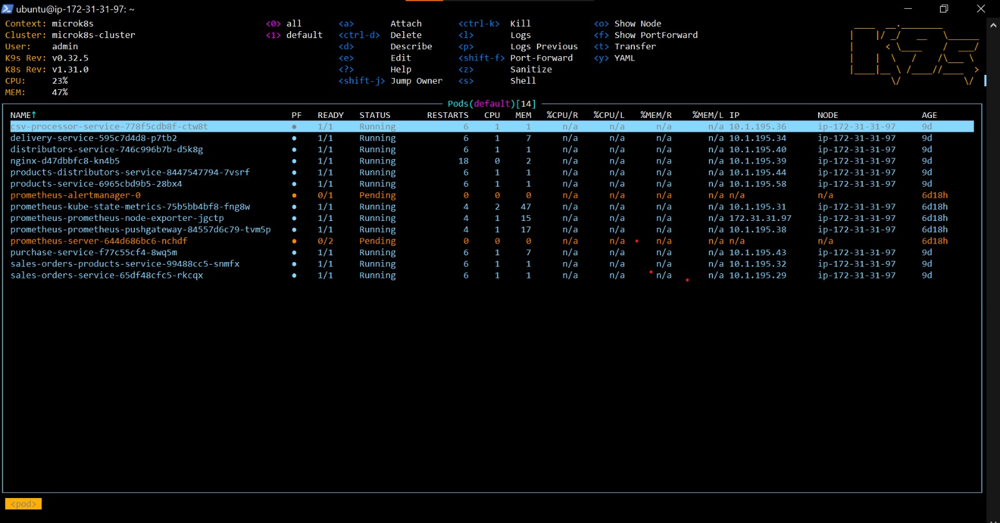
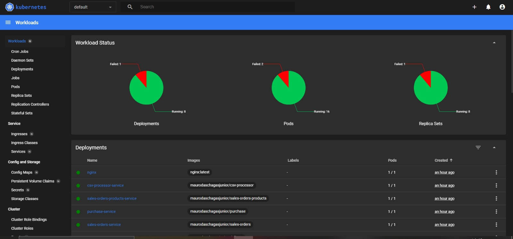

<div align="justify">

# Definição da Aplicação

&emsp;A conteinerização é fundamental em aplicações modernas, especialmente no contexto de microsserviços, pois permite a criação de ambientes isolados, consistentes e portáteis. Isso facilita o desenvolvimento, a escalabilidade e a manutenção de diversas partes da aplicação de maneira independente, melhorando a eficiência e a gestão de recursos. Este documento visa explicar como as tecnologias de conteinerização Docker e de orquestração Kubernetes (K8) foram usadas no projeto.

## Docker

&emsp;Docker é uma plataforma de conteinerização que permite empacotar uma aplicação e suas dependências em um contêiner, garantindo que ela seja executada da mesma forma em qualquer ambiente.

### Docker - Quarkus

&emsp;O framework Quarkus, por ser _kube-native_, já otimiza a criação de contêineres para ambientes Kubernetes. Ele gera automaticamente os _dockerfiles_ necessários, simplificando o processo de conteinerização da aplicação Java, otimizando o tempo de _startup_ e o uso de memória, especialmente em ambientes _cloud-native_.

&emsp;Existem diferentes _back-ends_ desenvolvidos para esse projeto, eles podem ser encontrados dentro da pasta `src/backend`. Os sistemas desenvolvidos utilizando a linguagem Java e o _framework_ Quarkus podem ser encontrados nos diretórios `monoquarkus` e `microjava`, sendo esses, respectivamente, uma aplicação monolítica e um sistema baseado na arquitetura de _microservices_. Os _dockerfiles_ podem ser encontrados dentro dos diretórios das aplicações nos caminhos `src/main/docker`. É válido ressaltar que no caso dos microsserviços, deve-se entrar em cada um para localizar suas pastas `src`. 

&emsp;O Quarkus gera automaticamente quatro arquivos Docker, cada um com uma finalidade específica:
1. **_dockerfile.jvm_**: utilizado para criar uma imagem que executa a aplicação em modo JVM. Este arquivo é indicado para quem deseja uma aplicação rápida e compatível com o Java tradicional, otimizando o tempo de startup e o uso de memória.
2. **_dockerfile.legacy-jar_**: gera uma imagem com o formato tradicional do JAR do Java. Este arquivo é útil quando você deseja rodar a aplicação em um ambiente mais próximo de aplicações Java convencionais, sem aproveitar ao máximo as otimizações que o Quarkus oferece.
3. **_dockerfile.native_**: permite criar uma imagem nativa da aplicação usando o GraalVM. Essa imagem tende a ser significativamente menor e mais rápida no tempo de inicialização, o que é ideal para cenários de alta escalabilidade e _cloud-native_, como em ambientes Kubernetes.
4. **_dockerfile.native-micro_**: semelhante ao anterior, mas focado em ambientes extremamente minimalistas. Este arquivo gera uma imagem nativa ainda mais otimizada para uso em microsserviços, com foco em minimizar o uso de recursos e garantir que a aplicação possa escalar rapidamente.

&emsp;Para o projeto em questão, o **_dockerfile_.jvm** foi o principal utilizado, uma vez que oferece uma combinação ideal de facilidade de implementação e desenvolvimento. Este arquivo permite a execução da aplicação em modo JVM, garantindo compatibilidade com o Java tradicional, ao mesmo tempo que proporciona otimizações no tempo de inicialização e no uso de memória. A estrutura do _dockerfile_ aproveita práticas recomendadas, como a separação de camadas, o que acelera o processo de build e reutiliza partes da imagem quando há alterações. Além disso, ele permite a configuração dinâmica de parâmetros da JVM por meio de variáveis de ambiente, o que o torna flexível para diferentes cenários de uso, sem a complexidade adicional de gerar e gerenciar imagens nativas.

### Docker - Go

&emsp;Go é uma excelente escolha para microsserviços por sua eficiência e desempenho. Como linguagem compilada, gera binários rápidos e leves, ideais para garantir o baixo consumo de recursos. Sua concorrência nativa com _goroutines_ facilita a execução simultânea de tarefas, essencial para sistemas distribuídos. A sintaxe simples de Go também torna o desenvolvimento e a manutenção de microsserviços mais ágeis. Ademais, Go se integra perfeitamente com ferramentas como Docker e Kubernetes, otimizando o _deploy_ e a escalabilidade de serviços da nuvem.

&emsp;Assim como a aplicação feita com Quarkus, também há um monolito feito em Go no caminho `src/backend/go` e uma versão com microsserviços `src/backend/microgo`. Ao contrário da solução em Java, os _dockerfiles_ foram feitos manualmente pelos membros do grupo visando o melhor uso possível de memória e eficiência das _builds_. Os arquivos podem ser encontrados na raiz dos diretórios dos respectivos _services_.

## Kubernetes

&emsp;Kubernetes é uma plataforma de orquestração de contêineres que automatiza o gerenciamento, escalabilidade e _deploy_ de aplicações conteinerizadas. No contexto deste projeto, ele foi usado para garantir a alta disponibilidade e escalabilidade dos microsserviços, facilitando o _deploy_ contínuo e o balanceamento de carga.

&emsp;No contexto do projeto, o Kubernetes foi configurado em máquinas da EC2 através do MicroK8s, uma distribuição leve do K8 com possibilidade de uso e integração com diferentes ferramentas. As EC2 foram configuradas para usarem a Amazon Machine Image (AMI) do Ubuntu Server 24.04 LTS (HVM), SSD Volume Type, com tipos de instância variando entre t3.medium e a t3.large. Ao conectar-se na instância, foram utilizados os seguintes comandos para fazer a configuração do ambiente para uso do Kubernetes tanto para os microsserviços feitos em Go quanto em Quarkus:

1. _update_ e _upgrade_ do Ubuntu
```bash
sudo apt-get update && sudo apt-get upgrade -y
```

2. instalação do Docker
```bash
sudo apt-get install -y docker.io
```

3. instalação do Microk8s
```bash
sudo snap install microk8s --classic --channel=1.31
```

4. verificação do funcionamento da distribuição
```bash
sudo microk8s status —wait-ready
```

&emsp;O Kubernetes foi majoritariamente utilizado para as aplicações usando a arquitetura de microsserviços, ou seja, o `microgo` e `microjava`. Para o deploy dessas aplicações, foram utilizados arquivos de _deployment_ que podem ser encontrados nas pastas `deployments` de ambas as aplicações. Esses arquivos definem os recursos desejados para os _pods_, como a imagem do contêiner a ser utilizada, o número de réplicas, as portas expostas e as variáveis de ambiente necessárias para o funcionamento das aplicações. Ademais, também foram configurados arquivos de _horizontal pod autoscaling_ (HPA) para permitir a escalabilidade dinâmica das aplicações com base na utilização de recursos, como a CPU e a memória. Esses arquivos podem ser encontrados na pasta `hpa`.

&emsp;Os deployments foram realizados via comandos `kubectl apply -f`, garantindo que os serviços fossem atualizados automaticamente conforme novas versões das aplicações fossem liberadas.

&emsp;Em adição ao que foi mencionado, ferramentas de gestão e observabilidade também foram configuradas de modo a garantir maior monitoramento sobre os serviços ativos. A observabilidade é crucial em ambientes de microsserviços, pois permite que as equipes identifiquem rapidamente problemas de desempenho, falhas e comportamentos inesperados das aplicações. Para facilitar a gestão e controle dos _pods_, foi utilizado o K9s, uma ferramenta de linha de comando que oferece uma interface interativa e intuitiva para navegar e gerenciar _clusters_ Kubernetes. Com o K9s, é possível visualizar os recursos do _cluster_, realizar operações como criação, atualização e exclusão de _pods_, além de acessar logs em tempo real, tudo isso de forma simplificada.

<div align="center">

<sub>Figura 01: CLI do K9s</sub>



<sup>Fonte: Material produzido pelos próprios autores (2024).</sup>

</div>

&emsp;Em complemento ao K9s, o _dashboard_ do Kubernetes também foi configurado para fornecer uma visão gráfica do estado do _cluster_ e dos recursos. Essa interface web permite monitorar a saúde dos _pods_, visualizar métricas de desempenho e gerenciar os _deployments_ de maneira fácil e visual. Com o _dashboard_, é possível acompanhar o _status_ dos serviços, identificar rapidamente problemas e tomar decisões informadas com base nas informações apresentadas.

<div align="center">

<sub>Figura 02: Tela principal do _dashboard_</sub>



<sup>Fonte: Material produzido pelos próprios autores (2024).</sup>

</div>

&emsp;Essas ferramentas de monitoramento e gestão não apenas melhoram a visibilidade sobre as aplicações em execução, mas também permitem uma resposta mais ágil a incidentes, contribuindo para uma experiência de usuário mais confiável e consistente. Com a implementação de _dashboards_ e alerta, é possível garantir que os serviços atendam aos níveis de desempenho esperados, promovendo a resiliência das aplicações e a colaboração eficaz entre as equipes de desenvolvimento e operações.

</div>