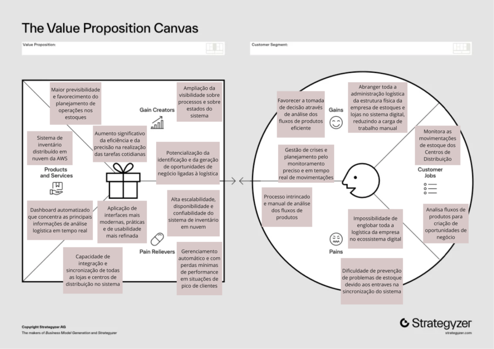
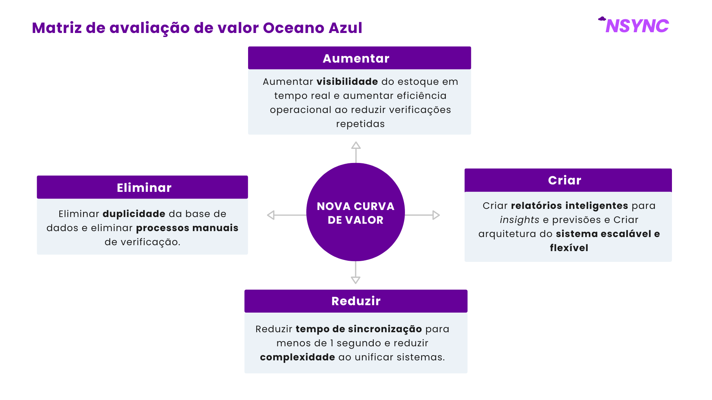
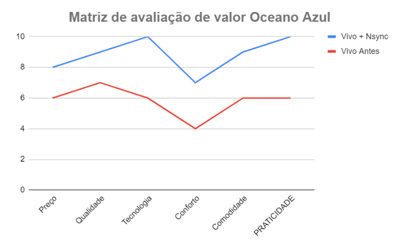
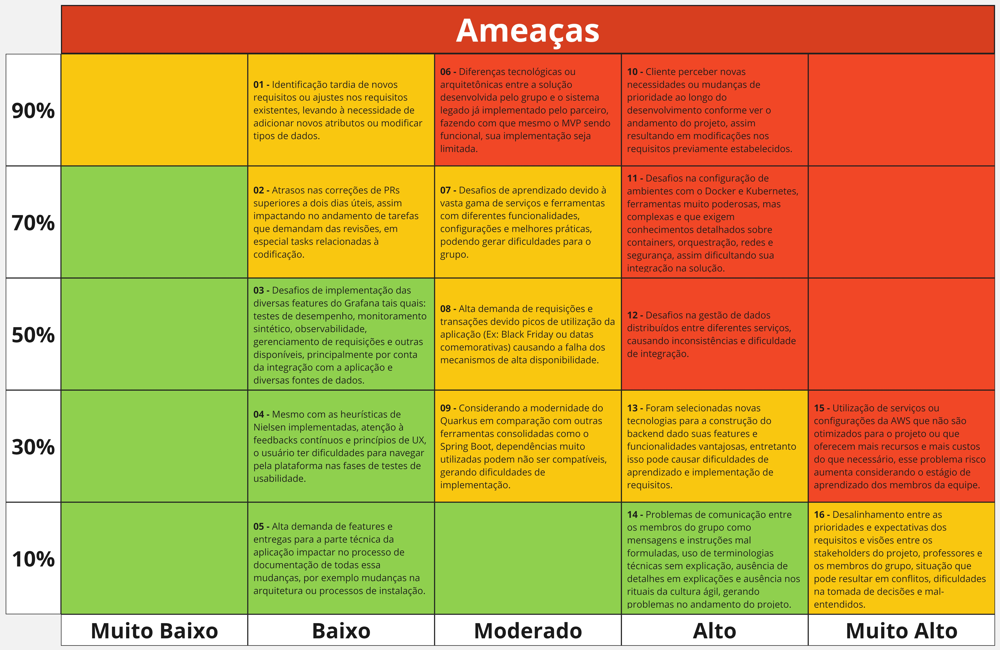
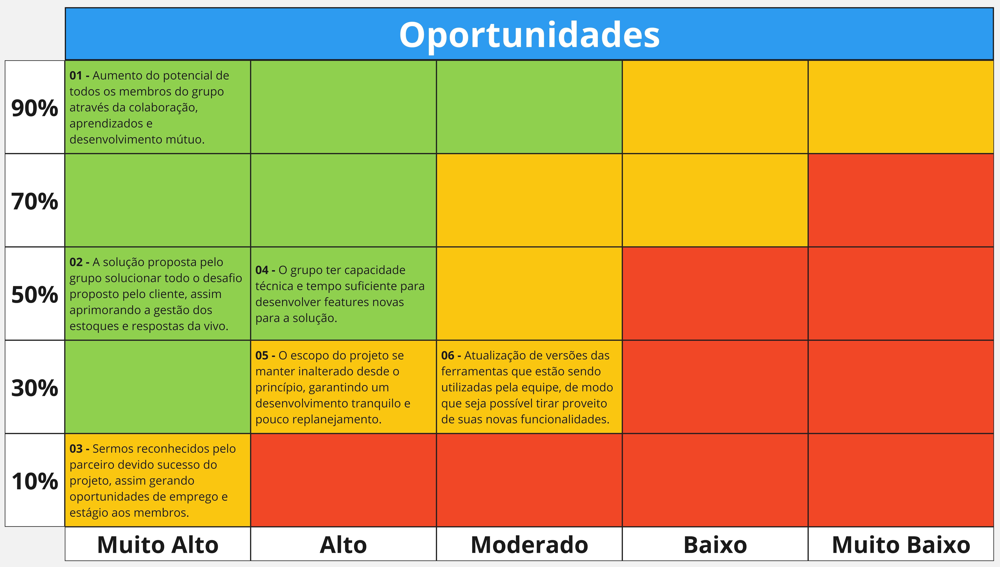

# Entendimento de Negócios

## 1. Canvas de Proposta de Valor

&emsp;A fim de se entregar um produto final alinhado às necessidades do usuário e que atenda aos requisitos de negócio da empresa parceira plenamente, é fundamental mapear os problemas, necessidades e expectativas dos clientes, assim como formular uma proposta de solução satisfatória e viável de acordo com esses dados e os critérios da empresa. Por isso, utilizou-se como ferramenta de desenvolvimento deste projeto o Canvas de Proposta de Valor[[1]](#r1), o qual consiste de duas seções: Perfil do Consumidor ([1.1](#s11)), que concentra essas principais informações referentes ao público-alvo mencionadas, e Mapa de Valor, que apresenta a proposta de valor do produto e como ele resolve a problemática em questão. Abaixo, é demonstrado o diagrama construído representando o Canvas de Proposta de Valor do projeto (figura 01).

Figura 01: Canvas de Proposta de Valor

Fonte: Material produzido pelos próprios autores (2024).

&emsp;A seguir, são detalhadas as informações presentes na imagem acima para fins descritivos, separadas entre os tópicos mencionados na seção Perfil do Consumidor e Mapa de Valor.

### 1.1. Perfil do Consumidor

&emsp;Esta parte do Canvas de Proposta de Valor consiste de três campos: as tarefas do consumidor, as dores e os ganhos, que definem, respectivamente, o que os clientes estão tentando realizar, quais são os entraves nesse processo e os benefícios que eles desejam alcançar ao completá-lo.

#### Tarefas do Consumidor

&emsp;Como tarefas que o usuário precisa realizar, incluiu-se o monitoramento das movimentações de estoque dos centros de distribuições e a análise desses fluxos de produtos para criação de oportunidades de negócios e para planejamento de operações. Esses foram considerados os principais processos do trabalho cotidiano do profissional de logística, persona deste projeto, de acordo com os dados adquiridos nas reuniões com o parceiro de negócios.

#### Dores

&emsp;Identificou-se como dificuldades na realização das tarefas supracitadas os seguintes pontos:

- Processo intrincado e manual de análise de fluxos de produtos, já que o profissional de logística da empresa parceira deste projeto não possui um *dashboard* automatizado e precisa agregar as informações através de plataformas como o SAP ECC, de usabilidade ultrapassada e burocrática;

- Impossibilidade de englobar toda a logística da empresa no ecossistema digital, impedindo a escalabilidade dos serviços ofertados e gerando uma carga de trabalho excessivamente manual para administração eficiente dos centros de distribuição e lojas que estão ainda fora do alcance deste sistema;

- Dificuldade de prevenção de problemas de estoque devido aos entraves na sincronização do sistema de inventário atual, que não permitem a visibilidade do estado atual dos produtos comercializados em tempo real, gerando atrasos e prejudicando a eficiência na tomada de decisão.

#### Ganhos

&emsp;Como ganhos esperados pelo cumprimento eficiente das tarefas do consumidor, são listados:

- Gestão de crises e planejamento eficientes pelo monitoramento preciso e em tempo real de movimentações de produtos dos estoques;

- Favorecer a tomada de decisão através de análise dos fluxos de produtos eficiente, processo que, aliado ao monitoramento das movimentações, gera *insights* valiosos para a equipe de logística e impacta, consequentemente, nos negócios da empresa como um todo;

- Abranger toda a administração logística da estrutura física da empresa de estoques e lojas no sistema digital, reduzindo a carga de trabalho manual neste aspecto da gestão.

### 1.2. Mapa de Valor

&emsp;No Canvas de Proposta de Valor, o Mapa de Valor busca explicitar o que é a solução desenvolvida e como ela pretende sanar as dores apresentadas pelos clientes. Isso é explicado através de três outros campos: produtos e serviços, aliviadores de dor e criadores de ganho, que contêm, respectivamente, o que será ofertado para o cliente como solução, como esse produto ou serviço pretende mitigar as dores do consumidor e como ele cria os ganhos desejados pelo público. 

#### Produtos e serviços

&emsp;Como resultado do desenvolvimento deste projeto, serão ofertados à empresa parceira um sistema de inventário distribuído em nuvem, que usufrui dos serviços da AWS (Amazon Web Services), e um *dashboard* automatizado que concentra as principais informações de análise logística em tempo real.

#### Aliviadores de dor

&emsp;Dentre os processos aliviadores das dores dos clientes agregados aos produtos mencionados acima, destacam-se:

- Aplicação de interfaces mais modernas, práticas e com usabilidade refinada, considerando os sistemas atualmente utilizados pelos profissionais de logística, como o SAP ECC, mitigando, dessa forma, os problemas relacionados à análise de fluxos de produtos

- Capacidade de integração e sincronização de todas as lojas e centros de distribuição no sistema de inventário distribuído, garantindo a escalabilidade desejada e reduzindo a carga de trabalho manual;

- Alta escalabilidade, disponibilidade e confiabilidade do sistema de inventário em nuvem, garantidas não só pela equipe desenvolvedora como também pela própria AWS, atenuando a maioria das dores apontadas anteriormente no Perfil do Consumidor.

- Gerenciamento automático e com perdas mínimas de performance em situações de pico de clientes, reduzindo as chances de problemas referentes à falta de produtos em estoque e efetuação de vendas de produtos já esgotados.

#### Criadores de ganho

&emsp;Como criadores dos ganhos almejados pelos consumidores, são elencados:

- Maior previsibilidade e favorecimento do planejamento de operações nos estoques, de acordo com o aumento da visibilidade sobre as movimentações de comércio de produtos pela implementação do *dashboard*;

- Aumento significativo da eficiência e da precisão na realização das tarefas cotidianas, conforme a potencialização do monitoramento e das análises dos fluxos de produtos pelo *dashboard* oferecido, assim como pela inserção de todos os centros de distribuição e lojas no ecossistema digital de gerenciamento de inventário.   

- Ampliação da visibilidade sobre processos e sobre estado do sistema, consoante às informações agregadas pelo *dashboard* em tempo real e às técnicas de tratamento de erros aplicadas no sistema de inventário distribuído construído.

- Potencialização da identificação e da geração de oportunidades de negócio ligadas à logística, consequência direta do aumento da visibilidade sobre os processos e o favorecimento das análises de fluxos mencionadas.

## 2. Matriz Oceano Azul

&emsp;A **Matriz de Avaliação de Valor Oceano Azul** é uma ferramenta estratégica desenvolvida no contexto da estratégia de Oceano Azul, que visa criar um novo espaço de mercado e tornar a concorrência irrelevante. Este conceito, introduzido por W. Chan Kim e Renée Mauborgne em seu livro "Blue Ocean Strategy", enfatiza a inovação e a diferenciação em vez de competir diretamente em mercados saturados. 

&emsp;A matriz permite que as empresas analisem e reavaliem os atributos de seu produto ou serviço em comparação com a concorrência, visando identificar áreas onde podem reduzir custos, eliminar atributos desnecessários, aumentar características valiosas e criar novos atributos que não são oferecidos pelo mercado atual. Esse processo ajuda a destacar a proposta de valor única de uma empresa e a definir estratégias que a diferenciem significativamente dos concorrentes.

&emsp;Para o projeto de desenvolvimento do **Sistema de Inventário Distribuído** da Nsync — equipe composta por alunos de Ciência da Computação do Inteli — para a Vivo, a avaliação da Matriz de Valor Oceano Azul é fundamental por várias razões. A matriz ajuda a identificar oportunidades de diferenciação, permitindo que se analisem as áreas onde o sistema atual da Vivo pode ser aprimorado ou onde a proposta da Nsync pode oferecer um valor superior, garantindo que a solução desenvolvida não apenas resolva problemas existentes, mas também crie um diferencial significativo no mercado. 

&emsp;Além disso, a análise de "Reduzir" e "Eliminar" permite identificar atributos ou processos que podem ser simplificados ou eliminados, o que pode reduzir custos operacionais e melhorar a eficiência, possibilitando. Já a avaliação de "Aumentar" contribui para a maximização das características que agregam mais valor ao cliente, como a confiabilidade dos dados e a visibilidade em tempo real do estoque, melhorando a experiência do usuário. Por fim, o aspecto de "Criar" possibilita a introdução de atributos inovadores que não estão presentes na oferta atual, oferecendo assim uma vantagem competitiva. A seguir, estão elencadas as ações específicas para "Reduzir", "Eliminar", "Aumentar" e "Criar" que foram identificadas para garantir que a solução proposta se destaque e agregue valor superior em relação ao sistema atual.

Figura 02: Matriz de Avaliação de valor Oceano Azul

Fonte: Material produzido pelos próprios autores (2024).

### 2.1. Reduzir

**Tempo de Sincronização dos Dados (Vivo Antes: 3 segundos)**
- **Vivo Antes:** O sistema atual sincroniza os dados a cada mudança de aba, levando 3 segundos para verificar a disponibilidade do produto em estoque.
- **Nsync:** Com a nova solução, o tempo de sincronização será significativamente reduzido através da unificação das bases de dados, removendo a necessidade de múltiplos processamentos.

**Custo Operacional (Vivo Antes: Alto)**
- **Vivo Antes:** O custo de manutenção e operação de dois sistemas distintos (base própria e sistema legado SAP) é elevado.
- **Nsync:** Ao unificar os sistemas, o custo operacional é reduzido, uma vez que não haverá duplicidade de processos e integração complexa entre plataformas.

### 2.2. Eliminar
**Múltiplas Bases de Dados (Vivo Antes: 2 sistemas)**
- **Vivo Antes:** A Vivo utiliza uma base própria e um sistema legado SAP, o que causa redundância e aumento de complexidade.
- **Nsync:** A solução da Nsync elimina a necessidade de manter dois sistemas diferentes, substituindo-os por uma única plataforma integrada.

**Processamento Manual de Arquivos (Vivo Antes: Presente)**
- **Vivo Antes:** Há a necessidade de processamento manual de arquivos de dados para sincronizar informações entre sistemas.
- **Nsync:** A automação completa do processo de sincronização elimina essa necessidade, reduzindo erros e melhorando a eficiência.

### 2.3. Aumentar

**Confiabilidade dos Dados (Vivo Antes: Moderada)**
- **Vivo Antes:** A confiabilidade dos dados é moderada, devido às discrepâncias causadas pela falta de sincronização em tempo real.
- **Nsync:** A confiabilidade será aumentada, com a sincronização em tempo real garantindo que o estoque sempre reflita a realidade.

**Escalabilidade do Sistema (Vivo Antes: Limitada)**
- **Vivo Antes:** A escalabilidade do sistema é limitada, com dificuldades de suportar grandes volumes de transações e múltiplas lojas.
- **Nsync:** A escalabilidade será aumentada para permitir a gestão eficiente de 1800 lojas e mais de 104 mil variações de itens.

### 2.4. Criar

**Visibilidade em Tempo Real (Vivo Antes: Limitada)**
- **Vivo Antes:** A visibilidade do estoque em tempo real é limitada, o que afeta a tomada de decisões e a gestão logística.
- **Nsync:** A criação de relatórios detalhados oferece maior visibilidade para a equipe de logística, permitindo uma melhor gestão do estoque.

**Sistema Unificado de Gestão de Estoques (Vivo Antes: Inexistente)**
- **Vivo Antes:** Não há um sistema unificado que integre todas as operações de estoque e vendas em uma única plataforma.
- **Nsync:** A criação de um sistema unificado permitirá que todas as operações de estoque sejam gerenciadas de forma centralizada e simplificada.

### Resumo da Matriz de Avaliação de Valor Oceano Azul:

| **Atributo**                            | **Reduzir**                                         | **Eliminar**                                    | **Aumentar**                                          | **Criar**                                               |
|-----------------------------------------|----------------------------------------------------|------------------------------------------------|------------------------------------------------------|---------------------------------------------------------|
| Tempo de Sincronização                  | Reduzir para menos de 1 segundo                     |                                                  |                                                      |                                                         |
| Dependência de Sistemas Legados         | Reduzir complexidade ao unificar sistemas           |                                                  |                                                      |                                                         |
| Duplicidade de Bases de Dados           |                                                    | Eliminar duplicidade                             |                                                      |                                                         |
| Processos Manuais para Verificação      |                                                    | Eliminar processos manuais                       |                                                      |                                                         |
| Visibilidade do Estoque em Tempo Real   |                                                    |                                                  | Aumentar visibilidade em tempo real                   |                                                         |
| Eficiência Operacional                  |                                                    |                                                  | Aumentar eficiência ao reduzir verificações repetidas |                                                         |
| Relatórios Inteligentes de Gerenciamento  |                                                    |                                                  |                                                      | Criar relatórios inteligentes para *insights* e previsões   |
| Escalabilidade e Flexibilidade do Sistema |                                                    |                                                  |                                                      | Criar arquitetura escalável e flexível                  |

---

### 2.5. Avaliação de atributos

&emsp;Ao aplicar a Matriz de Avaliação de Valor Oceano Azul, é possível visualizar, através de gráficos, onde a proposta da Nsync se destaca em comparação com o sistema atual da Vivo. Essa comparação não apenas ajuda a identificar os pontos fortes da nova solução, mas também permite decisões informadas sobre onde focar os esforços de desenvolvimento para maximizar a proposta de valor. A abordagem é benéfica porque fornece uma visão objetiva das melhorias esperadas, evidenciando como as mudanças propostas podem impactar positivamente a experiência do cliente e diferenciar a solução no mercado.

&emsp;Para esta análise, selecionamos seis atributos críticos que são importantes para a avaliação da proposta de valor: Preço, Qualidade, Tecnologia, Conforto, Comodidade e Praticidade. Os valores atribuídos a cada atributo refletem a percepção da proposta da Nsync (Vivo + Nsync) em comparação com o sistema atual da Vivo (Vivo Antes). A decisão dos valores foi baseada na análise das funcionalidades, benefícios e melhorias que a nova solução trará, considerando tanto a perspectiva dos usuários finais quanto as melhorias operacionais esperadas.

**Comparação dos Atributos**

&emsp;O gráfico abaixo (figura 03) apresenta a comparação entre os atributos do sistema proposto pela Nsync e o sistema atual da Vivo:

Figura 03: Gráfico - Matriz de Avaliação de valor Oceano Azul

Fonte: Material produzido pelos próprios autores (2024).

&emsp;A análise dos valores demonstra que a proposta da Nsync oferece uma vantagem competitiva significativa em relação ao sistema atual da Vivo, com melhorias notáveis em tecnologia, qualidade e praticidade. Esses atributos são essenciais para garantir uma melhor experiência para os usuários e atender de forma mais eficaz às necessidades do mercado.

### 2.6. Conclusão

&emsp;Portanto, infere-se que, a Matriz de Avaliação de Valor Oceano Azul proporciona uma estrutura clara para reavaliar e inovar a proposta de valor do sistema de inventário, garantindo que a solução da Nsync não só atenda às necessidades da Vivo, mas também se destaque significativamente no mercado, criando novas oportunidades e valor para todas as partes envolvidas.

## 3. Matriz de Riscos

&emsp;A matriz de risco é uma ferramenta essencial para avaliar a probabilidade de ocorrência de eventos e medir seus potenciais impactos, ou seja, como esses eventos poderiam afetar o ambiente de trabalho e o andamento de um projeto ou ação. Ademais, a matriz permite identificar e aproveitar oportunidades que podem surgir durante o desenvolvimento da solução, promovendo uma preparação adequada através da conscientização e organização prévia. Em termos de formato, a matriz de riscos é geralmente representada por uma tabela que relaciona a probabilidade de um evento ocorrer com seu possível impacto. Quanto maior a probabilidade e o impacto, maior deve ser o esforço de planejamento para lidar de maneira eficaz com a situação.

&emsp;Essa ferramenta de negócios é crucial para incentivar a reflexão e compreensão sobre os riscos e oportunidades que podem surgir ao longo do processo de desenvolvimento da solução. A matriz abrange tanto questões diretamente relacionadas ao MVP (_Minimum Viable Product_) quanto fatores que impactam o processo de construção do produto, como problemas internos de organização, falhas na comunicação, imprevistos externos ao projeto, entre outras situações que podem gerar impactos negativos (no caso das ameaças) ou positivos (no caso das oportunidades). Para cada ameaça identificada, foi elaborado um plano de ação visando facilitar a superação dessas dificuldades. Da mesma forma, foram traçadas estratégias para aproveitar ao máximo as oportunidades identificadas.

### 3.1. Ameaças

&emsp;Com o intuito de mapear as principais ameaças que podem acontecer no projeto, a matriz abaixo foi desenvolvida (figura 04). É válido ressaltar que, para facilitar a visualização, apenas as ameaças foram mapeadas, oportunidades estão contempladas na próxima sessão.

Figura 04: Matriz de Riscos (Ameaças)

Fonte: Material produzido pelos próprios autores (2024).

&emsp;A matriz acima apresenta 16 ameaças mapeadas pelo grupo, abaixo todas estão detalhadas e com suas respectivas estratégias de contenção.

**01 - Identificação tardia de novos requisitos ou ajustes nos requisitos existentes, levando à necessidade de adicionar novos atributos ou modificar tipos de dados.**

&emsp;Durante o desenvolvimento de software, é comum surgirem necessidades de realizar adaptações nas estruturas de dados para melhor atender aos requisitos do projeto. Isso pode incluir ajustes na modelagem do banco de dados, alteração de tipos de dados ou inclusão de novos campos para capturar informações adicionais.

&emsp;Essa situação pode acontecer devido a solicitações de mudanças por parte do cliente para a inclusão de novas funcionalidades que afetem diretamente nos esquemas e modelagens de dados definidos anteriormente. Ao longo do desenvolvimento, pode-se notar ineficiência nos processos e modelagens inicialmente definidos, sendo necessária uma refatoração dos atributos e seus tipos para melhor atender às demandas do parceiro.

&emsp;Pensando em prevenir essa ameaça, é de suma importância realizar revisões regulares dos requisitos e modelagens com a equipe de desenvolvimento e _stakeholders_ para identificar e planejar possíveis mudanças antes que o desenvolvimento esteja muito avançado. Considerando que ela aconteça, é importante manter uma documentação atualizada da estrutura de dados utilizada no projeto, além das mudanças necessárias com suas respectivas justificativas. Em adição, a implementação de migrações automatizadas da base de dados pode ser uma boa estratégia para agilizar o processo de mudança, além de uma arquitetura genérica e bem modularizada do lado do _back-end_, o que vai garantir pouca reescrita de código para as mudanças iminentes.

**02 - Atrasos nas correções de _pull requests_ (PRs) superiores a dois dias úteis, assim impactando no andamento de tarefas que demandam das revisões, em especial _tasks_ relacionadas à codificação.** 

&emsp;Projetos desenvolvidos usando ferramentas de versionamento como Git e Github contêm uma série de vantagens, dentre elas a possibilidade de criação de _pull requests_ que podem ser entendidos como propostas para mesclar alterações de uma _branch_ para outra. É uma boa prática sempre solicitar a revisão de PRs para os membros da equipe. Nesse processo, podem acontecer imprevistos que impeçam ou atrasem que os membros do grupo corrijam as atividades em tempo razoável.

&emsp;Além de possíveis imprevistos pessoais que podem acontecer durante o processo de desenvolvimento, outros problemas ligados ao projeto podem ocorrer como uma grande demanda de tarefas, mudanças de escopo e novas conversas com os _stakeholders_ de modo que os esforços precisem ser redirecionados para a conclusão de mais tarefas, enquanto correções e revisões são deixadas de lado.

&emsp;Para prevenir essa ameaça, é importante estabelecer prazos claros para a realização dos *feedbacks* e revisões de PRs. Em adição, é de vital importância promover uma cultura de comunicação aberta e constante entre os membros do grupo. Em casos de atraso, deve-se contar com revisores alternativos para evitar gargalos e atrasos. Além disso, é de suma importância aproveitar os rituais do _agile_ já realizados pela equipe, como a _daily meeting_, para a atualização geral de todos os membros da equipe entre as tarefas que estão fazendo e seus respectivos _status_ e impedimentos.

**03 - Desafios de implementação das diversas _features_ do Grafana tais quais: testes de desempenho, monitoramento sintético, observabilidade, gerenciamento de requisições e outras disponíveis, principalmente por conta da integração com a aplicação e diversas fontes de dados.**

&emsp;A implementação de um sistema de monitoramento eficaz, como o Grafana, pode ser desafiadora, especialmente se a equipe ainda não tem experiência prévia com a ferramenta ou se há múltiplas fontes de dados para integrar. A configuração inadequada pode resultar em falhas no monitoramento e na coleta de dados críticos para o projeto.

&emsp;Para mitigar essa ameaça, é interessante que os membros da equipe se organizem para estudar e compreender o Grafana com antecedência, além de aproveitar o auxílio dos professores para a compreensão da ferramenta e como ela pode ser utilizada no contexto do projeto. Em relação ao processo de desenvolvimento dessas visualizações de dados, sessões de "_pair programming_" também podem ser realizadas entre os membros responsáveis por essa tarefa.

**04 - Mesmo com as heurísticas de Nielsen implementadas, atenção à *feedbacks* contínuos e princípios de UX, o usuário ter dificuldades para navegar pela plataforma nas fases de testes de usabilidade.**

&emsp;Apesar da implementação das heurísticas de Nielsen e da aplicação de princípios de UX, é possível que os usuários ainda encontrem dificuldades para navegar pela plataforma durante as fases de testes de usabilidade. Isso pode acontecer por vários motivos, incluindo a complexidade inerente do sistema, a falta de familiaridade dos usuários com o domínio ou mesmo falhas na interpretação e aplicação dos *feedbacks* anteriores.

&emsp;Essa dificuldade pode surgir quando o design, embora tecnicamente correto, não leva em conta o contexto real de uso ou as expectativas dos usuários finais. Em situações onde a interface apresenta uma curva de aprendizado elevada ou onde os fluxos de navegação não são intuitivos, mesmo uma aplicação rigorosa das heurísticas pode não ser suficiente para garantir uma experiência de usuário fluida.

&emsp;Para reduzir esse risco, é essencial realizar testes de usabilidade em várias iterações, com diferentes perfis de usuários, garantindo uma amostra diversificada. Esses testes devem ser conduzidos em ambientes que reflitam as condições reais de uso, possibilitando a identificação de problemas que possam não ter sido captados em fases anteriores. Além disso, é importante analisar cuidadosamente os _feedbacks_ recebidos e estar preparado para revisitar e ajustar aspectos do _design_, mesmo que eles pareçam estar conforme as melhores práticas. Documentar essas descobertas e as modificações realizadas pode ajudar a manter um ciclo de melhoria contínua, alinhando ainda mais o produto às necessidades e expectativas dos usuários finais.

**05 - Alta demanda de _features_ e entregas para a parte técnica da aplicação impactar no processo de documentação de todas essa mudanças, por exemplo mudanças na arquitetura ou processos de instalação.** 

&emsp;Quando há uma alta demanda por novas _features_ e entregas rápidas, especialmente em aspectos técnicos da aplicação, o processo de documentação pode ser comprometido. Isso inclui a atualização de informações críticas, como mudanças na arquitetura do sistema ou nas instruções de instalação. A pressão para implementar rapidamente as novas funcionalidades podem levar a uma documentação superficial ou até mesmo inexistente, dificultando a manutenção e a escalabilidade futura do sistema.

&emsp;Essa vulnerabilidade é comum em projetos onde os prazos são apertados e há uma priorização das entregas técnicas sobre a documentação. Além disso, equipes que não possuem recursos dedicados para a documentação ou que não integram essa atividade no fluxo de trabalho diário correm um risco ainda maior de acumular dívida técnica. Essa situação pode resultar em dificuldades na compreensão das mudanças por novos membros da equipe, na replicação de ambientes de desenvolvimento ou até mesmo na implementação de correções e melhorias.

&emsp;Uma possível estratégia para contornar essa situação é implementar processos que integrem a documentação ao ciclo de desenvolvimento, como exigências de documentação para a conclusão de tarefas ou revisões. A alocação de tempo especificamente para a atualização da documentação pode garantir que ela esteja sempre em dia. Ademais, ferramentas de automação podem ser utilizadas para documentar mudanças técnicas automaticamente, como as alterações na arquitetura ou nos processos de instalação. Em caso de alta demanda, a priorização de tarefas deve considerar o impacto da falta de documentação e alocar recursos suficientes para garantir que essa atividade seja devidamente realizada.

**06 - Diferenças tecnológicas ou arquitetônicas entre a solução desenvolvida pelo grupo e o sistema legado já implementado pelo parceiro, fazendo com que mesmo o MVP sendo funcional, sua implementação seja limitada.** 

&emsp;A integração de uma solução moderna com um sistema legado pode enfrentar obstáculos significativos devido às diferenças tecnológicas ou arquitetônicas entre as duas plataformas. Essas diferenças podem envolver desde incompatibilidades de linguagem de programação, frameworks e bibliotecas até divergências nos padrões de comunicação entre os sistemas. Mesmo que o MVP seja funcional por si só, essas discrepâncias podem limitar sua implementação, restringindo o aproveitamento pleno da solução desenvolvida.

&emsp;Este risco é comum em cenários onde o sistema legado utiliza tecnologias mais antigas ou altamente customizadas, que não são compatíveis com as soluções modernas que o grupo desenvolveu. Por exemplo, a nova solução pode não ser capaz de se comunicar de maneira eficaz com o sistema legado, ou pode exigir uma infraestrutura que o sistema existente não suporta. Isso pode levar a dificuldades na integração, a necessidade de retrabalho ou até a limitação das funcionalidades que o MVP pode oferecer dentro do contexto do cliente.

&emsp;Para diminuir essa probabilidade de dano, é crucial realizar uma análise técnica detalhada do sistema legado logo no início do projeto, identificando todas as possíveis incompatibilidades e definindo uma estratégia de integração que leve em conta essas restrições. Se necessário, o grupo pode precisar adaptar a solução para que ela seja compatível com o ambiente existente, mesmo que isso signifique simplificar certas funcionalidades ou ajustar a arquitetura proposta. A comunicação contínua com o parceiro é vital para garantir que as expectativas sejam alinhadas e que as soluções propostas sejam viáveis dentro do contexto tecnológico existente. Além disso, a criação de protótipos e a realização de testes de integração em fases iniciais do desenvolvimento podem ajudar a identificar e resolver problemas antes que eles se tornem bloqueios significativos.

**07 - Desafios de aprendizado devido à vasta gama de serviços e ferramentas da AWS, todos com diferentes funcionalidades, configurações e melhores práticas, podendo gerar dificuldades para o grupo.**

&emsp;A _Amazon Web Services_ (AWS) oferece uma ampla gama de serviços e ferramentas, o que, embora poderoso, pode representar um desafio significativo para equipes que não têm familiaridade prévia com essa plataforma. A vasta quantidade de recursos disponíveis pode resultar em uma curva de aprendizado íngreme, exigindo um esforço considerável para que os membros da equipe adquiram o conhecimento necessário para utilizar esses serviços de forma eficaz e segura.

&emsp;Esse risco é particularmente relevante em projetos onde a AWS desempenha um papel central na infraestrutura e no desenvolvimento, mas onde a equipe pode não ter experiência prévia ou suficiente com a plataforma. A necessidade de entender e aplicar conceitos como redes, segurança, escalabilidade e automação na AWS pode sobrecarregar os membros da equipe, levando a atrasos e possíveis falhas na implementação se o tempo de aprendizado não for adequadamente planejado.

&emsp;Para lidar com esse problema, é importante planejar um período dedicado ao treinamento e capacitação da equipe, priorizando os serviços e ferramentas da AWS que serão mais relevantes para o projeto. Recursos como treinamentos oficiais da AWS, cursos online e documentação detalhada devem ser utilizados para acelerar o processo de aprendizagem. Ademais, o suporte dos professores de programação, principalmente os mais direcionados aos tópicos técnicos de como utilizar os serviços da nuvem, pode ser uma forma eficaz para guiar a equipe nas melhores práticas e ajudar a resolver dúvidas mais complexas. Caso dificuldades persistam, é importante revisar as atribuições e responsabilidades dentro da equipe, permitindo que membros mais experientes lidem com tarefas mais críticas enquanto os demais continuam seu processo de aprendizado.

**08 - Falha na implementação de mecanismos de alta disponibilidade, assim levando à indisponibilidade do sistema sob alta demanda.**

&emsp;Em períodos de grande demanda, como a Black Friday ou outras datas comemorativas, é comum que as aplicações enfrentem picos significativos de requisições e transações. Esses picos podem sobrecarregar os mecanismos de alta disponibilidade implementados, levando a falhas no sistema, indisponibilidade temporária ou redução da performance, o que pode afetar negativamente a experiência do usuário e resultar em perda de receita.

&emsp;Esse risco é particularmente relevante para aplicações que lidam com um grande volume de usuários ou transações em períodos específicos, onde a infraestrutura deve ser capaz de escalar rapidamente para atender à demanda. No entanto, mesmo com mecanismos de alta disponibilidade em vigor, como balanceamento de carga e réplicas de banco de dados, a súbita e elevada carga pode expor pontos fracos na arquitetura, resultando em falhas que comprometem a operação da aplicação.

&emsp;Para mitigar essa siuação, é essencial realizar testes de carga e estresse regularmente, simulando cenários de pico de utilização para identificar possíveis gargalos e falhas nos mecanismos de alta disponibilidade antes que ocorram em produção. A implementação de arquiteturas escaláveis e redundantes, como a utilização de serviços de nuvem com capacidade de escalonamento automático (_auto-scaling_), pode ajudar a absorver os picos de demanda. Além disso, monitoramento em tempo real e alertas podem permitir uma resposta rápida em caso de falhas iminentes, garantindo que a equipe técnica possa agir o mais rápido possível. Planejar e testar contingências, como servidores de reserva ou _backups_ adicionais, também pode ser uma estratégia eficaz para garantir a continuidade do serviço mesmo em momentos de alta pressão.

**09 - Considerando a modernidade do Quarkus em comparação com outras ferramentas consolidadas como o Spring Boot, dependências muito utilizadas podem não ser compatíveis, gerando dificuldades de implementação.**

&emsp;O Quarkus é uma tecnologia relativamente nova no ecossistema Java, oferecendo uma abordagem moderna e otimizada para a criação de aplicações em nuvem nativas e de alto desempenho. No entanto, devido à sua modernidade em comparação com _frameworks_ mais consolidados, como o Spring Boot, pode haver problemas de compatibilidade com algumas dependências amplamente utilizadas. Isso pode gerar dificuldades durante a implementação, especialmente se o projeto depender de bibliotecas ou extensões que ainda não foram totalmente adaptadas para funcionar com o Quarkus.

&emsp;Tal risco é especialmente relevante para equipes que precisam integrar várias dependências de terceiros em seus projetos. Enquanto o Spring Boot tem um ecossistema maduro com ampla compatibilidade e suporte, o Quarkus, embora inovador, pode ainda não oferecer suporte nativo ou adequado para todas as bibliotecas que a equipe pretende utilizar. Isso pode resultar em problemas como falhas de compilação, funcionalidades ausentes ou a necessidade de buscar alternativas que podem não ser tão bem documentadas ou suportadas.

&emsp;Para reverter esse possível cenário, é importante realizar uma análise detalhada das dependências necessárias para o projeto antes de escolher o Quarkus como a base do _back-end_. Ferramentas como listas de compatibilidade e a documentação oficial do Quarkus devem ser consultadas para verificar se as bibliotecas críticas são suportadas. Ademais, a equipe pode optar por utilizar extensões e dependências específicas do Quarkus, projetadas para oferecer compatibilidade com as melhores e principais bibliotecas Java, além de serem otimizadas para usarem o máximo das _features_ do _framework_, assim garantindo o Java subatômico e subsônico de alta performance para ambientes em _cloud_.

**10 - Cliente perceber novas necessidades ou mudanças de prioridade ao longo do desenvolvimento conforme ver o andamento do projeto, assim resultando em modificações nos requisitos previamente estabelecidos.**

&emsp;Durante o desenvolvimento de um projeto, é comum que o solicitante, ao acompanhar o progresso das entregas, identifique novas necessidades ou mude as prioridades em relação às funcionalidades inicialmente definidas. Isso pode levar a alterações nos requisitos previamente acordados, impactando o cronograma, o escopo e até mesmo os recursos alocados para o projeto.

&emsp;Esse risco é frequentemente observado em projetos de longa duração ou em ambientes onde as condições de mercado e as expectativas dos usuários finais podem mudar rapidamente. A descoberta de novas oportunidades ou a identificação de limitações nas funcionalidades já desenvolvidas pode motivar as partes interessadas a solicitar ajustes ou novas funcionalidades, o que pode resultar em retrabalho, aumento de custos e prazos, e comprometer a entrega final dentro do escopo originalmente acordado.

&emsp;Uma estratégia para lidar com isso é estabelecer um processo de gestão de mudanças claro e acordado com os _stakeholders_ desde o início do projeto. Isso inclui a definição de critérios para avaliar e priorizar novas solicitações, bem como a comunicação transparente sobre o impacto dessas mudanças no cronograma e nos recursos que serão alocados para atendê-las. A metodologia ágil que já está sendo implementada pelo grupo é uma forma prática de garantir que essa transparência seja cultivada com o parceiro, uma vez que o processo iterativo e de constantes validações permite que mudanças sejam implementadas de maneira controlada e planejada. O bom aproveitamento das _sprints reviews_ é um ótimo modo de garantir que todas as dúvidas sejam sanadas, além de ajudar a alinhar expectativas e identificar alterações necessárias em estágios iniciais, minimizando o impacto no projeto na totalidade. Além disso, manter uma documentação clara e atualizada das mudanças e suas justificativas pode ajudar a gerenciar as expectativas e a evitar surpresas no futuro.

**11 - Desafios na configuração de ambientes com o Docker e Kubernetes, ferramentas muito poderosas, mas complexas e que exigem conhecimentos detalhados sobre containers, orquestração, redes e segurança, assim dificultando sua integração na solução.**

&emsp;Docker e Kubernetes são ferramentas amplamente utilizadas para a criação e gestão de ambientes baseados em _containers_, oferecendo flexibilidade, escalabilidade e eficiência operacional. No entanto, devido à sua complexidade, a configuração correta desses ambientes pode ser desafiadora, especialmente para equipes que não possuem experiência avançada com _containers_, orquestração, redes e segurança. Esses desafios podem dificultar a integração dessas tecnologias na solução desenvolvida, resultando em atrasos, configurações inadequadas ou até mesmo falhas de segurança.

&emsp;Esse risco é relevante em projetos que dependem da utilização de _containers_ para garantir a portabilidade e escalabilidade das aplicações, mas onde a equipe de desenvolvimento pode não ter o conhecimento necessário para configurar e gerenciar esses ambientes de maneira eficaz. As dificuldades podem surgir em várias áreas, como a criação de redes de _containers_ seguras, a configuração de volumes persistentes, a implementação de políticas de segurança robustas, e a orquestração de múltiplos serviços através do Kubernetes.

&emsp;Uma forma de contornar essa situação de forma semelhante ao que foi realizado para os conhecimentos de AWS, é investir na priorização no domínio dos conceitos fundamentais dessas tecnologias, focando em um aprendizado antecipado e misto entre prática e teoria, garantindo o aperfeiçoamento no decorrer do projeto. Em adição ao estudo prévio e contínuo, começar com a implementação de ambientes de desenvolvimento e teste em pequena escala pode ajudar a equipe a ganhar confiança e experiência antes de avançar para a produção. A adoção de _templates_ e ferramentas de automação, como Helm para Kubernetes, pode simplificar a configuração e garantir consistência na implementação. Uma estratégia que já está sendo usada e que pode ser ainda mais aproveitada é o uso de tecnologias já integradas com conceitos de conteinerização, tal qual o framework Quarkus que está sendo usado no _back-end_, além de ferramentas específicas como o AWS EKS adaptado para facilitar a integração e configuração dessa infraestrutura para o projeto de forma robusta e segura.

**12 - Desafios na gestão de dados distribuídos entre diferentes serviços, causando inconsistências e dificuldade de integração.**

&emsp;A gestão de dados distribuídos entre diferentes serviços pode ser uma tarefa complexa, especialmente em arquiteturas de microsserviços ou sistemas que operam em múltiplos ambientes. A distribuição de dados entre serviços distintos pode levar a problemas de consistência, dificultando a integração e sincronização das informações, além de aumentar a complexidade da manutenção e do desenvolvimento contínuo do sistema.

&emsp;Essa ameaça é particularmente relevante em sistemas onde os dados são frequentemente compartilhados ou replicados entre diferentes serviços, cada um possuindo seu próprio banco de dados ou modelo de dados. A falta de sincronização adequada pode resultar em dados desatualizados ou conflitantes, o que pode comprometer a integridade das operações do sistema e a confiabilidade das informações processadas.

&emsp;Para lidar com essa situação, é crucial adotar práticas de gestão de dados robustas e adequadas para ambientes distribuídos. Uma abordagem recomendada é a implementação de estratégias de consistência eventual ou transações distribuídas, onde aplicável, para garantir que os dados permaneçam consistentes entre os serviços. Utilizar ferramentas de orquestração e coordenação, como Apache Kafka ou sistemas de filas de mensagens, pode ajudar a sincronizar dados de maneira mais eficiente. Além disso, é importante definir e seguir padrões claros para o design de APIs e contratos de dados, garantindo que todos os serviços interajam de forma consistente e previsível. A realização de testes rigorosos de integração e a monitoração contínua dos dados em produção são igualmente fundamentais para detectar e corrigir rapidamente quaisquer inconsistências que possam surgir.

**13 - Foram selecionadas novas tecnologias para a construção do _back-end_ dado suas _features_ e funcionalidades vantajosas, entretanto isso pode causar dificuldades de aprendizado e implementação de requisitos.** 

&emsp;A escolha de novas tecnologias para a construção do _back-end_ é muitas vezes motivada pelas vantagens e _features_ inovadoras que elas oferecem, como melhor desempenho, escalabilidade ou funcionalidades específicas que atendem às necessidades do projeto. No entanto, a adoção de tecnologias recentes ou menos conhecidas pode introduzir desafios significativos de aprendizado para a equipe, além de complicar a implementação dos requisitos do projeto, especialmente se a equipe não tiver experiência prévia com essas tecnologias.

&emsp;Esse risco é comum em cenários onde o desejo de aproveitar as vantagens de uma tecnologia de ponta supera a familiaridade da equipe com as ferramentas utilizadas. A curva de aprendizado pode ser íngreme, exigindo tempo adicional para que a equipe adquira as habilidades necessárias. Isso pode resultar em atrasos, erros na implementação ou mesmo em subutilização das funcionalidades da tecnologia escolhida, o que pode comprometer o sucesso do projeto.

&emsp;Do mesmo modo que as outras tecnologias, como AWS e Kubernetes, oferecem desafios de aprendizagem que podem ser contornados a partir do estudo antecipado e compreensão das bases fundamentais dessas ferramentas. A aplicação de protótipos em menor escala pode ser interessante para ampliar a compreensão dos membros da equipe sobre a tecnologia, em especial quando forem realizadas implementações de funcionalidades únicas do _framework_. Em complemento, uma estratégia que pode ser utilizada aproveitando a arquitetura de microsserviços é a construção de partes críticas da aplicação usando linguagens e frameworks mais confortáveis para o grupo, assim garantindo um misto de aprendizado e segurança no desenvolvimento.

**14 - Problemas de comunicação entre os membros do grupo como mensagens e instruções mal formuladas, uso de terminologias técnicas sem explicação, ausência de detalhes em explicações e ausência nos rituais da cultura ágil, gerando problemas no andamento do projeto.** 

&emsp;A comunicação clara e eficaz é essencial para o sucesso de qualquer projeto, especialmente em equipes que adotam a cultura ágil. Problemas de comunicação, como mensagens ou instruções mal formuladas, o uso de terminologias técnicas sem a devida explicação, e a falta de detalhes em explicações, podem causar mal-entendidos, retrabalho e atrasos. Além disso, a ausência de membros da equipe nos rituais ágeis, como _daily stand-ups_, _sprint reviews_ e _retrospectives_, pode resultar em falta de alinhamento, impedindo a identificação e a resolução de problemas de maneira rápida e eficaz.

&emsp;Essa vulnerabilidade é especialmente preocupante em equipes multidisciplinares ou distribuídas, onde a clareza na comunicação é fundamental para garantir que todos os membros estejam na mesma página. Quando a comunicação falha, as tarefas podem ser mal executadas ou incompletas, o que afeta diretamente a qualidade do trabalho e o cumprimento dos prazos. Além disso, a falta de participação nos rituais ágeis compromete a transparência e a colaboração, que são pilares dessa metodologia.

&emsp;Lidar com a comunicação sempre é um desafio para projetos em equipe, para isso é necessário estabelecer normas claras de comunicação dentro da equipe, incluindo a utilização de linguagem acessível e a explicação de termos técnicos sempre que necessário. Incentivar a elaboração de mensagens e instruções detalhadas pode ajudar a evitar mal-entendidos. Além de reforçar a importância da participação ativa nos rituais ágeis, ação essencial para manter o alinhamento e a coesão da equipe. Alguns padrões específicos podem ser utilizados para garantir que o que precisa ser comunicado seja bem expresso, tal qual o uso de uma ferramenta centralizada de comunicação como o Slack, uso de linguagem simples e objetiva, marcações para acionar notificações aos interessados e o cultivo de um ambiente seguro para que os membros da equipe se sintam à vontade para fazer perguntas, pedir esclarecimentos e exporem seus pontos de vista, assim minimizando o problema da comunicação.

**15 - Utilização de serviços ou configurações da AWS que não são otimizados para o projeto ou que oferecem mais recursos e mais custos do que necessário, esse problema aumenta considerando o estágio de aprendizado dos membros da equipe.** 

&emsp;A equipe pode escolher serviços ou configurações da AWS que não se alinham perfeitamente com as necessidades do projeto, devido à falta de experiência dos membros da equipe com as ferramentas da AWS. Essa situação pode resultar em opções que oferecem mais recursos do que o necessário, levando a um aumento significativo nos custos operacionais do projeto. Além disso, serviços e configurações não otimizados podem gerar uma sobrecarga administrativa e complexidade no gerenciamento da infraestrutura.

&emsp;O impacto desse risco pode ser substancial, uma vez que os custos excessivos podem afetar o orçamento do projeto e comprometer os recursos disponíveis para outras áreas. A falta de otimização pode também acarretar dificuldades na administração dos recursos, o que pode atrasar o desenvolvimento e a entrega do projeto.

&emsp;Da mesma forma que os aprendizados para todas as tecnologias novas envolvidas no projeto terão que ser priorizados e feitos com antecedência e planejamento, os conhecimentos relacionados a precificação e otimização de custos são de suma importância e deverão ser uma das principais prioridades do projeto. Uma estratégia interessante com certeza será tirar constantes dúvidas com os professores responsáveis pela matéria de computação em nuvem, principalmente aproveitando suas experiências de trabalho em grandes corporações que utilizam amplamente tais serviços e precisam otimizar custos ao máximo. Além disso, realizar refatorações constantes no código visando maior performance e clareza dos processos é vital para garantir um bom uso dos recursos computacionais de _cloud computing_.

**16 - Desalinhamento entre as prioridades e expectativas dos requisitos e visões entre os stakeholders do projeto, professores e os membros do grupo, situação que pode resultar em conflitos, dificuldades na tomada de decisões e mal-entendidos.**

&emsp;Pode ocorrer um desalinhamento entre as prioridades e expectativas dos requisitos entre as partes interessadas do projeto, professores e membros do grupo, resultando de diferentes entendimentos ou visões sobre o que é mais importante para o projeto. Esse desalinhamento pode levar a conflitos e mal-entendidos, afetando a qualidade e o progresso do trabalho. Quando as partes envolvidas têm visões divergentes, a tomada de decisões dificulta-se e pode atrasar o projeto.

&emsp;O impacto desse problema pode incluir atrasos significativos, dificuldades na coordenação das atividades e potencial comprometimento dos objetivos do projeto. Conflitos entre _stakeholders_ e membros do grupo podem prejudicar a coesão da equipe e a eficácia do desenvolvimento, gerando um ambiente de trabalho menos produtivo e harmonioso.

&emsp;Para atenuar esse risco, é crucial estabelecer uma comunicação clara e contínua entre todas as partes envolvidas. Realizar reuniões regulares para alinhar expectativas e revisar os requisitos pode ajudar a manter todos os _stakeholders_ na mesma página. Além disso, documentar e revisar constantemente as prioridades e expectativas pode facilitar a identificação e resolução de desalinhamentos antes que se tornem problemas significativos.

### 3.2. Oportunidades

&emsp;Com intuito de mapear as principais oportunidades que podem acontecer no projeto, a matriz abaixo foi desenvolvida (figura 05). É válido ressaltar que para facilitar a visualização, apenas as oportunidades foram mapeadas.

Figura 05: Matriz de Riscos (Oportunidades)

Fonte: Material produzido pelos próprios autores (2024).

&emsp;A matriz acima apresenta 6 oportunidades mapeadas pelo grupo, abaixo todas estão detalhadas e com suas respectivas estratégias de aproveitamento.

**01 - Aumento do potencial de todos os membros do grupo através da colaboração, aprendizados e desenvolvimento mútuo.**

&emsp;Essa oportunidade surge da sinergia que pode ser criada quando todos os membros do grupo colaboram de maneira eficiente. Ao compartilhar conhecimentos, habilidades e experiências, cada membro pode crescer não apenas individualmente, mas também contribuir para o fortalecimento do grupo todo. Esse desenvolvimento mútuo pode levar a uma maior inovação, criatividade e eficiência, resultando em um produto final de maior qualidade.

&emsp;Para aproveitar ao máximo essa oportunidade, o grupo deve instituir uma cultura de *feedback* contínuo e sessões regulares de compartilhamento de conhecimentos, como sessões de _pair programming_ e de _brainstorming_ para discutir _features_ do projeto e/ou ações específicas para solucionar o problema proposto. Atribuir papéis que desafiem as habilidades de cada membro também pode ajudar a promover o crescimento individual, ao mesmo tempo, em que contribui para o sucesso coletivo. Monitorar o progresso individual e do grupo regularmente pode garantir que todos estejam se beneficiando desse ambiente colaborativo.

**02 - A solução proposta pelo grupo solucionar todo o desafio proposto pelo cliente, assim aprimorando a gestão dos estoques e respostas da vivo.**

&emsp;Se a solução desenvolvida pelo grupo atender completamente às necessidades dos interessados no projeto, isso representará uma grande vitória. Não só demonstrará a capacidade técnica e estratégica do grupo, mas também poderá resultar em uma melhoria significativa na eficiência operacional em relação ao sistema previamente usado para a gestão de estoques e na agilidade de resposta e sincronização de informações, desse modo não só resolvendo o problema, mas reforçando a relação e proporcionando novas chances de realizar mais projetos com o mesmo solicitante.

&emsp;Para garantir que essa oportunidade seja maximizada, o grupo deve realizar um mapeamento detalhado das necessidades dos _stakeholders_ e manter uma comunicação constante com eles durante todo o projeto. Testes rigorosos devem ser conduzidos para assegurar que todos os requisitos sejam atendidos. Além disso, é importante coletar *feedback* contínuo das partes interessadas para fazer ajustes em tempo real e garantir que a solução final resolva realmente os problemas propostos.

**03 - Sermos reconhecidos pelo parceiro devido sucesso do projeto, assim gerando oportunidades de emprego e estágio aos membros.**

&emsp;O sucesso do projeto pode abrir portas para todos os membros do grupo, criando oportunidades valiosas de emprego ou estágio. Esse reconhecimento pode não apenas beneficiar individualmente cada membro, mas também elevar a reputação da faculdade como um todo. Ser reconhecido por entregar um projeto de alta qualidade pode atrair a atenção de outros potenciais _leads_, aumentando ainda mais as oportunidades futuras.

&emsp;Para maximizar essa oportunidade, o grupo deve focar na excelência em todas as etapas do projeto, desde a fase de planejamento até a entrega final. Manter a transparência com os _stakeholders_ e demonstrar comprometimento constante pode ajudar a construir uma relação de confiança. Ademais, é importante que cada membro do grupo esteja preparado para comunicar suas habilidades e contribuições ao projeto de forma clara e profissional durante qualquer interação com o parceiro.

**04 - O grupo ter capacidade técnica e tempo suficiente para desenvolver funcionalidades novas para a solução.**

&emsp;Ter a capacidade técnica e o tempo necessário para desenvolver novas funcionalidades além do escopo inicial é uma oportunidade valiosa. Isso não só pode aumentar a robustez e a competitividade da solução, mas também demonstra a capacidade do grupo de inovar e agregar valor ao cliente. Essa flexibilidade pode ser crucial para adaptar a solução às necessidades emergentes do mercado. Um exemplo de funcionalidade nova poderia ser o uso de modelos de machine learning para fornecer _insights_ sobre o fluxo de esvaziamento dos estoques quando os mesmos continuam cheios ou o uso de algoritmos que recomendem o abastecimento das lojas e centros de distribuição baseado nas demandas regionais de cada um, assim maximizando os resultados não só da sincronização de dados, mas também de como eles são utilizados.

&emsp;Antes de pensar em implementar novas funcionalidades, é crucial cumprir com o escopo inicial estabelecido. Portanto, a melhor estratégia para viabilizar a adição de novas _features_ é garantir a execução de alta qualidade e eficiência das tarefas essenciais. Ao desenvolver rapidamente o MVP necessário, cria-se espaço para aprofundar discussões sobre o problema, envolver o parceiro nas conversas e explorar possíveis gargalos ainda presentes na solução. Isso permite identificar novas oportunidades de melhorias no sistema e, com o tempo necessário, desenvolver essas funcionalidades adicionais.

**05 - O escopo do projeto se manter inalterado desde o princípio, garantindo um desenvolvimento tranquilo e pouco replanejamento.**

&emsp;Um escopo de projeto bem definido e inalterado é uma oportunidade que pode trazer muita estabilidade ao processo de desenvolvimento. Isso permite que o grupo trabalhe com mais previsibilidade, evitando surpresas e a necessidade de replanejamentos frequentes. A consistência no escopo também possibilita um foco maior na qualidade do desenvolvimento, já que menos tempo será gasto em ajustes e revisões.

&emsp;Para garantir essa estabilidade, o grupo deve investir tempo suficiente na fase inicial de definição do escopo, assegurando que todos os requisitos estejam claros e acordados com o cliente. Estabelecer um processo de gestão de mudanças rígido, onde qualquer solicitação de alteração passe por uma avaliação criteriosa, pode ajudar a minimizar mudanças no escopo. Documentação clara e detalhada também é essencial para garantir que todos estejam alinhados.

**06 - Atualização de versões das ferramentas que estão sendo utilizadas pela equipe, de modo que seja possível tirar proveito de suas novas funcionalidades.**

&emsp;Novas funcionalidades e atualizações nas ferramentas utilizadas podem oferecer oportunidades para melhorar a eficiência do desenvolvimento e a qualidade do produto final. Essas inovações podem fornecer recursos avançados, automações ou simplificações que o grupo pode usar para melhorar seu trabalho. Aproveitar essas novas ferramentas pode colocar o grupo à frente da concorrência, ao adotar rapidamente as melhores práticas e tecnologias mais recentes.

&emsp;Para aproveitar essa oportunidade, o grupo deve monitorar regularmente as atualizações das ferramentas utilizadas e avaliar como essas novas funcionalidades podem ser integradas ao projeto. A alocação de tempo para treinamento e experimentação com essas novas ferramentas é essencial. Além disso, deve-se criar um ambiente de desenvolvimento flexível, onde seja possível testar e implementar essas inovações sem comprometer o cronograma ou a qualidade do projeto.

## 4. Análise Financeira

### Contextualização da Análise Financeira

&emsp;Esta análise financeira visa fornecer uma visão clara e detalhada dos investimentos e custos projetados para o desenvolvimento - com duração de **dez semanas** - suporte e manutenção do projeto - durante o período de **um ano**, incluindo o desenvolvimento. As estimativas foram baseadas em entrevistas com *stakeholders* e nas melhores práticas do setor, levando em consideração os recursos necessários para atingir os objetivos do projeto. É importante ressaltar que os valores apresentados são estimativas e podem variar conforme o andamento do projeto e as necessidades identificadas ao longo do tempo.

### Orçamento do Projeto - Detalhamento

O orçamento do projeto foi dividido em duas seções principais: **Desenvolvimento do MVP**, com duração de 2,5 meses e **Manutenção e Suporte** para os 9,5 meses restantes.

#### 1. Desenvolvimento do MVP (2,5 meses)

| Item                        | Descrição                                                                                            | Valor Estimado   |
|-----------------------------|------------------------------------------------------------------------------------------------------|------------------|
| **Salários dos Desenvolvedores** | Custos salariais incluindo tributos e encargos para 6 desenvolvedores júnior por 10 semanas | 97.500,00 reais   |
| **Anualidade do serviço de Cloud Computing (Proporcional ao Desenvolvimento)** | 25% do custo total anual de nuvem, proporcional ao período do MVP | 2.507,40 reais    |
| **Total**                                  | **Soma dos custos mencionados acima para o Desenvolvimento do MVP**                         | **100.007,40 reais** |

**Explicação:**
- **Salários dos Desenvolvedores:** Foram alocados 6 desenvolvedores júnior, com um custo total de 97.500,00 reais para 10 semanas de trabalho.
- **Anualidade da Cloud (Proporcional):** 25% do custo anual de cloud computing foi alocado para o desenvolvimento do MVP, resultando em 2.507,40 reais.

#### 2. Manutenção e Suporte (9,5 meses restantes)

| Item                        | Descrição                                                                                            | Valor Estimado   |
|-----------------------------|------------------------------------------------------------------------------------------------------|------------------|
| **Salários dos Técnicos de Suporte** | Custos salariais incluindo tributos e encargos para 2 técnicos de suporte júnior por 9,5 meses | 108.000,00 reais |
| **Anualidade do serviço de Cloud Computing (Proporcional à Manutenção)** | 75% do custo total anual de nuvem, proporcional ao período de manutenção | 7.522,21 reais    |
| **Consultoria de Testes** | Custo estimado para consultoria especializada em testes de carga e segurança durante a manutenção | 10.000,00 reais   |
| **Total**                                  | **Soma dos custos mencionados acima para Manutenção e Suporte**                         | **125.522,21 reais** |

**Explicação:**
- **Salários dos Técnicos de Suporte:** Foram alocados 2 técnicos de suporte júnior, com um custo total de 108.000,00 reais para 9,5 meses de manutenção e suporte.
- **Anualidade da Cloud (Proporcional):** 75% do custo anual de cloud computing foi alocado para a fase de manutenção, totalizando 7.522,21 reais.
- **Consultoria de Testes:** Foi incluída uma estimativa de 10.000,00 reais para consultoria especializada em testes de carga e segurança.

### Resumo do Orçamento Total

| Seção                        | Valor Estimado   |
|------------------------------|------------------|
| **Desenvolvimento do MVP**   | 100.007,40 reais |
| **Manutenção e Suporte**     | 125.522,21 reais |
| **Total Geral**              | **225.529,61 reais** |

### Custos Humanos de Desenvolvimento

&emsp;A seguir, estão detalhados os custos humanos de desenvolvimento, destacando o tempo de desenvolvimento necessário e os custos associados aos desenvolvedores júnior.

| Desenvolvedor Júnior | Quantidade | Tempo de Desenvolvimento | Custo por Desenvolvedor | Custo Total             |
|----------------------|------------|--------------------------|-------------------------|-------------------------|
| 6                    | 10 semanas (2,5 meses) | 6.500,00 reais/mês       | 16.250,00 reais         | 97.500,00 reais         |

#### Justificativa dos Custos Humanos

&emsp;O desenvolvimento do projeto está previsto para durar dez semanas. Durante esse período, seis desenvolvedores júnior serão responsáveis pela codificação e implementação das funcionalidades necessárias para o *MVP* (*Minimum Viable Product*). O custo de dezesseis mil duzentos e cinquenta reais por desenvolvedor para o período de desenvolvimento inclui salários, tributos e encargos trabalhistas, totalizando noventa e sete mil e quinhentos reais para os seis desenvolvedores[[2]](#r2)[[4]](#r4). Esses valores são baseados na média salarial do setor para desenvolvedores júnior, conforme fontes de mercado.

### Custos de Manutenção e Suporte

&emsp;A análise também inclui os custos de manutenção e suporte do sistema por um ano, que será realizado por 2 desenvolvedores júnior.

| Suporte Nível 3        | Quantidade | Duração     | Custo por Desenvolvedor Júnior | Custo Total             |
|------------------------|------------|-------------|-------------------------------|-------------------------|
| 2 desenvolvedores júnior | 1 ano       | 5.500,00 reais/mês              | 66.000,00 reais         | 132.000,00 reais        |

#### Justificativa dos Custos de Manutenção e Suporte

&emsp;A manutenção e suporte do sistema serão realizados por 2 desenvolvedores júnior durante um ano. O suporte identificado como o necessário será de nível 3, focado em soluções definitivas e complexas do sistema, já que esse serviço não envolve o chamado direto do cliente, e sim um solução interna para um problema de otimização de entregas e performance. O custo mensal por desenvolvedor de suporte nível 3 é de cinco mil e quinhentos reais, resultando em um custo anual de sessenta e seis reais por desenvolvedor e cento e trinta e dois mil reais para os dois desenvolvedores[[3]](#r3). Esses valores são fundamentados na média salarial de suporte técnico para desenvolvedores júnior no mercado.

#### Fonte da Média Salarial

&emsp;Os valores salariais utilizados na análise foram baseados em pesquisas de mercado e dados de portais especializados, como o Glassdoor e o Catho, que fornecem informações sobre as médias salariais para desenvolvedores e analistas técnicos júnior no Brasil.

### Custos de Infraestrutura *Cloud*

&emsp;Esta seção apresenta uma estimativa dos custos anuais para a implementação de uma solução de e-commerce da Vivo utilizando serviços da Amazon Web Services (AWS). A solução abrange três principais componentes: Amazon S3 para hospedagem do front-end, Amazon RDS PostgreSQL para gerenciamento do banco de dados, e Amazon EC2 para suportar o backend, com capacidade de escalabilidade para 1800 lojas e até 14 mil acessos diários. As estimativas de custo foram calculadas com base nas características do tráfego e na infraestrutura necessária para garantir o desempenho e a escalabilidade do sistema.

##### **Descrição dos Serviços e Estimativas**

###### **1. Amazon S3 (Simple Storage Service)**

&emsp;O Amazon S3 será utilizado para armazenar e servir os arquivos estáticos do front-end do e-commerce da Vivo. A solução prevê a entrega de duas páginas web simples para 14 mil visitantes diários em média, como informação fornecida pelo *workshop*. Abaixo, é detalhada a estimativa de uso e custos associados.

- **Tamanho Médio da Página**:
  - **HTML, CSS, JS**: Aproximadamente 100 KB por página.
  - **Imagens Otimizadas**: Cerca de 150 KB por página.
  - **Total por Página**: 250 KB.
  
- **Tráfego Diário**:
  - **Visitantes Diários**: 14 mil.
  - **Total de Dados por Visita**: 2 páginas por visita, resultando em 500 KB por visitante.
  - **Total de Dados por Dia**: 7 GB por dia.

- **Tráfego Mensal**:
  - **Número de Dias no Mês**: 30 dias.
  - **Total de Dados por Mês**: 7 GB/dia * 30 dias = 210 GB/mês.

- **Estimativa de Custos com S3**:
  - **Armazenamento de Arquivos**: Considerando 10 MB para os arquivos HTML, CSS, JS, e imagens.
  - **Custo de Transferência de Dados**:
    - **Transferência de Dados para Fora da AWS**: 210 GB * $0.02/GB = $4.20/mês.

**Resumo**:
- **Custo Total de Armazenamento e Transferência de Dados (Mensal)**: $4.20/mês.
- **Custo Anual Estimado com S3**: $50.40.

###### **2. Amazon RDS PostgreSQL (Relational Database Service)**

&emsp;O Amazon RDS PostgreSQL gerenciará o banco de dados do e-commerce, armazenando informações críticas como o catálogo de produtos, ordens de compra, e inventário das 1800 lojas e centros de distribuição.

- **Tamanho Estimado da Base de Dados**:
  - **Catálogo de Produtos**:
    - **Número de Produtos**: 104 mil.
    - **Dados por Produto**: 2 KB (incluindo nome, descrição, preço, etc.).
    - **Total para o Catálogo**: 104 mil produtos * 2 KB = 208 MB.
  - **Ordens de Compra**:
    - **Taxa de Conversão**: 1%, resultando em 140 ordens por dia.
    - **Dados por Ordem**: 5 KB (detalhes do cliente, produtos, valores, etc.).
    - **Total de Armazenamento para Ordens por Mês**: 4,200 ordens * 5 KB = 21 MB/mês.
  - **Inventário**:
    - **Número de Lojas e Centros de Distribuição**: 1800.
    - **Produtos por Loja**: 104 mil são os produtos totais, mas como muitos produtos estão desatualizados do catálogo, e diversas lojas terão menos produtos, será considerada uma média relativamente alta de ~3467 produtos por loja.
    - **Dados por Produto por Local**: 0.5 KB.
    - **Total para Inventário**: 1800 lojas * 3466,6 produtos * 0.5 KB = 3,120 MB = 3.12 GB.

- **Total Estimado Inicial de Armazenamento**:
  - **Catálogo de Produtos**: 208 MB.
  - **Ordens de Compra**: 21 MB/mês.
  - **Inventário**: 3.12 GB.
  - **Total Inicial**: Aproximadamente 3.4 GB.

- **Estimativa de Consultas e Performance**:
  - **Consultas Diárias**: 70 mil consultas (com base em 5 consultas por acesso, 14 mil acessos diários).
  - **Instância Recomendada para o parceiro**: db.t3.medium com 2 vCPUs e 4 GB de RAM.
  - **Armazenamento**: 100 GB SSD.

**Custo Estimado com RDS**:
- **Instância**: $30/mês.
- **Armazenamento**: $11.50/mês para 100 GB SSD.
- **Backup e Overhead**: Aproximadamente $2 a $3/mês.

**Resumo**:
- **Custo Total Mensal**: Aproximadamente $45.50 a $50/mês.
- **Custo Anual Estimado com RDS**: $546.00 a $600.00.

###### **3. Amazon EC2 (Elastic Compute Cloud)**

&emsp;O Amazon EC2 será responsável por disponibilizar o backend do e-commerce, com suporte a escalabilidade para atender até 1800 lojas da Vivo e 14 mil acessos diários ao site em média.

- **Requisitos de Carga**:
  - **Número de Acessos Diários**: 14 mil.
  - **Consultas Simultâneas em Picos**: Aproximadamente 7,900 (considerando 5 consultas por sessão).
  - **Número de Lojas**: 1800 lojas, com 10% ativas simultaneamente em picos (180 lojas).

- **Instância Recomendada**:
  - **Instância Inicial**: m5dn.large com 2 vCPUs e 8 GB de RAM.
  - **Auto Scaling**: Configurado para até 5 instâncias durante picos de demanda.

- **Armazenamento e Logs**:
  - **Armazenamento EBS SSD**: 100 GB para logs, cache e dados temporários.

**Custo Estimado com EC2**:
- **Instância Base**: $69/mês para uma instância m5.large.
- **Auto Scaling**: Custo adicional de $41.40/mês em picos (supondo 3 instâncias adicionais por 6 horas/dia).
- **Armazenamento EBS**: $11.50/mês para 100 GB SSD.

**Resumo**:
- **Custo Total Mensal**: $80.50 a $121.90/mês.
- **Custo Anual Estimado com EC2**: $966.00 a $1,462.80.

##### **Tabela de Custos Anuais com *Cloud Computing* Consolidada** [[5]](#r5)[[6]](#r6)[[7]](#r7)

| Serviço             | Custo Mensal Estimado (USD) | Custo Anual Estimado (USD) |
|---------------------|-----------------------------|----------------------------|
| **Amazon S3**       | $4.20                       | $50.40                      |
| **Amazon RDS**      | $45.50 - $50.00             | $546.00 - $600.00           |
| **Amazon EC2**      | $80.50 - $121.90            | $966.00 - $1,462.80         |
| **Total**           | $130.20 - $176.10           | **$1,562.40 - $2,113.20**   |

##### **Conclusão dos custos de *Cloud Computing***

&emsp;A solução descrita é projetada para suportar um e-commerce robusto, incluindo escalabilidade para um grande número de acessos diários e interações com até 1800 lojas. O custo total estimado para manter essa infraestrutura na AWS varia entre **$1,562.40** e **$2,113.20** por ano, considerando uso médio e picos de tráfego. Este documento serve como uma estimativa inicial, e os valores reais podem variar conforme as necessidades do negócio evoluam, entre alterações na política de preços da AWS. O valor consolidado na tabela final de custos do projeto é a média da estimativa anual de custos com a infraestrutura *cloud*, resultando em **$1,837.80** dólares, que na atual cotação representaria (sem considerar os custos pela conversão de moedas) **10,029.61** reais.

### Receita do Projeto

### Definição do Valor a Ser Cobrado pelo Projeto

&emsp;Com base na análise dos custos estimados para o desenvolvimento do MVP e considerando que os custos de manutenção e suporte pelos próximos 9,5 meses serão de responsabilidade do parceiro, é apresentado a seguir o valor a ser cobrado pelo projeto.

#### Cálculo dos Custos de Desenvolvimento do MVP

&emsp;O desenvolvimento do MVP foi estimado em **100.007,40 reais**, como informado anteriormente. Este valor inclui os custos salariais dos desenvolvedores e a anualidade proporcional do serviço de *cloud computing*.

#### Adição de Margem de Lucro e Impostos

&emsp;Para determinar o valor final a ser cobrado pelo projeto, será adicionada uma margem de lucro e considerados os impostos aplicáveis. Uma margem de lucro de 20% será aplicada sobre os custos diretos de desenvolvimento do MVP. Além disso, uma alíquota de 15% de impostos será aplicada sobre o valor total, incluindo o lucro.

1. **Margem de Lucro**:

   $\text{Lucro} = \text{Custo do MVP} \times 20\% = 100.007,40 \times 0,20 = 20.001,48 \text{ reais}$

2. **Valor Antes dos Impostos**:

   $\text{Valor Antes dos Impostos} = \text{Custo do MVP} + \text{Lucro} = 100.007,40 + 20.001,48 = 120.008,88 \text{ reais}$

3. **Impostos (15%)**:

   $\text{Impostos} = \text{Valor Antes dos Impostos} \times 15\% = 120.008,88 \times 0,15 = 18.001,33 \text{ reais}$

4. **Valor Final a Ser Cobrado**:

   $\text{Valor Final} = \text{Valor Antes dos Impostos} + \text{Impostos} = 120.008,88 + 18.001,33 = 138.010,21 \text{ reais}$

### Valor Final do Projeto

&emsp;Portanto, o valor total a ser cobrado pelo desenvolvimento do MVP, considerando uma margem de lucro de 20% e a adição de impostos, é de **138.010,21 reais**.

&emsp;Este valor cobre todos os custos relacionados ao desenvolvimento do MVP e já inclui a margem de lucro necessária para garantir a sustentabilidade do projeto. Cabe destacar que os custos de manutenção e suporte após a entrega do MVP não estão incluídos nesse valor, uma vez que serão gerenciados diretamente pelo parceiro conforme acordado.

### Benefícios Financeiros da Solução em *Cloud Computing* Escalável para o Parceiro do Projeto

&emsp;Embora a implementação de uma solução em *cloud computing* escalável para o gerenciamento de estoque e operações da plataforma de *e-commerce* não afete diretamente a receita atual do parceiro, ela oferece uma oportunidade significativa para otimização de custos e expansão da operação. Isso pode levar a melhorias na eficiência operacional.

&emsp;Além disso, com a melhoria na entrega, redução de custos de frete, maior disponibilidade de produtos, maior estabilidade do sistema e ampliação das vendas, há uma possibilidade real de aumento na receita e no número de usuários compradores. Contudo, sem estar aliada a outras estratégias de *growth*, marketing e captação da empresa - que demonstrem, por exemplo, a rapidez de entrega - é comprometedor projetar uma receita estimada diretamente associada ao projeto. Por esse motivo, valores exatos de receita não serão estimados neste momento. A seguir, estão descritos os principais benefícios financeiros que a solução proposta pode gerar.

1. **Redução de Custos Operacionais**:
    A solução escalável em nuvem permitirá uma automação mais eficiente dos processos, reduzindo a dependência de tarefas manuais e, consequentemente, diminuindo os custos operacionais. Estima-se que a eficiência operacional dessa atividade possa ser melhorada substancialmente, o que resultaria em uma redução proporcional nos custos associados a operações manuais e falhas humanas. Além disso, o modelo de pagamento por uso oferecido pela nuvem evitará gastos desnecessários com infraestrutura subutilizada, garantindo que os recursos sejam utilizados de maneira mais eficiente.

2. **Prevenção de Perdas de Vendas**:
    Com a capacidade de lidar com altos volumes de acessos simultâneos, a solução em nuvem minimizará o risco de quedas de sistema durante períodos de pico, como a Black Friday. Essa maior estabilidade pode evitar perdas de receita associadas à indisponibilidade do site, projetando um aumento nas conversões durante esses períodos críticos, o que, em um cenário de alto volume de vendas, pode representar uma melhoria significativa nos resultados financeiros.

3. **Escalabilidade e Expansão**:
    A solução em nuvem é altamente escalável, o que permitirá à empresa integrar novas lojas e centros de distribuição sem necessidade de investimentos adicionais em infraestrutura física. Isso possibilitará a expansão da operação de forma rápida e eficiente, com uma projeção de crescimento da capacidade operacional em até 100% das unidades de venda sem que isso represente um aumento proporcional dos custos de sistema (sem considerar os custos de logística de entrega para cada unidade). A expansão para novas regiões ou mercados também será facilitada, permitindo à empresa capturar novas fontes de receita.

4. **Otimização do Fluxo de Caixa**:
    O modelo de *cloud computing* permite que a empresa ajuste seus gastos conforme as necessidades reais de operação, o que pode melhorar significativamente o fluxo de caixa. Durante períodos de menor demanda, os custos operacionais podem ser reduzidos sem comprometer a capacidade de atender às necessidades dos clientes. Essa flexibilidade pode resultar em uma economia nos custos operacionais em comparação com a manutenção de uma infraestrutura fixa.

5. **Melhoria na Gestão de Estoque e Redução de Desperdícios**:
    A gestão de estoque em tempo real proporcionada pela solução em nuvem permitirá à empresa otimizar a alocação de produtos, evitando o overselling e garantindo que o estoque seja utilizado de maneira mais eficiente. A melhoria na precisão da gestão de estoque pode reduzir os custos associados a produtos encalhados e minimizar o desperdício, com uma projeção de redução nos custos de armazenamento e manuseio de estoque.

6. **Segurança e Conformidade**:
    A robusta infraestrutura de segurança oferecida pela nuvem ajuda a proteger os dados sensíveis da empresa e de seus clientes, reduzindo o risco de incidentes de segurança que podem gerar custos elevados, como multas, processos judiciais e perda de confiança do consumidor. A capacidade de garantir a conformidade com regulamentações através de ferramentas e certificações disponíveis na nuvem pode evitar penalidades e assegurar a continuidade operacional.

&emsp;Dessa forma, a adoção da computação em nuvem traz inúmeros benefícios que embasam os pontos mencionados. Segundo a Oracle[[8]](#r8), a computação em nuvem permite uma redução significativa nos custos operacionais ao eliminar a necessidade de hardware e software próprios, além de centralizar a segurança dos dados e melhorar o desempenho e a disponibilidade dos sistemas. A Kinsta[[9]](#r9) destaca que a nuvem oferece escalabilidade e flexibilidade, permitindo que as empresas ajustem seus gastos conforme a demanda, o que otimiza o fluxo de caixa e evita desperdícios². Além disso, a capacidade de recuperação eficiente de desastres e a conformidade facilitada com regulamentações são aspectos cruciais que garantem a continuidade dos negócios e a segurança das operações. Esses benefícios tornam a computação em nuvem uma escolha estratégica indispensável para empresas que buscam eficiência operacional, inovação e competitividade no mercado.

&emsp;Em suma, embora os impactos diretos sobre a receita do parceiro possam ser limitados, o projeto se alinha às melhores práticas de mercado, oferecendo uma plataforma robusta e preparada para sustentar o crescimento e as demandas futuras da empresa.

## Referências

1. GUSHIKEN, Amanda. *Value Proposition Canvas*: o que é e como funciona essa metodologia? G4 Educação, 2023. Disponível em: https://g4educacao.com/portal/value-proposition-canvas. Acesso em: 12 ago. 2024.

2. Portal Glassdoor. Salários de Programador Junior (Brasil). Glassdoor, 2024. Disponível em: https://www.glassdoor.com.br/Sal%C3%A1rios/programador-junior-sal%C3%A1rio-SRCH_KO0,18.htm. Acesso em: 13 ago. 2024.

3. Portal Glassdoor. Salários de Analista De Suporte Junior (Brasil). Glassdoor, 2024. Disponível em: https://www.glassdoor.com.br/Sal%C3%A1rios/analista-de-suporte-junior-sal%C3%A1rio-SRCH_KO0,26.htm. Acesso em: 13 ago. 2024.

4. ZOUBAREF, Fernanda. O que faz um desenvolvedor de software? Confira tudo sobre a área! Catho, 2023. Disponível em: https://www.catho.com.br/carreira-sucesso/desenvolvedor-software-carreira/. Acesso em: 13 ago. 2024.

5. Portal AWS. Definição de preço do Amazon S3. Amazon Web Services, 2024. Disponível em: https://aws.amazon.com/s3/pricing/. Acesso em: 13 ago. 2024.

6. Portal AWS. Preço do Amazon RDS. Amazon Web Services, 2024. Disponível em: https://aws.amazon.com/rds/pricing/. Acesso em: 13 ago. 2024.

7. Portal AWS. Definição de preço do Amazon EC2. Amazon Web Services, 2024. Disponível em: https://aws.amazon.com/ec2/pricing/. Acesso em: 13 ago. 2024.

8. Portal Oracle. Os 10 principais benefícios da computação em nuvem. Oracle. Disponível em: https://www.oracle.com/br/cloud/what-is-cloud-computing/top-10-benefits-cloud-computing/. Acesso em: 13 ago. 2024.

9. JONES, Edward. 11 Benefícios da Computação em Nuvem. Kinsta, 2023. Disponível em: https://kinsta.com/pt/blog/computacao-em-nuvem/. Acesso em: 13 ago. 2024.

10. SCHIERHOLT, Daniele Christine. Um Oceano Azul para a Redlar Rolante: o design de um negócio em um novo mercado estratégico. 2022. Tese de Doutorado. Disponível em: http://hdl.handle.net/10400.26/43130. Acesso em: 15 ago. 2024.

