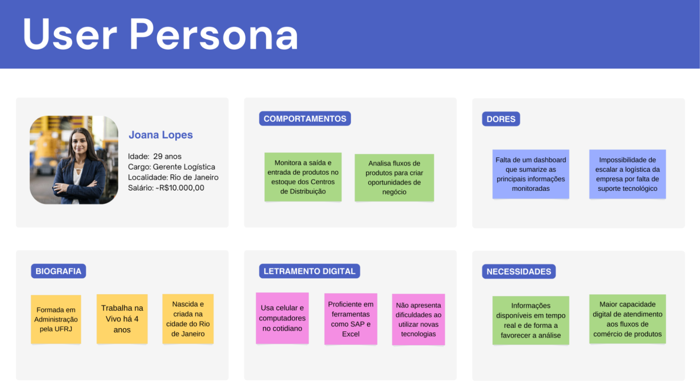
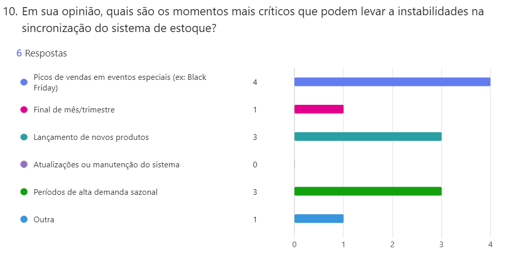
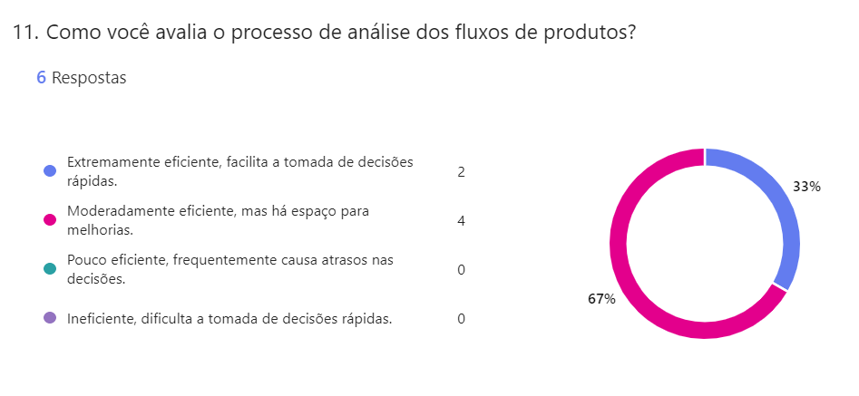

# Entendimento do Usuário

&emsp;A fim de se arquitetar eficientemente uma solução tecnológica para resolução de uma problemática em um projeto, é crucial considerar a experiência do usuário como parte central do desenvolvimento, pois o produto final deve atender às necessidades e sanar as dores daquele que o utiliza, contribuindo para a realização mais eficiente de seus objetivos. Para isso, são aplicadas técnicas e ferramentas que facilitam a visualização e o entendimento da relação entre o usuário e a solução desenvolvida, como a criação de personas a partir do estudo aprofundado do problema e a execução de pesquisas qualiquantitativas com o público-alvo.

&emsp;Dessa forma, com o objetivo de construir uma solução adequada à situação-problema apresentada pela empresa parceira e que maximize a qualidade da experiência do usuário final, foram conduzidas três etapas de estudo e definição precisa do usuário do produto, focadas na obtenção e agregação de informações relevantes para a identificação desse público ideal, assim como na captação de dados que concretizassem seus supostos comportamentos e/ou que trouxessem novos _insights_ para a equipe. Essas etapas são detalhadas nas seções seguintes deste documento ([1](#s1), [2](#s2), [3](#s3) e [4](#s4)).

## 1. Introdução à Pesquisa Exploratória e Qualiquantitativa

&emsp;O objetivo da pesquisa exploratória foi coletar dados iniciais sobre o processo de gerenciamento de estoque na área de logística da Vivo, identificando os principais desafios enfrentados e as expectativas dos usuários em relação à solução a ser desenvolvida. Esta etapa inicial buscou definir os pontos-chave para a compreensão das necessidades dos colaboradores, utilizando reuniões com stakeholders e análise de documentos de projeto. O uso de técnicas como _design thinking_ possibilitou o desenvolvimento de uma solução que se alinhasse às expectativas do parceiro de negócios e às especificidades do público-alvo, estabelecendo uma base sólida para pesquisas subsequentes.

&emsp;A pesquisa qualiquantitativa foi elaborada com o intuito de validar as hipóteses levantadas na fase exploratória, proporcionando uma visão mais aprofundada dos problemas e oportunidades identificados. A combinação de abordagens qualitativas e quantitativas permitiu uma análise rica e detalhada dos dados, possibilitando tanto a identificação de padrões quanto a obtenção de _insights_ mais específicos. Essa abordagem foi essencial para garantir que a solução final atenda de maneira eficaz às necessidades dos colaboradores de logística, minimizando os problemas de sincronização de estoque e aprimorando a eficiência do sistema.

&emsp;A justificativa para a realização dessa pesquisa está diretamente ligada à necessidade de alinhar o desenvolvimento do sistema de gerenciamento de estoque às reais demandas dos usuários, garantindo uma solução escalável, eficiente e adequada ao contexto operacional da Vivo. Através da coleta e análise sistemática de dados, espera-se alcançar melhorias significativas no processo logístico, impactando positivamente a experiência do usuário e os resultados operacionais da empresa.

## 2. Pesquisa exploratória

&emsp;A pesquisa exploratória consiste na coleta inicial de dados referentes ao assunto trabalhado no cerne do projeto e ao que se espera como solução final pelo parceiro de negócios e tem como finalidade determinar os pontos-chave para o entendimento do usuário da solução, estabelecendo de forma preliminar o que se acredita que sejam suas principais dores, expectativas e _feedbacks_ em relação às tarefas que deseja cumprir. Esse processo é realizado principalmente a partir do contato direto com representantes da empresa parceira em reuniões, das informações presentes nos documentos de definição geral do projeto e da aplicação de conceitos de _design thinking_ para o desenvolvimento de um produto de fato prático e viável, considerando o público-alvo definido.

&emsp;Dessarte, a equipe desenvolvedora do projeto efetuou esse processo buscando estabelecer a base inicial para a realização de uma pesquisa qualiquantitativa com o público (seção [4](#s4) deste documento), com o objetivo de confirmar as hipóteses levantadas, gerar novos _insights_ e, assim, favorecer o entendimento do usuário através de dados concretos. Além disso, procurou-se obter um detalhamento aprofundado em respeito aos requisitos do projeto e às questões internas da empresa parceira que tangem o assunto com o qual o grupo desenvolvedor trabalhará, ou seja, o sistema de gerenciamento de estoque da plataforma de _e-commerce_, isso para melhorar a estruturação do protótipo e ampliar a visão sobre as problemáticas enfrentadas.

&emsp;A partir dos objetivos acima explicitados, foram separados dois passos para realização da pesquisa exploratória: a elaboração de perguntas para extrair informações importantes do parceiro de negócios na primeira reunião de alinhamento do projeto (dia 07 de agosto de 2024) e a análise minuciosa do documento de definição de escopo e contexto da solução tecnológica a ser desenvolvida. Com isso, foi possível inferir precisamente as seguintes definições:

- **Problemas apresentados:** o processo de sincronização do banco de dados com a plataforma de _e-commerce_ da empresa é lento e custoso operacionalmente, porque usufrui de tecnologias obsoletas atualmente e conta com um processamento computacional que leva cerca de três minutos, realizado a cada meia hora automaticamente. Em picos de má performance, o sistema já registrou vinte minutos necessários para sincronização do banco, fato que denuncia a fragilidade e a inadequação da implementação desse processo para uma empresa deste porte, considerando o número de clientes simultâneos que acessam o _website_ (até 2380 visitas por minuto registradas) e compram produtos que podem estar fora de estoque. Nota-se, pois, uma dificuldade expressiva no quesito escalabilidade, o que também foi um ponto levantado pelos parceiros de negócios: deseja-se internamente escalar esse sistema para quase dez vezes o número atual de lojas e centros de distribuição, ação que provavelmente colapsaria a plataforma digital de vendas devido ao volume muito mais alto do que o suportado no presente. Por fim, foi mencionado que o time de logística da empresa precisa ter mais visibilidade sobre os fluxos de movimentações de produtos comercializados, dado que a análise desses dados hoje é feita de forma excessivamente manual e imprecisa.

- **Solução esperada:** como produto final, espera-se a entrega de um sistema distribuído de administração de estoque em nuvem, integrado com as tecnologias da AWS (Amazon Web Services) e minimamente preparado para possível implementação na plataforma de _e-commerce_. A proposta consiste em desenvolver uma solução altamente escalável, capaz de suportar fluxos intensos de acessos simultâneos, com tempo de resposta o mais próximo factível do processamento em tempo real em suas operações principais e que ofereça um alto nível de rastreabilidade dos fluxos de informações que transporta e produz. Para melhor adequação com os serviços já utilizados pela empresa parceira, idealmente a plataforma teria seu _back-end_ escrito utilizando a linguagem de programação Java e funcionaria como uma _web_ API (_application programming interface_). No _front-end_, deve ser montado um _dashboard_ para visualização de fluxos das mercadorias do estoque para o time de logística da empresa.

- **Expectativas agregadas:** atrelado à solução desenvolvida, o cliente espera uma redução de custos de capital e operacionais referentes ao armazenamento e manuseio digital do estoque, assim como uma maior facilidade para realizar processamentos secundários relativos às vendas, como a contabilização de comissão para vendedores de lojas físicas e geração de dashboard de análise de fluxos. Ademais, espera-se que o produto final apresente medidas básicas de cybersegurança para sistemas _web_ (principalmente medidas preventivas contra ataques externos) e seja capaz de limitar a venda de produtos de acordo com a área de cobertura de entrega dos centros de distribuição e lojas.

&emsp;Tendo em vista a sua crucialidade para o desenvolvimento bem direcionado do projeto, as informações coletadas foram também utilizadas em fases de concepção do produto além do entendimento do usuário, como na análise de negócios da empresa parceira e na elicitação de requisitos funcionais e não funcionais, o que demonstra a relevância deste processo de pesquisa exploratória realizado. Ademais, conforme o intuito supracitado de designação e compreensão preliminar do público-alvo de acordo com os _insights_ gerados, foi estipulada uma persona para o projeto consoante às conclusões depreendidas da pesquisa, detalhadamente introduzida e explicada na seção seguinte deste documento ([2](#s2)).

## 3. Persona

&emsp;Segundo Harley (2015, tradução própria), "Uma persona é uma descrição ficcional realista de um usuário típico ou alvo do produto. É um arquétipo em vez de um ser humano real, mas personas devem ser descritas como se fossem pessoas reais."; ou seja, as personas são representações ideais do público-alvo. Elas funcionam como ferramentas para criação de empatia e aprofundamento do entendimento do time desenvolvedor de uma solução para com o usuário da mesma, descrevendo este como uma pessoa com características, individualidades, dores e objetivos. Dessa forma, aproxima-se a visão dos responsáveis pelo projeto sobre o problema enfrentado à do público que a utilizará, consequentemente favorecendo a priorização da viabilidade e da usabilidade do produto final.

&emsp;Consoante às informações acima, principalmente aos resultados da pesquisa exploratória realizada (seção [1](#s1) deste documento), foi concebida uma persona para este projeto que representa a expectativa de usuário ideal da solução em desenvolvimento: um profissional da área de logística da empresa parceira de negócios. Abaixo, apresenta-se o perfil imaginado em formato de imagem (figura 01), o qual é detalhado em seguida para fins descritivos.

Figura 01: Persona do projeto

Fonte: Material produzido pelos próprios autores (2024)

&emsp;Joana Lopes, persona deste projeto, é uma mulher de 29 anos originária da cidade do Rio de Janeiro e formada em Administração pela Universidade Federal do Rio de Janeiro (UFRJ). Ela trabalha há quatro anos na Vivo, onde atualmente ocupa o cargo de Gerente Logística, que consiste no monitoramento das movimentações de produtos dos estoques dos Centros de Distribuição e das lojas, a fim de sustentar decisões e criar oportunidades de negócios a partir da análise desses fluxos de comércio.

&emsp;Alinhadas às especificidades da problemática a ser tratada pela solução em desenvolvimento, as dores de Joana (dificuldades enfrentadas ao tentar realizar suas principais tarefas) se manifestam majoritariamente na falta de praticidade, confiabilidade e escalabilidade no processo de registro e análise dos fluxos de produtos dos estoques. Essas adversidades são agravadas pela ausência de um _dashboard_ que sumarize em tempo real as informações que a gerente precisa monitorar com frequência, já que as ferramentas utilizadas pela equipe logística da empresa são operacionalizadas de forma burocrática (muitos cliques necessários para realização de uma tarefa) e não oferecem essa funcionalidade de forma simplificada.

&emsp;Portanto, as necessidades de Joana são a disponibilidade em tempo real das informações a serem monitoradas com confiabilidade e facilidade de análise, agregando dados importantes referentes aos fluxos de mercadoria da empresa e possivelmente também sobre os comportamentos dos usuários da plataforma de _e-commerce_ da Vivo que possam gerar _insights_ importantes para os negócios. Ademais, com o objetivo de englobar toda a rede logística da Vivo e, assim, favorecer a execução eficiente das tarefas de Joana, é crucial ampliar a capacidade do sistema digital de armazenamento de estoque. Isso permitirá que as lojas da empresa e os centros de distribuição operem em sincronia e de maneira plenamente integrada, e não com número reduzido como é feito hodiernamente devido à dificuldade de escalabilidade do sistema já depreciado.

## 4. Pesquisa qualiquantitativa

&emsp;A pesquisa qualiquantitativa tem como objetivo validar as hipóteses levantadas sobre as dificuldades enfrentadas pela área de logística da Vivo no gerenciamento de estoque, utilizando a [pesquisa exploratória](#s2) e a [persona](#s3) desenvolvida para tornar a pesquisa mais direcionada e eficaz. O foco está, especialmente, nas questões relacionadas à sincronização de dados entre centros de distribuição e lojas. Além disso, a pesquisa busca obter _insights_ sobre a percepção dos colaboradores da Vivo S.A em relação à eficiência do sistema atual e identificar áreas de melhoria, garantindo que a solução final atenda de forma mais precisa às necessidades reais dos usuários.

### 4.1. Metodologia

#### 4.1.1. Levantamento de hipóteses

&emsp;A primeira etapa da metodologia consistiu no levantamento de hipóteses relacionadas aos principais problemas enfrentados pela área de logística da Vivo no gerenciamento de estoque. Essa etapa é crucial para direcionar o foco da pesquisa e garantir que as perguntas abordem os desafios mais relevantes. Ao levantar hipóteses, a equipe pôde identificar áreas críticas como a sincronização de dados entre centros de distribuição e lojas, a eficiência do sistema, e a percepção dos colaboradores sobre esses processos. As hipóteses guiaram o desenvolvimento do questionário e permitiram uma análise mais direcionada e profunda dos resultados obtidos, sendo fundamentais para validar ou refutar os problemas previamente identificados.

#### 4.1.2. Amostragem

&emsp;Foi utilizada a técnica de amostragem bola de neve, onde o primeiro grupo de respondentes é escolhido a partir de contatos diretos na área de logística da Vivo. Esses respondentes, por sua vez, indicam outros colaboradores que possuam o perfil adequado para participar da pesquisa, garantindo uma maior abrangência e representatividade dos dados.

&emsp;A escolha da amostragem bola de neve se deu pela necessidade de alcançar perfis específicos dentro da área de logística, que lidam diretamente com o gerenciamento de estoque e sincronização de dados. Essa técnica permite que a pesquisa alcance profissionais com experiência relevante e _insights_ profundos sobre as operações diárias.

#### 4.1.3. Viés Utilizado

&emsp;O viés utilizado na pesquisa foi o viés de seleção, pois a escolha dos participantes foi direcionada por indicações dentro de um grupo específico de profissionais. No entanto, essa escolha foi estratégica, uma vez que buscamos coletar dados de pessoas que têm conhecimento direto das operações logísticas da Vivo e estão envolvidas em processos críticos de gerenciamento de estoque.

&emsp;O viés de seleção foi considerado aceitável, pois o objetivo da pesquisa é explorar as percepções e desafios enfrentados por um grupo específico de profissionais. Embora esse viés limite a generalização dos resultados para toda a empresa, ele permite uma análise mais precisa das questões enfrentadas pela equipe logística.

### 4.2. Elaboração do Questionário

&emsp;O questionário foi estruturado em quatro seções principais, cada uma abordando aspectos diferentes do sistema de gerenciamento de estoque:

1. **Perguntas Gerais sobre o Processo Logístico:**

   - Descrição do sistema atual e das ferramentas utilizadas.
   - Frequência de problemas enfrentados.

2. **Eficiência e Desempenho do Sistema Atual:**

   - Acesso a informações em tempo real e dificuldades na sincronização de dados.

3. **Críticas e Reações ao Estoque:**

   - Protocolos em situações críticas e avaliação do processo de análise de fluxos.

4. **Importância do Acesso a Informações:**
   - Importância atribuída ao acesso a informações em tempo real.

**Formato das Perguntas:**

&emsp;As perguntas foram formuladas em diferentes formatos, como perguntas abertas para obter respostas detalhadas e perguntas de múltipla escolha para padronizar as respostas e facilitar a análise quantitativa.

### 4.3. Aplicação da Pesquisa

&emsp;A pesquisa foi inicialmente enviada para um _stakeholder_ da Vivo, que a direcionou aos diretores responsáveis. Posteriormente, os diretores encaminharam a pesquisa aos colaboradores de logística, que, após responderem ao questionário, devem indicar outros profissionais para participar. O processo ainda não foi finalizado e será repetido até que um número satisfatório de respostas seja obtido.

**Ferramenta Utilizada:** A pesquisa foi aplicada utilizando uma plataforma _online_ de formulários da Microsoft Forms, permitindo fácil acesso e preenchimento por parte dos respondentes. Para acessar as perguntas da pesquisa, [acesse aqui](https://docs.google.com/document/d/1f7FpAfaT9eMjGSgeWgiVfUtVS9i5Z-N1D-5ooDfs2Ww/edit?usp=sharing).

### 4.4. Resultados da pesquisa

&emsp;Dada a importância da pesquisa para a elaboração de um projeto mais fundamentado e que tenha _features_ que irão atingir as dores e problemas do usuário. Dos participantes, 67% trabalham em centros de distribuição, 17% em lojas e um participante está envolvido no planejamento logístico Outbound. Este perfil permitiu uma amostra representativa dos diferentes níveis operacionais, dando maior ênfase no que deve ser desenvolvido e à compreensão da jornada de trabalho de alguns colaboradores. Abaixo serão analisadas as respostas de cada um dos colaboradores, bem como a importância para o desenvolvimento do projeto.

Figura 02: Visão geral - formulário

Fonte: Material produzido pelos próprios autores (2024)

&emsp;A maioria dos colaboradores (83%) considera essencial o acesso a informações em tempo real para a eficiência do trabalho, embora 17% acreditem que seria útil, mas não crucial. No entanto, apenas uma pequena parte dos respondentes tem acesso a essas informações em tempo real, muitas vezes limitadas a consultas em sistemas legados, como o SAP, o que reflete uma lacuna importante na sincronização de dados.

&emsp;A pesquisa também revelou, conforme a resposta de alguns colaboradores, que a complexidade do sistema legado e a demora no processamento de dados são as principais dificuldades na sincronização de estoque entre centros de distribuição e lojas. Esse problema é exacerbado durante picos de vendas e lançamentos de novos produtos, confirmando as hipóteses levantadas inicialmente sobre os momentos críticos que causam instabilidades no sistema.

Figura 03: Pergunta 10 do formulário

Fonte: Material produzido pelos próprios autores (2024)

&emsp;No que diz respeito à eficiência do sistema atual, 67% dos respondentes consideram o processo de análise dos fluxos de produtos moderadamente eficiente, mas com espaço para melhorias, enquanto 33% o consideram extremamente eficiente. Um dos principais desafios mencionados foi a integração com sistemas legados, como a loja online, que foi apontada como uma área de grande preocupação devido à falta de sincronização. Como relatado por um dos colaboradores: "O sistema de gerenciamento de estoque atende as necessidades, o problema está na integração com a loja online que não é síncrona, as atualizações ocorrem a cada 30 minutos." Essa falta de sincronização causa atrasos significativos e problemas na gestão de estoque, prejudicando a eficiência operacional.

Figura 04: Pergunta 11 do formulário

Fonte: Material produzido pelos próprios autores (2024)

&emsp;As sugestões de melhorias incluem a implementação de painéis de controle (dashboards) mais claros e acessíveis, a criação de ferramentas de Business Intelligence (BI) que facilitem a tomada de decisões rápidas e a necessidade de um forecast logístico mais preciso para alinhar as projeções comerciais com as capacidades de estoque. Um colaborador destacou: "Apesar de conseguir visualizar o estoque das lojas e CDs no ERP, carece de painéis, relatórios e informações de estoque de forma mais clara e rápida, principalmente para lojas e áreas comerciais."

&emsp;Esses resultados ressaltam a necessidade crítica de desenvolver um novo sistema de gerenciamento de estoque que vá além de simplesmente integrar as funcionalidades existentes. É imperativo que esse sistema melhore significativamente a sincronização em tempo real entre os diferentes centros de distribuição, lojas físicas e a loja online, eliminando os atrasos que atualmente afetam a eficiência operacional. Embora a introdução de painéis de controle (dashboards) e ferramentas de Business Intelligence (BI) de fácil acesso não seja obrigatória conforme o escopo do projeto, sua inclusão poderia garantir que todos os níveis da operação logística possam tomar decisões informadas rapidamente. Atender a essas necessidades garantirá uma gestão de estoque mais eficiente e proativa, diretamente alinhada às expectativas e desafios reais enfrentados pelos colaboradores da Vivo, resultando em operações mais ágeis e confiáveis.

## Referências

LEIFER, Larry; LEWRICK, Michael; LINK, Patrick. A Jornada do _Design Thinking_. Rio de Janeiro: Editora Alta Books, 2019. _E-book_. ISBN 9788550808741. Disponível em: https://integrada.minhabiblioteca.com.br/#/books/9788550808741/. Acesso em: 07 ago. 2024.

HARLEY, Aurora. _Personas Make Users Memorable for Product Team Members_. Nielsen Norman Group, 2015. Disponível em: https://nngroup.com/articles/persona/. Acesso em: 07 ago. 2024.

VINUTO, Juliana. A amostragem em bola de neve na pesquisa qualitativa: um debate em aberto. Tematicas, Campinas, SP, v. 22, n. 44, p. 203–220, 2014. DOI: 10.20396/tematicas.v22i44.10977. Disponível em: https://econtents.bc.unicamp.br/inpec/index.php/tematicas/article/view/10977. Acesso em: 14 ago. 2024.

UNIVERSIDADE FEDERAL DE SANTA CATARINA. Capítulo 4: Tipos de vieses em estudos observacionais. Disponível em: https://guiariscodeviescobe.paginas.ufsc.br/capitulo-4-tipos-de-vieses-em-estudos-observacionais/. Acesso em: 18 ago. 2024.

