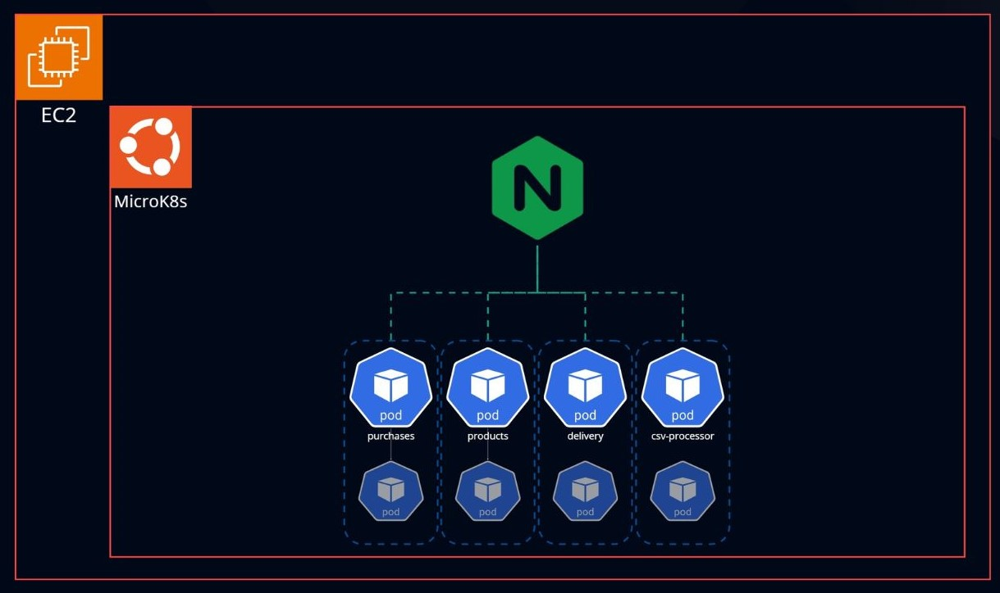
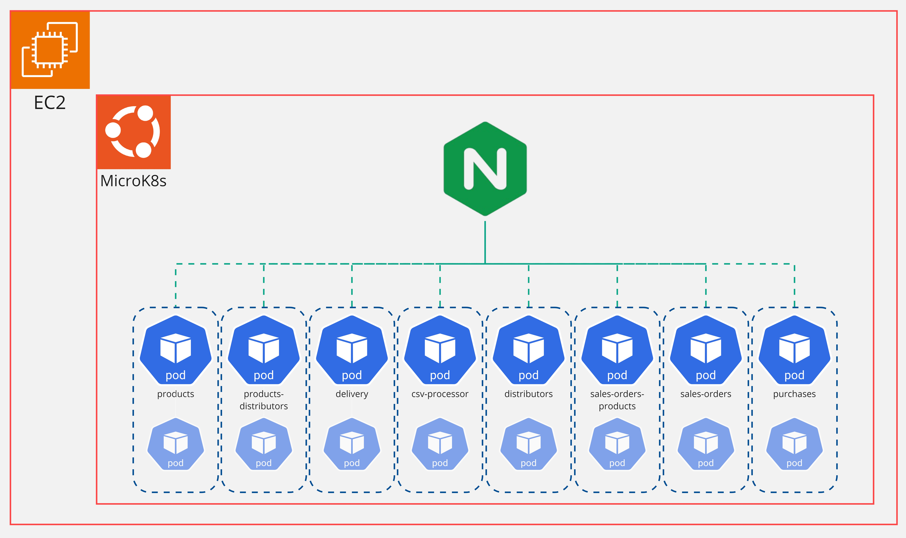

# Microsserviços

&emsp;A arquitetura de microsserviços é uma abordagem moderna para o desenvolvimento de _software_ que consiste em dividir uma aplicação em diversos serviços menores e independentes, cada um com uma responsabilidade específica. Tais unidades da solução podem ser desenvolvidas, implementadas e escaladas de forma isolada, o que oferece uma série de vantagens em relação à abordagem monolítica tradicional. No modelo monolítico, a aplicação é construída como um único bloco, o que significa que qualquer mudança ou erro em uma parte do sistema pode afetar toda a aplicação. Além disso, a escalabilidade desse modelo exige a expansão de todo o sistema, mesmo que apenas um módulo específico precise de mais recursos. Já na arquitetura de microsserviços, como cada serviço é independente, atualizações ou correções podem ser aplicadas a partes específicas sem impactar os demais. Ademais, a escabalabilidade é feita de forma seletiva, conforme a demanda, o que otimiza o uso de recursos.

## Kubernetes (K8)

&emsp;Kubernetes é uma plataforma _open-source_ projetada para a orquestração de contêineres, permitindo a automatização da implantação, escalabilidade e gerenciamento de aplicações conteinerizadas. Originalmente desenvolvido pelo Google, tornou-se uma das tecnologias mais populares para gerenciar aplicações distribuídas, especialmente em cenários que envolvem a arquitetura de microsserviços. O K8 se integra de maneira direta com a conteinerização, facilitando o gerenciamento de contêineres, que são pacotes leves contendo tudo o que uma aplicação precisa para rodar – desde o código-fonte até bibliotecas e dependências. Com isso, essa ferramenta garante que as aplicações rodem de forma consistente em diferentes ambientes, seja em servidores locais, em nuvem ou em data centers.

&emsp;Em ambientes de microsserviços, Kubernetes se mostra ainda mais eficaz, já que permite a automação completa do ciclo de vida dos contêineres, desde sua criação até o monitoramento e eventual destruição. Como cada microsserviço é executado em um contêiner, o K8 facilita o gerenciamento centralizado de todos esses serviços, garantindo que estejam sempre disponíveis, balanceados e escaláveis conforme a demanda. A escolha do dessa tecnologia em projetos que adotam arquiteturas com serviços desacoplados se justifica pela sua capacidade de orquestrar de maneira eficiente serviços independentes, reduzindo significativamente a complexidade operacional e permitindo que os desenvolvedores se concentrem no desenvolvimento das funcionalidades em vez de se preocupar com a infraestrutura.

## Quarkus (Java)

&emsp;A escolha do Java para o projeto foi baseada em diversos fatores, entre os quais se destacam seu vasto ecossistema, que oferece uma ampla gama de bibliotecas e _frameworks_ para o desenvolvimento de sistemas distribuídos. Além disso, o Java oferece excelente escalabilidade, permitindo o uso desde aplicações monolíticas até arquiteturas de microserviços.

&emsp;A escolha pelo Quarkus foi uma decisão estratégica para garantir eficiência e modernidade no desenvolvimento. O Quarkus é otimizado para ambientes nativos na nuvem e proporciona alto desempenho e eficiência. Quando utilizado em conjunto com o GraalVM, ele possibilita a compilação da aplicação em binário, resultando em um aplicativo mais leve e rápido, ideal para ambientes _cloud-native_.

Figura 01: Diagrama dos microsserviços em Java

Fonte: Material produzido pelos próprios autores (2024).

&emsp;Os microserviços foram desenvolvidos com foco nas necessidades do _front-end_ da aplicação, sendo divididos em quatro principais: consulta de produtos, consulta de dias de entrega baseado no CEP, realização de compra e upload de dados via CSVs. Essa arquitetura visa garantir escalabilidade e facilitar a manutenção, permitindo que cada serviço possa ser escalado e atualizado de maneira independente, conforme as demandas do sistema.

## Go

&emsp;No projeto em questão, utilizamos a linguagem Go para implementar uma aplicação baseada em microsserviços. A escolha do Go foi motivada por sua robustez para aplicações distribuídas e sua capacidade de lidar com alta carga de processamento, especialmente em sistemas que requerem baixa latência e alta escalabilidade. Abaixo está um diagrama com a estrutura da aplicação desenvolvida.

Figura 02: Diagrama dos microsserviços em Go

Fonte: Material produzido pelos próprios autores (2024).

&emsp;Cada um desses microsserviços roda em containers independentes, orquestrados pelo Kubernetes através do MicroK8s, em uma infraestrutura EC2 na AWS. A construção de cada um deles foi pensada visando isolar as responsabilidades, sendo assim executam apenas funções específicas e geralmente relacionadas a suas respectivas entidades no banco de dados, como o serviço dos produtos que interage com a respectiva tabela de produtos. Além disso, foram desenvolvidos serviços específicos para certas demandas do problema em questão, como do cálculo de dias de entrega, processamento de arquivos CSV e realização de compras. Por fim, através de arquivos de _deployments_ foram feitas configuração de escalonamento automático, o que garante que novas instâncias dos serviços sejam criadas de forma automática mediante mudanças na demanda.

