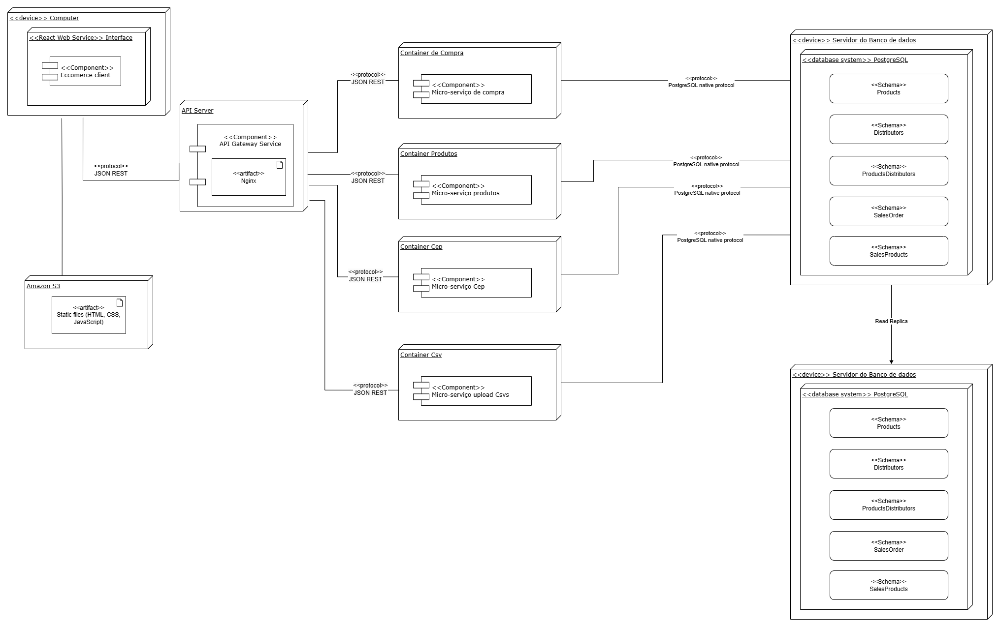
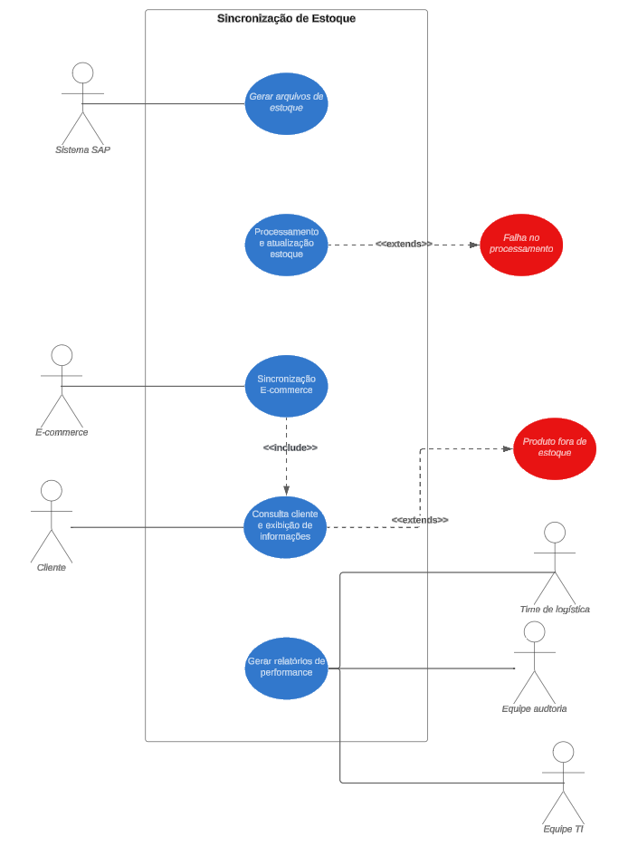
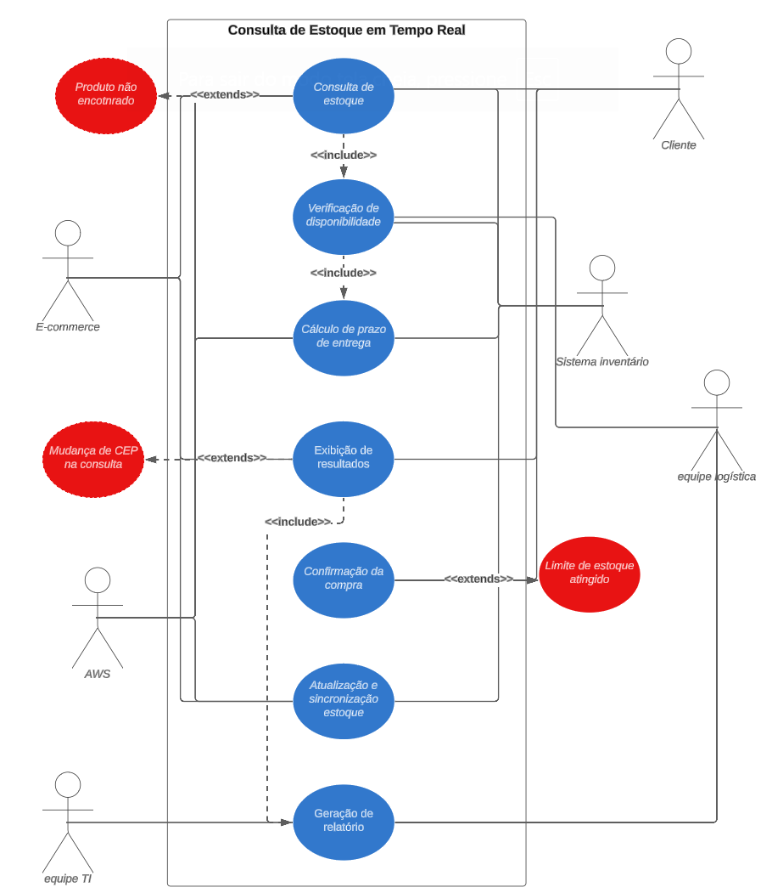
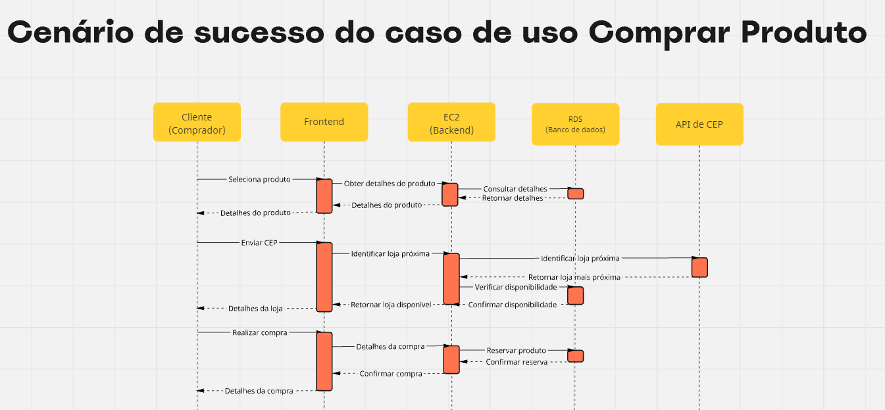
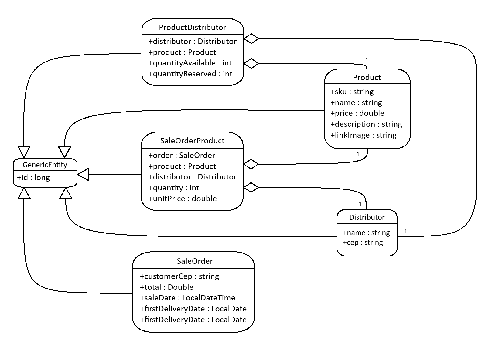
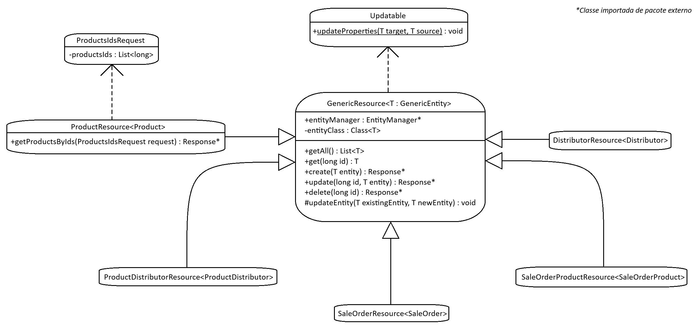
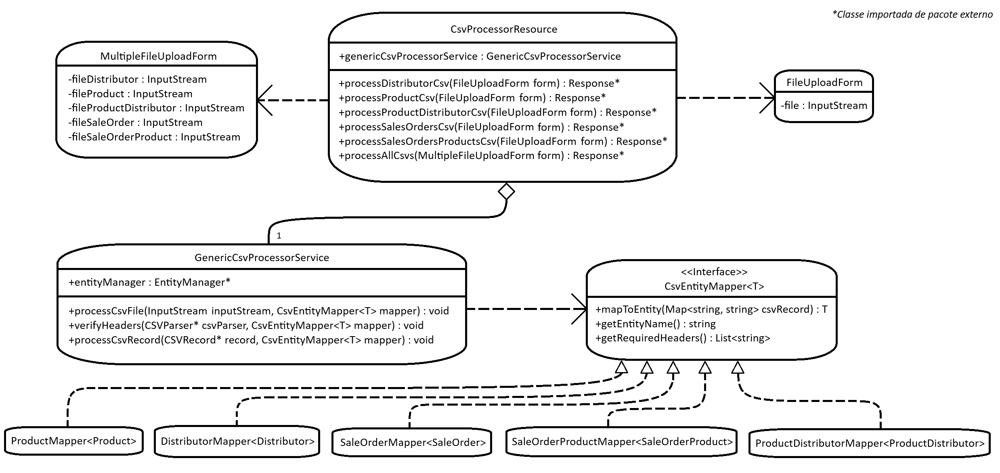
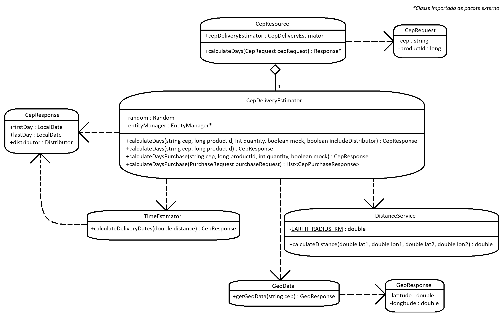
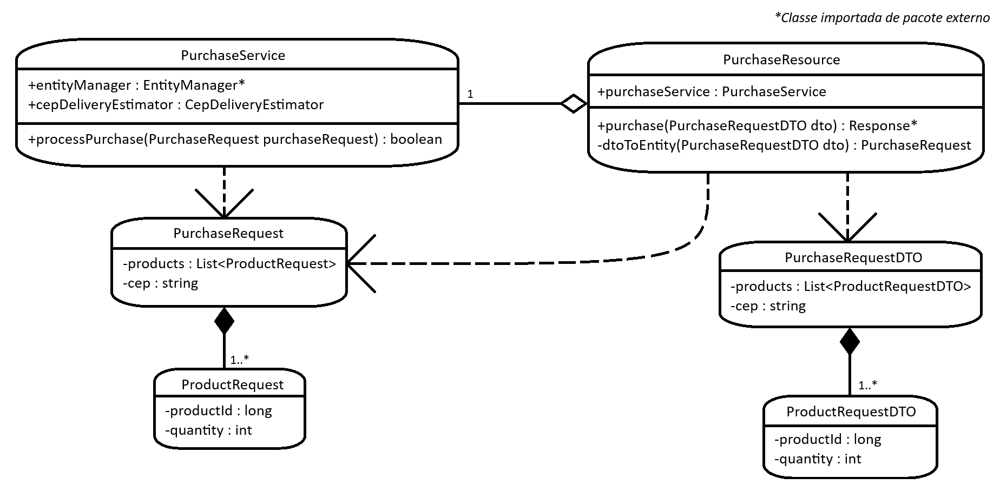

# Modelagem

## Introdução

&emsp;Este documento aborda a modelagem do sistema distribuído de gerenciamento de estoque do NSYNC, enfatizando o papel essencial da modelagem no desenvolvimento de soluções complexas. Diagramas, como os de implantação, de sequência e de classes, são ferramentas fundamentais para visualizar a arquitetura, definir fluxos de comunicação e identificar as interações entre os componentes. A modelagem oferece uma visão clara da estrutura do sistema, facilitando a tomada de decisões durante o planejamento e a implementação, além de garantir que a solução seja modular, escalável e de fácil manutenção.

&emsp;Tendo em vista a possibilidade de o parceiro de projeto implementar a solução proposta, o uso de ferramentas visuais é fundamental para garantir um entendimento claro e preciso da arquitetura do sistema. Esses diagramas permitem não apenas visualizar a estrutura e o funcionamento da solução, mas também identificar pontos de integração com o sistema já existente. Dessa forma, a modelagem facilita o alinhamento entre as equipes técnicas e garante uma transição suave, reduzindo o risco de incompatibilidades e retrabalho durante a implementação.

## Diagrama de Implantação

&emsp;Na imagem a seguir é possível visualizar a arquitetura do sistema distribuido de gerenciamento de estoque do grupo NSYNC utilizando microsserviços, apresentado no diagrama de implantação. O sistema está dividido em componentes *front-end* e *back-end*, com múltiplos microsserviços e um banco de dados PostgreSQL para gerenciamento de dados.

Figura 01: Diagrama de Implantação

Fonte: Material produzido pelos próprios autores (2024).

### Interface do cliente (*Front-end*)

&emsp;A interface do cliente é acessada a partir de um computador através de uma aplicação web desenvolvida em React, que está hospedada como uma página estática no Amazon S3. Essa interface permite que os usuários visualizem os produtos, realizem compras e administrem seus carrinhos de forma eficiente. Toda a comunicação entre o cliente e o servidor ocorre por meio de solicitações REST no formato JSON, que são roteadas através de um serviço de *gateway* de API. Esse serviço de *gateway* atua como a camada de comunicação intermediária, direcionando as requisições do cliente aos microsserviços apropriados.

### Micro-serviços

&emsp;O sistema *back-end* é composto por diversos *containers*, cada um abrigando um microserviço dedicado a uma funcionalidade específica. O *container* de compra é responsável por lidar com as operações de compra, como o processamento de pedidos e pagamentos. Esse *container* se comunica via protocolo JSON REST com o *gateway* de API, que repassa as solicitações vindas da interface do cliente. O *container* de produtos gerencia todas as informações relacionadas ao catálogo de produtos, como descrições, preços e disponibilidade em estoque, permitindo operações CRUD *(Create, Read, Update, Delete)* sobre os itens disponíveis no e-commerce. Para calcular os dias de entrega, o *container* de CEP é responsável por calcular o tempo de entrega baseado no CEP do consumidor e os locais dos distribuidores. Além desses, o sistema conta com um *container* dedicado ao upload de arquivos CSV, permitindo que arquivos contendo dados como listas de produtos ou informações de vendas sejam carregados e processados diretamente pelo sistema.

### Banco de dados

&emsp;No que diz respeito à persistência de dados, o sistema utiliza um servidor de banco de dados PostgreSQL. Esse banco de dados é estruturado com múltiplos *schemas* que armazenam as informações essenciais do sistema. O *schema* de produtos contém dados detalhados sobre os produtos disponíveis na plataforma, incluindo seu nome, preço e quantidade. As informações sobre os distribuidores que fornecem esses produtos estão armazenadas no *schema* de distribuidores. Para relacionar quais distribuidores são responsáveis por quais produtos, o *schema* de produtos-distribuidores realiza essa associação. O sistema também armazena as informações de cada pedido de compra realizado pelos clientes no *schema* de pedidos de venda, enquanto os produtos incluídos em cada pedido são registrados no *schema* de produtos de venda. Também é importante observar que existe uma duplicação do banco de dados para garantir a alta disponibilidade do sistema.

### Sequência de interações

&emsp;O fluxo de comunicação entre os componentes do sistema segue um padrão claro e eficiente. O cliente interage com a interface React, que envia requisições para o *gateway* de API utilizando o protocolo JSON REST. O *gateway*, por sua vez, redireciona essas requisições para o microsserviço apropriado, seja o microserviço de compra, o microserviço de produtos, o microserviço de CEP ou o microserviço de upload de CSVs. Esses microsserviços, ao processarem as requisições, interagem com o banco de dados PostgreSQL para armazenar ou recuperar as informações necessárias, utilizando o protocolo nativo do PostgreSQL para a comunicação com o servidor de banco de dados.

&emsp;Tecnicamente, o protocolo REST é o padrão utilizado para as comunicações entre a interface do cliente e os microsserviços, com os dados sendo transferidos no formato JSON. O PostgreSQL é o banco de dados relacional escolhido para garantir a persistência e a integridade dos dados no sistema. Cada microsserviço possui responsabilidades bem definidas e se comunica de forma independente, o que torna a solução modular, escalável e de fácil manutenção.

## Diagrama de caso de uso

&emsp;A realização de testes de caso de uso para o Sistema de Inventário Distribuído é fundamental para validar o comportamento esperado e a robustez da solução em desenvolvimento. Os casos de uso CDU1 e CDU2 foram criados para cobrir os cenários de sincronização de estoque e consulta de estoque em tempo real, que são essenciais para o correto funcionamento da plataforma de e-commerce integrada ao sistema legado SAP ECC.

### Caso de Uso CDU1: Sincronização de Estoque

- **Escopo**: Sistema de Inventário Distribuído
- **Nível**: Objetivo do usuário
- **Ator Principal**: Sistema SAP ECC

### Interessados e Interesses:

- **Time de Logística**: Deseja ter uma visibilidade clara, em tempo real, do estoque disponível em cada loja e centro de distribuição. A visibilidade deve ser precisa para facilitar a tomada de decisão, evitar rupturas de estoque e otimizar as operações logísticas.

- **Plataforma de _E-commerce_**: Deseja garantir uma sincronização rápida e confiável do estoque, minimizando a sobrecarga de processamento durante a jornada do cliente. Essa sincronização deve ocorrer sem impactar o tempo de resposta do sistema, garantindo que os clientes tenham uma experiência de compra fluida.

- **Cliente**: Deseja uma experiência de compra sem fricções, onde os produtos desejados estejam disponíveis para compra e a estimativa de prazo de entrega seja precisa. O cliente espera que as informações sejam atualizadas em tempo real para evitar problemas durante a compra.

- **Sistema SAP ECC**: Deseja um método robusto para enviar e receber atualizações de estoque e garantir que essas informações sejam propagadas corretamente para a plataforma de _e-commerce_. Necessita de alta disponibilidade, segurança e confiabilidade nas transações.

- **Equipe de TI e Desenvolvimento**: Deseja uma arquitetura escalável, segura e fácil de manter, que permita o desenvolvimento e implantação de novas funcionalidades de forma contínua e segura.

- **Equipe de Compliance e Auditoria**: Deseja garantir que todos os registros de transações de estoque sejam precisos e estejam em conformidade com normas regulatórias aplicáveis.

### Pré-Condições:

- O sistema SAP ECC está configurado para gerar arquivos de dados de estoque das lojas e centros de distribuição (CDs) de forma regular e está integrada ao barramento corporativo para a troca de informações.
- As instâncias EC2 estão ativas, configuradas corretamente com Auto Scaling e dentro dos grupos de segurança apropriados.
- A conectividade entre o File Gateway e os sistemas SAP ECC e AWS S3 está estabelecida e testada.
- A plataforma de _e-commerce_ está conectada à API corporativa que interage com o sistema SAP ECC para consultas em tempo real sobre a disponibilidade de produtos.
- Sistemas de monitoramento e alertas estão configurados para detectar falhas e problemas de performance.

### Garantia de Sucesso (ou Pós-Condições):

- A sincronização de estoque entre os centros de distribuição (CDs) e as lojas foi realizada com sucesso, e os dados estão disponíveis na plataforma de lojas virtuais para visualização e consulta pelo cliente.
- O sistema de inventário foi atualizado com as informações mais recentes sobre a disponibilidade de produtos.
- Relatórios de performance e métricas (taxa de sucesso de sincronização, tempo de resposta médio, etc.) foram gerados e armazenados para análise contínua.
- Qualquer falha ocorrida durante o processo de sincronização foi devidamente registrada e um alerta foi enviado.

### Cenário de Sucesso Principal (ou Fluxo Básico):
Abaixo será explicado o fluxo mais extensão de sucesso do cenário. Não foi incluido no diagrama os serviços mais profundos da aplicação por questão de padronização com o diagrama de caso de uso, mas será incluido abaixo para um melhor entendimento de todo o fluxo do diagrama.

1. **Início da Sincronização**:
    - O Sistema SAP ECC gera arquivos de dados de estoque para todas as lojas e CDs. Cada arquivo inclui informações detalhadas como SKU, número do escritório de vendas, quantidade disponível, e detalhes da loja ou CD.
2. **Transferência de Arquivos para o File Gateway**:
    - Os arquivos de estoque são transferidos para o File Gateway usando o Connect Direct, garantindo uma transferência segura e eficiente entre sistemas.
3. **Processamento Inicial pelo Bastion Host**:
    - O Bastion Host, que serve como ponto de entrada seguro para a rede privada da VPC, recebe e armazena os arquivos de estoque de forma temporária. Ele também verifica a integridade dos arquivos recebidos e autentica as transações.
4. **Transferência de Arquivos para EC2 e Armazenamento em S3**:
    - O Bastion Host distribui os arquivos de estoque para as instâncias EC2 na sub-rede privada para processamento adicional. Em paralelo, os arquivos são armazenados no Amazon S3 para _backup_.
5. **Processamento e Atualização de Dados de Estoque**:
    - As instâncias EC2 processam os arquivos de estoque, validam as informações e inserem ou atualizam os dados no banco de dados RDS. Durante o processamento, o sistema verifica a integridade e consistência dos dados, garantindo que somente informações válidas sejam persistidas.
6. **Sincronização com a Plataforma de E-commerce**:
    - O sistema de inventário comunica-se com a plataforma de _e-commerce_ via API corporativa para atualizar a disponibilidade de produtos e o status de estoque em tempo real. A sincronização deve ocorrer com uma latência máxima de 1 segundo.
7. **Consulta pelo Cliente e Exibição de Informações**:
    - O cliente acessa a plataforma das lojas onlines, busca um produto e insere o CEP para cálculo de entrega. O sistema consulta o banco de dados atualizado no RDS e verifica a disponibilidade do produto nas lojas e CDs mais próximos, retornando o prazo estimado de entrega.
8. **Conclusão da Sincronização**:
    - Após a conclusão da sincronização e das consultas, o sistema gera relatórios de performance e envia para o painel de monitoramento da equipe de TI.

### Extensões (ou Fluxos Alternativos):

_a. Falha na Transferência de Arquivos para o File Gateway:_

1. O sistema detecta uma falha durante a transferência de arquivos de estoque para o File Gateway.
2. O sistema envia um alerta automático para a equipe de operações de TI para intervenção manual.
3. O sistema tenta uma nova transferência após um intervalo configurado.

_b. Falha na Atualização de Dados no Banco de Dados RDS:_

1. O sistema detecta uma falha ao tentar inserir ou atualizar dados no banco de dados RDS.
2. O sistema reverte qualquer transação parcial e mantém o banco de dados em um estado consistente.
3. Um alerta é gerado, e o sistema tenta o processo de atualização novamente.

_c. Produto Fora de Estoque Durante a Jornada do Cliente:_

1. Durante a jornada de compra, o cliente tenta adicionar um produto ao carrinho, mas o produto está fora de estoque.
2. O sistema sinaliza o status "Indisponível" para o produto e sugere alternativas semelhantes.

_d. Falha de Comunicação com o Sistema SAP ECC:_

1. O sistema detecta uma falha de comunicação com o SAP ECC ao tentar obter os arquivos de estoque.
2. Uma mensagem de erro é registrada, e um alerta é enviado à equipe de integração para revisão.

### Requisitos Especiais:

- **Alta Disponibilidade**: Garantida por meio de replicação de instâncias EC2 em múltiplas zonas de disponibilidade e configuração de Auto Scaling.
- **Recuperação de Desastres**: Utilização de Read Replica para o banco de dados RDS, garantindo que uma cópia dos dados esteja sempre disponível em caso de falhas.
- **Segurança**: Uso de Security Groups, Bastion Host e criptografia para proteger dados em trânsito e em repouso.
- **Desempenho e Escalabilidade**: Configuração do Auto Scaling para ajustar automaticamente a capacidade do sistema conforme a demanda de sincronização de estoque aumenta ou diminui.

### Lista de Variantes Tecnológicas e de Dados:

a. Transferência de arquivos através de Connect Direct e SFTP para o File Gateway, garantindo segurança e integridade dos dados.

b. Sincronização de dados usando APIs RESTful para integração em tempo real com a plataforma de _e-commerce_ e SAP ECC.

c. Utilização de balanceamento de carga ELB para distribuir o tráfego entre várias instâncias EC2, melhorando o desempenho e a resiliência.

### Frequência de Ocorrência:

- A sincronização de estoque ocorre a cada 10 minutos, configurável conforme as necessidades operacionais.

### Problemas em Aberto:

- **Otimização da Transferência de Dados**: Como otimizar a transferência de dados de estoque para minimizar a latência durante os períodos de pico?
- **Resiliência da Arquitetura em Alta Escala**: Qual o melhor mecanismo de failover para garantir a continuidade das operações mesmo em caso de falhas catastróficas?
- **Personalização de Soluções para Diferentes Modelos de Negócios**: Como adaptar a solução de sincronização de estoque para diferentes tipos de clientes e volumes de transações?

### Plano de Teste:

- **Carga e Desempenho**: Testes de carga utilizando K6 para validar a capacidade do sistema de lidar com até 30 mil requisições por segundo e um tempo de resposta inferior a 1 segundo.
- **Alta Disponibilidade**: Simulações de falhas para testar a recuperação de desastres, failover e resiliência do sistema.
- **Usabilidade**: Testes de usabilidade para garantir que os usuários consigam navegar no sistema de forma intuitiva e eficiente.

Figura 02: Diagrama de caso de uso: Sincronização de Estoque

Fonte: Material produzido pelos próprios autores (2024).

&emsp;A seguir está uma explicação detalhada da parte visual que foi feita no diagrama de caso de uso "Sincronização de Estoque" para o sistema de inventário distribuído. Essa explicação se baseia nos elementos apresentados no diagrama e nas relações estabelecidas entre eles:

**Atores Externos:**

- _Sistema SAP ECC:_ Representado como um ator primário responsável por gerar arquivos de dados de estoque. Este ator interage diretamente com o sistema de inventário para iniciar o processo de sincronização.
- _AWS:_ Representada como um ator que inclui vários componentes (EC2, RDS, S3, ALB, Auto Scaling, Security Groups, Bastion Host, Route 53). Esses componentes são configurados para garantir a alta disponibilidade, segurança e escalabilidade da sincronização de dados de estoque.
- _Plataforma de E-commerce:_ Um ator que consome os dados de estoque sincronizados para atualizar a disponibilidade de produtos e garantir uma experiência de compra fluida.
- _Cliente:_ Um ator que interage indiretamente com o sistema ao consultar informações sobre produtos disponíveis na plataforma de e-commerce.
- _Time de Logística, Equipe de TI e Equipe de Auditoria:_ São interessados que monitoram e garantem que a sincronização ocorra corretamente, sem falhas, e dentro das conformidades regulatórias.

**Casos de Uso:**
&emsp;Os casos de uso estão organizados em uma sequência lógica que segue o fluxo de sincronização de estoque. Cada caso de uso é representado por uma elipse e mostra um passo fundamental no processo de sincronização:
- Gerar Arquivos de Estoque: Caso de uso inicial onde o Sistema SAP ECC gera os arquivos de dados de estoque.
- Transferência para o File Gateway: Representa a transferência dos arquivos de estoque para o File Gateway usando protocolos seguros como Connect Direct.
- Processamento pelo Bastion Host: O Bastion Host recebe, autentica e verifica a integridade dos arquivos antes de enviá-los para processamento adicional.
- Transferência para EC2 e Armazenamento em S3: Os arquivos são transferidos para as instâncias EC2 para processamento e armazenados no S3 para backup.
- Processamento e Atualização de Estoque: As instâncias EC2 processam os arquivos e atualizam o banco de dados RDS com as informações de estoque.
- Sincronização com a Plataforma de E-commerce: O sistema de inventário atualiza a plataforma de e-commerce via API corporativa com as informações mais recentes de estoque.
- Consulta pelo Cliente e Exibição de Informações: O cliente realiza consultas na plataforma de e-commerce, que utiliza as informações sincronizadas para mostrar a disponibilidade e o prazo de entrega.
- Gerar Relatórios de Performance: Após a sincronização, o sistema gera relatórios de desempenho que são enviados para o painel de monitoramento da equipe de TI.

**Relacionamentos `<<include>>`:**
&emsp;Esses relacionamentos representam casos de uso que são parte integrante e sempre necessários para o caso de uso principal:
- Transferência File Gateway `<<include>>` Processamento Bastion Host: O processamento pelo Bastion Host depende da transferência de arquivos para o File Gateway.
- Transferência EC2 Armazenamento S3 `<<include>>` Processamento e Atualização de Estoque: A atualização de estoque requer a transferência dos arquivos para EC2 e seu armazenamento em S3.
- Sincronização E-commerce `<<include>>` Consulta Cliente e Exibição de Informações: Para que o cliente obtenha informações corretas, é necessário que a sincronização com o e-commerce ocorra.

**Relacionamentos `<<extend>>`:**
&emsp;Esses relacionamentos indicam extensões ou exceções que ocorrem somente em determinadas condições:
- Falha na Transferência `<<extend>>` Transferência File Gateway: Se houver uma falha na transferência de arquivos para o File Gateway, este caso de uso de falha é ativado.
- Falha no Processamento `<<extend>>` Processamento e Atualização de Estoque: Se ocorrer uma falha ao processar ou atualizar o estoque, o sistema entra no modo de extensão de falha.
- Produto Fora de Estoque `<<extend>>` Consulta Cliente e Exibição de Informações: Durante a consulta do cliente, se um produto estiver fora de estoque, este fluxo alternativo será ativado.

### Caso de Uso CDU2: Consulta de Estoque em Tempo Real

- **Escopo**: Sistema de Inventário Distribuído
- **Nível**: Objetivo do usuário
- **Ator Principal**: Cliente (Usuário da Plataforma de _E-commerce_)

### Interessados e Interesses:

- **Cliente (Usuário da Plataforma de E-commerce)**: Deseja verificar a disponibilidade de um produto antes de comprá-lo. Espera obter informações precisas sobre o estoque e o prazo de entrega para tomar uma decisão de compra informada.

- **Time de Logística**: Deseja ter um sistema que permita consultar o estoque em tempo real para responder rapidamente a demandas, evitar rupturas e planejar reposições de forma eficiente.

- **Plataforma de E-commerce**: Precisa fornecer uma experiência de usuário fluida, rápida e confiável. Espera que as consultas ao estoque ocorram em tempo real, sem impacto na _performance_ do sistema.

- **Sistema de Inventário**: Deseja sincronizar continuamente com os sistemas legados e corporativos, como o SAP ECC, para fornecer dados precisos e atualizados aos usuários finais.

- **Componentes AWS (EC2, RDS, ALB, Auto Scaling, S3, etc.)**: Precisam operar de forma integrada para garantir que as consultas ao estoque sejam processadas rapidamente e que o sistema seja escalável para atender a picos de demanda.

### Pré-Condições:

- O sistema de inventário distribuído está em operação, com integração total ao SAP ECC e à plataforma de _e-commerce_ via API corporativa.
- Os dados de estoque estão sincronizados e atualizados em tempo real entre todos os centros de distribuição (CDs) e lojas.
- O Auto Scaling está configurado para lidar com picos de consulta, garantindo que o sistema mantenha alta disponibilidade e baixa latência.
- O banco de dados RDS contém registros atualizados de estoque e está configurado para replicação assíncrona entre as zonas de disponibilidade.

### Garantia de Sucesso (ou Pós-Condições):

- O cliente consegue visualizar, em tempo real, a disponibilidade do produto desejado, bem como o prazo de entrega estimado, baseado na sua localização.
- A plataforma das lojas virtuais exibe informações precisas e atualizadas sobre o estoque e as opções de entrega disponíveis.
- O sistema de inventário registra todas as consultas realizadas para monitoramento e geração de relatórios de _performance_.
- Qualquer falha durante a consulta ou comunicação entre sistemas é capturada, registrada e gerada uma notificação para a equipe de operações de TI.

### Cenário de Sucesso Principal (ou Fluxo Básico):

1. **Cliente Acessa a Plataforma de E-commerce**:
    
    - O cliente navega até a plataforma de _e-commerce_ e inicia uma busca por um produto específico (por exemplo, _smartphone_).
2. **Seleção do Produto**:
    
    - O cliente seleciona o produto desejado e é redirecionado para a página de detalhes do produto. Nesta página, estão disponíveis informações detalhadas, como nome, descrição, preço, imagem, e SKU.
3. **Consulta de Estoque em Tempo Real**:
    
    - O cliente insere seu CEP para consulta de entrega. O sistema de inventário realiza uma chamada à API corporativa, que consulta o banco de dados RDS para verificar a disponibilidade de estoque nas lojas e centros de distribuição (CDs) mais próximos.
4. **Verificação de Disponibilidade de Estoque**:
    
    - O sistema verifica a disponibilidade do produto nas lojas e CDs mais próximos ao CEP informado. A lógica de negócios é aplicada para identificar as três localizações mais próximas que tenham o produto em estoque.
5. **Cálculo de Prazo de Entrega**:
    
    - O sistema calcula o prazo estimado de entrega com base na localização do cliente, distância para o CD ou loja e a logística disponível. Este cálculo é realizado em tempo real e leva em consideração o tempo de processamento e transporte.
6. **Exibição de Resultados ao Cliente**:
    
    - O sistema exibe ao cliente as informações de disponibilidade do produto, os três locais mais próximos que o possuem em estoque, e o prazo estimado de entrega para cada um. Se houver opções de frete ou retirada na loja, estas são apresentadas ao cliente.
7. **Confirmação da Compra**:
    
    - O cliente seleciona o método de entrega e confirma a compra. O sistema de inventário atualiza o banco de dados de estoque no RDS para refletir a reserva do produto e prepara o pedido para processamento.
8. **Atualização e Sincronização de Dados de Estoque**:
    
    - O sistema de inventário envia uma solicitação para o SAP ECC, atualizando o status de estoque para refletir a venda. Essa atualização é sincronizada com a plataforma de _e-commerce_ e o banco de dados RDS.
9. **Geração de Relatório de Consulta e Sincronização**:
    
    - O sistema gera um relatório detalhado da consulta e da sincronização, incluindo métricas como tempo de resposta, número de produtos consultados, e sucesso/falha na sincronização de estoque.

### Extensões (ou Fluxos Alternativos):

_a. Produto Não Encontrado em Estoque em Nenhuma Localização Próxima:_

1. O sistema verifica o banco de dados RDS e não encontra o produto disponível nas três localizações mais próximas.
2. O sistema sinaliza que o produto está "Indisponível" para o cliente e sugere produtos alternativos ou notificações de disponibilidade futura.

_b. Falha na Consulta de Estoque devido a Problemas de Comunicação:_

1. O sistema detecta uma falha ao tentar consultar o banco de dados RDS ou ao comunicar-se com o SAP ECC.
2. Uma mensagem de erro é exibida ao cliente, informando a indisponibilidade temporária do sistema. Um alerta é enviado automaticamente para a equipe de TI para investigação.

_c. Cliente Muda o CEP Durante a Consulta:_

1. O cliente decide alterar o CEP para outro endereço de entrega.
2. O sistema refaz a consulta em tempo real para o novo CEP e atualiza as informações de disponibilidade e prazo de entrega.

_d. Limite de Estoque Atingido durante a Confirmação de Compra:_

1. Durante a confirmação da compra, o sistema verifica novamente o estoque e descobre que o produto já foi reservado ou vendido.
2. O sistema avisa o cliente sobre a indisponibilidade e oferece a opção de adicionar o item à lista de espera.

### Requisitos Especiais:

- **Resposta em Tempo Real**: As consultas de estoque devem ter uma latência máxima de 1 segundo para garantir uma experiência de usuário fluida.
- **Escalabilidade e Balanceamento de Carga**: O sistema deve ser capaz de escalar horizontalmente para lidar com picos de consulta, utilizando o Elastic Load Balancer (ELB) para distribuir a carga entre várias instâncias EC2.
- **Recuperação de Desastres**: Utilização de Read Replica para o RDS, garantindo alta disponibilidade e tolerância a falhas.
- **Segurança de Dados**: Todo o tráfego entre os componentes do sistema deve ser criptografado. Os Security Groups devem estar configurados para permitir apenas tráfego autorizado.

### Lista de Variantes Tecnológicas e de Dados:

a. Consultas ao banco de dados RDS são realizadas usando SQL otimizado e índices específicos para acelerar a busca por SKUs e CEPs.

b. Utilização de APIs RESTful e métodos assíncronos para garantir baixa latência nas consultas e atualizações de estoque.

c. Processamento em lote para calcular prazos de entrega quando há múltiplos pedidos em um curto período.

### Frequência de Ocorrência:

- As consultas de estoque ocorrem a cada vez que um cliente realiza uma busca ou acessa a página de um produto. Em períodos de alta demanda, como Black Friday, essas consultas podem ocorrer de forma contínua.

### Problemas em Aberto:

- **Otimizando o Algoritmo de Cálculo de Prazo de Entrega**: Como garantir que o cálculo do prazo de entrega seja o mais eficiente possível, considerando diferentes métodos de transporte e condições de tráfego?
- **Sincronização de Dados em Cenários de Falha**: Como garantir que a sincronização de dados ocorra sem falhas mesmo em condições de rede adversas ou falhas de sistema?
- **Personalização de Resultados para o Cliente**: Como adaptar a apresentação dos resultados de disponibilidade de estoque e prazos de entrega para diferentes perfis de clientes?

### Plano de Teste:

- **Testes de Carga e Desempenho**: Realizados com K6 para avaliar a capacidade do sistema de suportar grandes volumes de consultas simultâneas sem degradação perceptível de desempenho.
- **Testes de Recuperação e Failover**: Simulações de falhas de comunicação e perda de dados para garantir a recuperação rápida e segura.
- **Testes de Usabilidade**: Sessões de teste com usuários para avaliar a clareza das informações apresentadas e a facilidade de navegação no sistema.

Figura 03: Diagrama de caso de uso: Consulta de Estoque em Tempo Real

Fonte: Material produzido pelos próprios autores (2024).

&emsp;A seguir está uma explicação detalhada da parte visual que foi feita no diagrama de caso de uso "Sincronização de Estoque" para o sistema de inventário distribuído. Essa explicação se baseia nos elementos apresentados no diagrama e nas relações estabelecidas entre eles:

**Atores Externos:**
- _Cliente (Usuário da Plataforma de E-commerce):_ Representado por um ícone de "stickman" (boneco de palito), este ator inicia o processo de consulta de estoque em tempo real. Ele está posicionado fora do retângulo que representa o sistema, indicando que é um ator externo que interage com o sistema.
- _Plataforma de E-commerce:_ Outro ator externo representado no diagrama, responsável por fornecer uma interface ao cliente para consulta de estoque e exibição de informações.
- _Time de Logística:_ Este ator também está posicionado fora do retângulo do sistema. Embora não interaja diretamente com o cliente, ele depende das funcionalidades de verificação de estoque para tomada de decisões logísticas.
- _Sistema de Inventário:_ Posicionado dentro do escopo do sistema, este ator realiza o processamento principal das consultas e a sincronização de dados de estoque.
- _Componentes AWS (EC2, RDS, ALB, Auto Scaling, S3, etc.):_ Ator responsável por suportar a infraestrutura subjacente necessária para realizar consultas e cálculos de forma eficiente.
- _Equipe de TI:_ Outro ator que está envolvido principalmente nos casos de falha e monitora o sistema para garantir seu funcionamento contínuo.

**Casos de Uso:**
&emsp;Os casos de uso estão representados como elipses dentro do retângulo que define o escopo do sistema de inventário distribuído. Eles estão organizados de forma a seguir o fluxo lógico da consulta de estoque e os cálculos de entrega:
- Consulta de Estoque em Tempo Real: Caso de uso principal iniciado pelo cliente, que envolve a consulta de estoque de produtos na plataforma de e-commerce.
- Verificação de Disponibilidade de Estoque: Caso de uso que verifica a disponibilidade de produtos nos CDs e lojas mais próximos ao CEP do cliente. É um processo detalhado que garante a precisão das informações apresentadas.
- Cálculo de Prazo de Entrega: Após verificar a disponibilidade, o sistema calcula o prazo estimado de entrega com base na localização do cliente e nas opções de transporte disponíveis.
- Exibição de Resultados ao Cliente: Caso de uso que envolve a exibição de informações ao cliente, incluindo disponibilidade de produtos e prazos de entrega.
- Confirmação da Compra: O cliente confirma a compra com base nas informações exibidas, e o sistema atualiza o estoque para refletir a reserva do produto.
- Atualização e Sincronização de Dados de Estoque: Este caso de uso sincroniza os dados de estoque com o SAP ECC e atualiza a plataforma de e-commerce e o banco de dados RDS.
- Geração de Relatório de Consulta e Sincronização: Caso de uso responsável por gerar relatórios de consultas realizadas, incluindo métricas de performance e sincronização.

**Relacionamentos `<<include>>`:**
&emsp;Os relacionamentos `<<include>>` são representados por setas pontilhadas com o estereótipo <<include>>. Eles indicam que um caso de uso é parte essencial de outro caso de uso principal:
- Consulta de Estoque em Tempo Real `<<include>>` Verificação de Disponibilidade de Estoque: Indica que toda consulta de estoque inclui a verificação de disponibilidade de produtos nos CDs e lojas mais próximos.
- Verificação de Disponibilidade de Estoque `<<include>>` Cálculo de Prazo de Entrega: A verificação de disponibilidade sempre inclui o cálculo do prazo de entrega para fornecer informações completas ao cliente.
- Exibição de Resultados ao Cliente `<<include>>` Geração de Relatório de Consulta e Sincronização: Quando os resultados são exibidos ao cliente, um relatório é gerado para análise e monitoramento.

**Relacionamentos `<<extend>>`:**
&emsp;Os relacionamentos `<<extend>>` são usados para representar fluxos alternativos ou exceções que ocorrem sob certas condições. Eles são representados por setas pontilhadas com o estereótipo <<extend>>:
- Consulta de Estoque em Tempo Real `<<extend>>` Produto Não Encontrado em Estoque em Nenhuma Localização Próxima: Este caso de uso alternativo é ativado quando o produto não está disponível nas localizações próximas, e o sistema sugere produtos alternativos.
- Exibição de Resultados ao Cliente `<<extend>>` Cliente Muda o CEP Durante a Consulta: Se o cliente alterar o CEP durante a consulta, o sistema realiza uma nova verificação em tempo real e atualiza as informações exibidas.
- Confirmação da Compra `<<extend>>` Limite de Estoque Atingido durante a Confirmação de Compra: Durante a confirmação da compra, se o produto já estiver reservado ou vendido, o sistema notifica o cliente da indisponibilidade.

&emsp;Os testes de caso de uso realizados para o Sistema de Inventário Distribuído demonstraram que a solução está bem estruturada e pronta para operar em um ambiente de alta demanda, como uma plataforma de _e-commerce_ integrada ao sistema SAP ECC. Esses resultados fortalecem a confiança na solução proposta e sua capacidade de alcançar os objetivos estabelecidos, como a redução de sobrecarga de processamento na plataforma das lojas _online_ e a melhora da visibilidade do estoque para o time de logística. No entanto, desafios como a otimização contínua da transferência de dados e a personalização de soluções para diferentes perfis de clientes ainda exigem atenção.

## Diagrama de Sequência

&emsp;O diagrama de sequência UML é uma ferramenta visual essencial para modelar a interação entre diferentes componentes de um sistema ao longo do tempo. Ele foca na ordem das mensagens trocadas entre os objetos ou atores envolvidos em um processo específico, destacando como eles colaboram para atingir um objetivo comum. Este tipo de diagrama é particularmente útil para documentar e analisar fluxos de trabalho complexos, como processos de negócio, transações em sistemas de _software_ e comunicação entre microsserviços, pois oferece uma visão clara e detalhada da dinâmica de interação entre os elementos do sistema.

Figura 04: Diagrama de sequência UML

Fonte: Material produzido pelos próprios autores (2024).

&emsp;O diagrama de sequência representa o fluxo de operações do sistema de inventário distribuído, ilustrando como os componentes interagem entre si para garantir a sincronização eficiente de estoque em tempo real. Cada mensagem e retorno entre os componentes foi cuidadosamente projetada para otimizar o processamento e reduzir o tempo de resposta, mantendo a integridade dos dados e a satisfação do cliente. Cada componente do sistema desempenha um papel específico, e o diagrama de sequência ilustra como esses papéis se interconectam para garantir uma operação eficiente e uma experiência de usuário satisfatória. Abaixo, está o detalhamento minucioso de cada interação no fluxo:

### Componentes e Interações

**Cliente (Comprador)**
- **Papel:** O Cliente é o usuário final que interage com o sistema através do _frontend_ para realizar a compra de um produto. Seu papel no diagrama é iniciar o fluxo de operações, desde a seleção do produto até a finalização da compra.
- **Contexto no Diagrama:** O Cliente realiza ações como selecionar um produto, enviar o CEP para determinar a loja mais próxima e confirmar a compra. Cada uma dessas ações gera uma solicitação que é processada pelos componentes subsequentes no diagrama. Ele é o ponto de partida e o destinatário final de todas as informações exibidas no fluxo.

**_Frontend_**
- **Papel:** O _frontend_ é a interface do usuário que conecta o Cliente ao sistema de inventário distribuído. Ele é responsável por capturar as entradas do Cliente (como a seleção de produtos e o CEP), processar essas entradas e exibir os resultados retornados pelo _backend_.
- **Contexto no Diagrama:** O _frontend_ serve como mediador entre o Cliente e o _backend_ (EC2). Ele envia solicitações ao _backend_ para obter detalhes do produto, verificar a loja mais próxima, confirmar a compra, entre outras operações. Após receber as respostas do _backend_, ele apresenta as informações ao Cliente de forma clara e amigável.

**EC2 (_Backend_)**
- **Papel:** O EC2 representa o _backend_ da aplicação, responsável por processar as solicitações do _frontend_, executar a lógica de negócios e interagir com outros componentes como o RDS (Banco de Dados) e a API de CEP. Ele é o núcleo de processamento do sistema.
- **Contexto no Diagrama:** O _backend_ desempenha o papel central no fluxo de operações. Ele recebe solicitações do _frontend_, como "Obter detalhes do produto" ou "Identificar loja mais próxima", e realiza as operações necessárias. O _backend_ consulta o banco de dados (RDS) para verificar a disponibilidade do produto e reserva o estoque, além de interagir com a API de CEP para identificar a loja mais próxima. Ao final, ele retorna as respostas para o _frontend_, garantindo que o Cliente receba informações precisas e atualizadas.

**API de CEP**
- **Papel:** A API de CEP é um serviço externo que fornece informações de geolocalização. Ela é usada para identificar a loja mais próxima do Cliente com base no CEP informado.
- **Contexto no Diagrama:** Quando o Cliente fornece seu CEP para calcular a loja mais próxima que possui o produto desejado, o _backend_ faz uma chamada para a API de CEP. A API de CEP processa a requisição e retorna a loja mais próxima que pode atender ao pedido do Cliente. O uso dessa API é crucial para garantir que a loja mais adequada seja escolhida, otimizando a logística de entrega.

**RDS (Banco de Dados)**
- **Papel:** O RDS (_Relational Database Service_) é o banco de dados do sistema. Ele armazena informações detalhadas sobre os produtos, incluindo estoque, detalhes das lojas, preços, entre outros dados essenciais para o funcionamento da aplicação.
- **Contexto no Diagrama:** O RDS desempenha um papel fundamental em várias etapas do fluxo. Quando o _backend_ precisa de informações detalhadas sobre um produto, ele consulta o RDS. Da mesma forma, quando precisa verificar a disponibilidade do produto na loja mais próxima, o _backend_ novamente interage com o RDS. O banco de dados também é responsável por atualizar o estoque após a reserva de um produto e confirmar essa reserva para o _backend_. A integridade e a precisão dos dados armazenados no RDS são vitais para garantir que o sistema funcione conforme o esperado.

&emsp;O diagrama de sequência proposto para o sistema de inventário distribuído desenvolvido em parceria com a Vivo apresenta uma solução robusta para o problema de sincronização de estoque de forma eficiente e em tempo real. Ao minimizar a sobrecarga de processamento na plataforma de _e-commerce_ e melhorar a visibilidade dos estoques para o time de logística, a solução proposta não apenas melhora a experiência do cliente, mas também otimiza o fluxo de operações dentro da empresa. A implementação deste sistema visa a alta disponibilidade, escalabilidade e tolerância a falhas, garantindo que a empresa esteja preparada para lidar com grandes volumes de transações e demandas de clientes de forma eficiente.

## Diagrama de Classes

&emsp;O diagrama de classes UML é uma outra ferramenta visual importante na modelagem da estrutura estática de um sistema, representando suas classes, atributos, métodos e os relacionamentos entre elas. Ele foca em como os objetos são organizados e interligados em termos de hierarquia e dependências, destacando as responsabilidades e comportamentos de cada classe no contexto de um sistema específico. Este tipo de diagrama é significativamente útil para documentar e projetar a arquitetura de sistemas orientados a objetos, fornecendo uma visão clara e detalhada da estrutura e organização interna do software. Por isso, construiu-se o diagrama de classes do *back-end* da solução desenvolvida em Java (Quarkus).

&emsp;É fundamental ressaltar que, no diagrama construído, os métodos "getters" e "setters" das classes apresentadas foram omitidos devido à baixa relevância de sua representação, já que são, por padrão, implementados em todas as classes do programa. Além disso, as relações de dependência representadas no diagrama indicam a impossibilidade de funcionamento integral de uma classe caso aquela da qual depende não exista.

&emsp;Tendo em vista essas informações, a seguir, devido à numerosa quantidade de classes, cada parte do diagrama é detalhada individualmente para maior compreensão acerca do sistema.

### Entidades

&emsp;Na imagem abaixo (figura 05), é apresentada a seção do diagrama de classes referente às entidades.

Figura 05: Diagrama de Classes - Entidades

Fonte: Material produzido pelos próprios autores (2024).

&emsp;As entidades acima apresentadas representam as tabelas do banco de dados da solução e as respectivas informações que elas guardam. Todas elas herdam as características da classe "GenericEntity", que possui apenas um campo de identificador a nível da implementação realizada pelo grupo NSYNC. Entretando, um detalhe não contido no diagrama é que ela herda da classe "PanacheEntityBase", presente no pacote externo utilizado como ORM ("Object Relational Mapper") para mapeamento automático das entidades e suas respectivas tabelas equivalentes na base de dados. 

&emsp;Essa informação sobre a classe "PanacheEntityBase" foi omitida no diagrama pois nenhum dos atributos e métodos da classe foram utilizados explicitamente no código, apenas pela lógica interna do ORM aplicado no sistema. De forma semelhante, nas subseções a seguir, a relação de dependência das classes apresentadas para com as classes de entidade acima é omitida para maior clareza visual das representações, considerando que muitas das implementações mostradas abaixo dependem das entidades para seu funcionamento pleno. Dessa forma, sempre que referenciada uma entidade, denota-se implicitamente uma relação de dependência para com ela.

### *Resources*

&emsp;Na imagem a seguir (figura 06), é apresentada a seção do diagrama de classes referente aos *resources*.

Figura 06: Diagrama de Classes - Resources

Fonte: Material produzido pelos próprios autores (2024).

&emsp;Os *resources* representam a camada da aplicação que recebe e lida com as requisições HTTP dos usuários. Eles foram construídos de forma genérica para maior reusabilidade e modularidade do código. Dessa forma, cada entidade do diagrama anterior (figura 05) possui seu respectivo *resource* com os atributos e métodos explicitados na classe "GenericResource", além daqueles que sua implementação específica adicionar (por exemplo, o *resource* de produto, "ProductResource", adiciona o método "getProductsByIds").

&emsp;A letra maiúscula "T" presente no diagrama representa a tipagem genérica possibilitada pela implementação da classe "GenericResource", e é explicitado que o tipo "T" deve herdar da classe "GenericEntity", confirmando que qualquer implementação de um *resource* baseada na classe "GenericResource" deve ser uma das entidades apresentadas anteriormente. É possível observar que isso é representado nas implementações específicas no diagrama, nas quais a letra "T" é substituída pelo nome da classe da entidade.

&emsp;Por fim, as classes acompanhadas com um asterisco ("*") após seu nome (como "EntityManager") são importadas de pacotes externos utilizados na solução. Classes das bibliotecas padrão da linguagem Java (como "List" e "Class") não foram denotadas desta maneira.

### Processamento de arquivos CSV

&emsp;Na imagem a seguir (figura 07), é apresentada a seção do diagrama de classes referente ao processamento de arquivos CSV para popular a base de dados.

Figura 07: Diagrama de Classes - Processamento de arquivos CSV

Fonte: Material produzido pelos próprios autores (2024).

&emsp;Este diagrama demonstra como foi organizado o processamento de arquivos CSV para popular a base de dados da solução: utilizou-se novamente de "Generics" em Java para criação de lógicas de mapeamento de informações que se aplicam para todas as entidades demonstradas na figura 05 através das implementações específicas da interface genérica "CsvEntityMapper". Essas implementações são então usadas como parâmetros nos métodos da classe "GenericCsvProcessorService" através das chamadas feitas pelo *resource* "CsvProcessorResource", que recebe os arquivos CSV dos usuários.

&emsp;É importante destacar que, apesar da classe "GenericCsvProcessorService" não ser utilizada em outra parte do código a não ser pelo "CsvProcessorResource", ela foi estruturada como um *service*, ou seja, uma estrutura modular e independente que lida com lógicas complexas de forma reutilizável. Por essa característica de reusabilidade do código e a possibilidade de aplicação deste serviço em outras partes da solução, a relação entre ambas as classes foi denotada como agregação e não composição.

### Estimativa de entrega e CEP

&emsp;Na imagem a seguir (figura 08), é apresentada a seção do diagrama de classes referente ao cálculo de estimativas de data de entrega e outros processamentos baseados em código de endereçamento postal (CEP).

Figura 08: Diagrama de Classes - Estimativa de entrega e CEP

Fonte: Material produzido pelos próprios autores (2024).

&emsp;Esta seção do diagrama demonstra a organização do processo de cálculo de estimativas de datas de entrega e desse processamento para cenários de compras de produtos também. Neste contexto, a classe "CepDeliveryEstimator" funciona como um *service* e é o principal agente, utilizando dos recursos de outros serviços menores para completar suas funcionalidades.

&emsp;É importante ressaltar a presença de um atributo referente à entidade de distribuidor ("Distributor") apresentada na figura 05 na classe "CepResponse": ela indica o distribuidor de onde sairia o produto consultado para que ele chegasse ao cliente entre os dias estabelecidos nos atributos "firstDay" e "lastDay". Além disso, o atributo "random" em "CepDeliveryEstimator" é para casos de simulação de cálculos (ou seja, é utilizado quando o método "calculateDays" recebe o parâmetro "mock" como verdadeiro).

&emsp;Por fim, a relação entre "CepDeliveryEstimator" e "CepResource" não é denotada como composição seguindo a mesma lógica explicitada na subseção anterior em relação ao "GenericCsvProcessorService", com o adendo de que o "CepDeliveryEstimator" não é um serviço utilizado exclusivamente pelo respectivo *resource*, como será abordado na próxima subseção sobre as classes referentes ao processamento de compras.

### Processamento de compras

&emsp;Na imagem a seguir (figura 09), é apresentada a seção do diagrama de classes referente ao processamento de compras.

Figura 09: Diagrama de Classes - Processamento de compras

Fonte: Material produzido pelos próprios autores (2024).

&emsp;Esta seção do diagrama de classes explicita a organização do processamento de compras pela solução construída: a requisição chega ao "PurchaseResource" e é processada pelo "PurchaseService". Diferentemente das seções anteriores do diagrama, esta contém duas relações de composição, pois "ProductRequest" e "ProductRequestDTO" não são estruturas independentes e reutilizáveis, são parte de "PurchaseRequest" e "PurchaseRequestDTO" respectivamente.

&emsp;Como mencionado na subseção acima, o serviço "CepDeliveryEstimator" é novamente utilizado, dessa vez para cálculo de estimativa de entrega para compras pelo *service* "PurchaseService", agregado ao *resource* "PurchaseResource". Logo, em uma representação que incluísse todas as classes na mesma imagem, "CepDeliveryEstimator" teria uma relação de agregação de apenas um objeto (valor de multiplicidade) com "PurchaseService".

