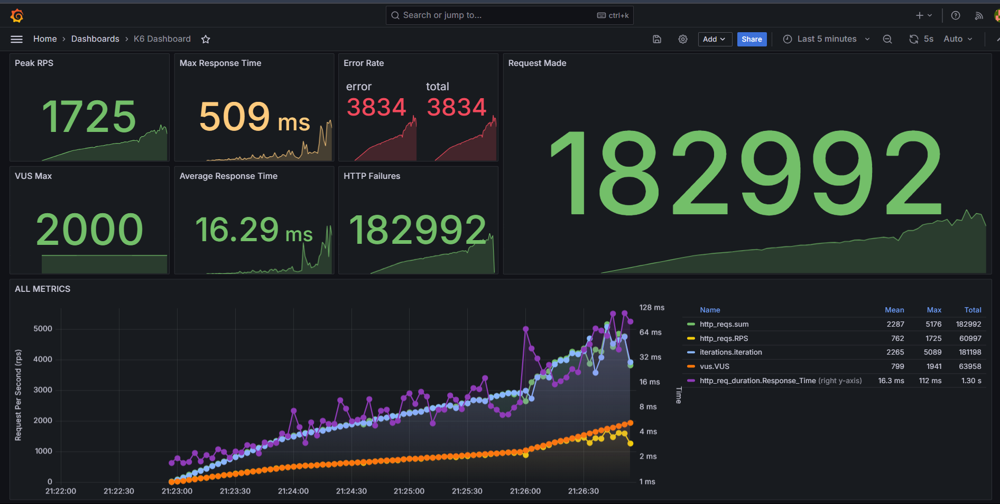
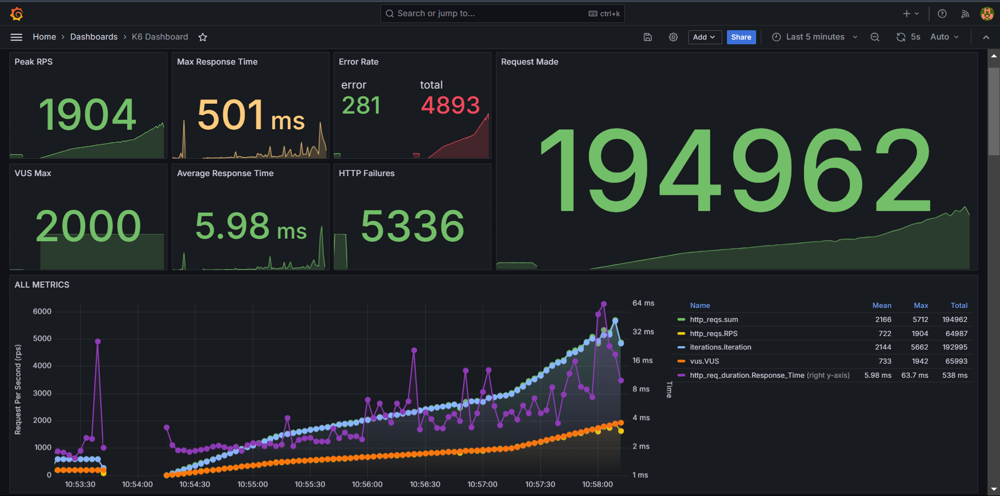
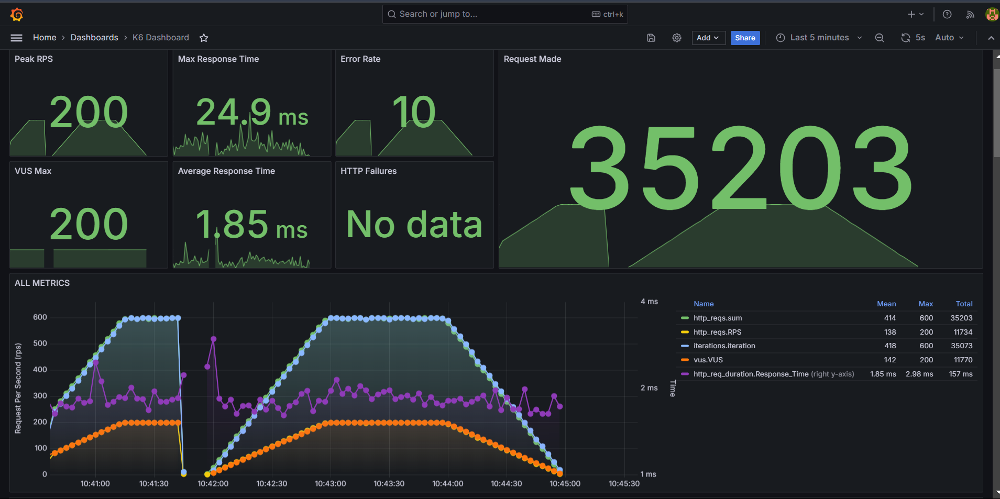
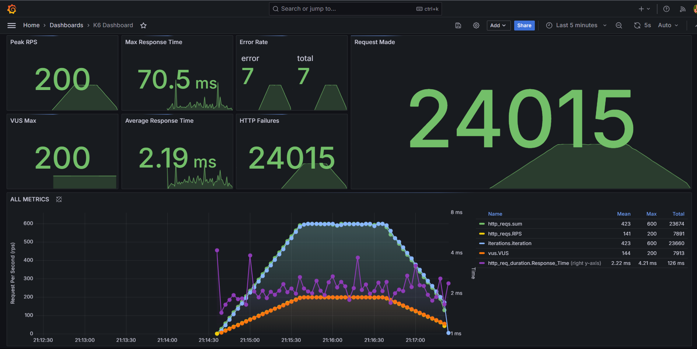

# Relatório técnico

## Requisitos funcionais e não funcionais - revisão

&emsp;Essa parte do relatório técnico documenta a revisão dos requisitos funcionais e não funcionais do projeto de Sistema de Gestão de Estoques, que tem como objetivo integrar um novo sistema de gestão de estoque com os sistemas legados da Vivo. Esta revisão foi realizada com base no _feedback_ fornecido, considerando a necessidade de melhorias e alinhamento com as normas e boas práticas de requisitos de _software_.

### 1. Revisão dos Requisitos Funcionais e Não Funcionais
&emsp;Durante a Sprint 3, o grupo revisou e aprimorou os requisitos funcionais e não funcionais com base no _feedback_ recebido nas _sprints_ anteriores. Esta seção detalha as principais alterações, novos requisitos e ajustes feitos nos requisitos existentes, com foco em garantir clareza e completude.

#### 1.1. Requisitos Funcionais
&emsp;Os requisitos funcionais revisados incluem todas as funcionalidades que o sistema deve fornecer para atender às necessidades dos usuários. A principal alteração feita nesta categoria foi:

**Adição do Requisito Funcional RF13 - Integração com Sistemas Legados da Vivo:** Foi identificado um novo requisito relacionado à integração do sistema com os sistemas legados da Vivo. A interoperabilidade é essencial para garantir a consistência dos dados entre o novo sistema e os sistemas existentes.

- Descrição: O sistema deve ser capaz de se integrar de forma transparente com os sistemas legados da Vivo, utilizando APIs específicas para troca de informações e sincronização de dados.
- Prioridade: Alta
Além disso, foi realizado um ajuste no requisito funcional RF4 para evitar duplicidade e garantir clareza na definição dos requisitos:

**Refinamento do RF4 - Consultar Informações Internas do Produto:** O requisito foi ajustado para especificar que abrange apenas consultas internas e administrativas, não visíveis aos usuários finais, evitando duplicidade e melhorando a clareza.

#### 1.2. Requisitos Não Funcionais
&emsp;Os requisitos não funcionais foram amplamente revisados para garantir conformidade com a norma ISO 25010, abrangendo aspectos como confiabilidade, segurança, usabilidade, desempenho e escalabilidade. O objetivo é assegurar que o sistema atenda a critérios rigorosos de qualidade.

**RNF 1 - Carga da Aplicação:**
- Descrição: O sistema deve suportar até 30 mil requisições por segundo nas consultas ao _back-end_.
- Prioridade: Alta.
- Plano de Teste: Testes de carga utilizando a ferramenta K6 serão executados para simular diferentes volumes de requisições e verificar a capacidade de resposta do sistema.

**RNF 2 - Tempo de Resposta:**
- Descrição: O sistema deve garantir um tempo máximo de resposta de até 1 segundo para consultas ao banco de dados.
- Prioridade: Alta.
- Plano de Teste: Serão realizados testes de tempo de resposta com K6, monitorando a latência do sistema para garantir conformidade com os requisitos.

**Definição de Índice de Alta Disponibilidade no RNF3:** Foi adicionado um índice de disponibilidade específico de 99,99% ao requisito RNF3 para atender à necessidade de clareza e conformidade com padrões de confiabilidade.
- Descrição Atualizada: O sistema deve ser projetado com redundâncias, garantindo alta disponibilidade e confiabilidade com um índice de disponibilidade de 99,99%.
- Correções Ortográficas e de Consistência: A categoria do requisito RNF2 foi corrigida para "Performance" e foi revisada a consistência dos termos usados nos requisitos.

**RNF 4 - Sistema Intuitivo:**
- Descrição: O sistema deve ser intuitivo, permitindo que mais de 80% dos usuários realizem suas atividades sem dificuldades.
- Prioridade: Média.
- Plano de Teste: Testes de usabilidade serão conduzidos com grupos de usuários, com análises qualitativas e quantitativas para garantir uma experiência otimizada.

**RNF 5 - Escalabilidade do Sistema:**
- Descrição: O sistema deve ser capaz de escalar horizontalmente e verticalmente, suportando um aumento de até 100% na carga de trabalho sem degradação perceptível.
- Prioridade: Alta.
- Plano de Teste: Testes de estresse serão realizados utilizando o K6, avaliando a estabilidade e desempenho do sistema em situações de carga elevada.

### 2. Alinhamento com o Feedback e Progresso Atual
Todos os requisitos não funcionais foram revisados conforme o _feedback_ recebido, garantindo que até os que não precisaram de alterações passassem por testes específicos. Esse processo garante que todos os aspectos críticos do sistema sejam atendidos de maneira robusta. 

&emsp;O grupo conseguiu abordar todos os testes de requisitos funcionais e não funcionais até a _Sprint_ 3, conforme documentado neste relatório. Os requisitos estão devidamente identificados e categorizados, atendendo às expectativas de clareza e detalhamento conforme o _feedback_ do Prof. Tomaz.

### 3. Próximas Etapas e Implementações Futuras
&emsp;Todos os requisitos não funcionais foram revisados de acordo com o _feedback_ recebido, assegurando que mesmo os que não necessitaram de modificações passassem por testes específicos. Esse processo reforça que todos os aspectos críticos do sistema sejam abordados de forma sólida. Em _sprints_ recentes, concluímos a implementação do Terraform para gerenciar a infraestrutura de todos os serviços AWS utilizados pelo grupo, além de implementar microsserviços utilizando Golang e Quarkus, garantindo maior modularidade, flexibilidade e eficiência na gestão dos recursos do projeto.

## Testes de carga e performance do sistema

&emsp;Este resumo técnico apresenta os resultados dos testes de carga realizados para o projeto de Sistema de Gestão de Estoques, que visa integrar a gestão de estoque com os sistemas legados da Vivo. Os testes de carga foram conduzidos com o objetivo de avaliar o desempenho e a resiliência do sistema sob condições de alta demanda. A execução dos testes utilizou o K6 como ferramenta principal, rodando no ambiente da Amazon Web Services (AWS). A análise dos resultados foca na comparação de diferentes infraestruturas, como instâncias T3 Medium, Kubernetes, e Load Balancer com múltiplas instâncias T2 Micro.

### 1. Objetivo dos Testes de Carga
&emsp;Os testes de carga têm como objetivo avaliar a capacidade do sistema de escalar e lidar com um grande número de usuários simultâneos. Estes testes ajudam a identificar se o sistema mantém sua funcionalidade e desempenho esperado à medida que a carga aumenta. O foco é garantir que o sistema atenda aos requisitos não funcionais especificados para disponibilidade, confiabilidade e performance.

### 2. Configuração dos Testes de Carga
&emsp;Foram definidos três cenários principais para os testes de carga, cada um focando em diferentes endpoints críticos do sistema. A configuração dos testes envolveu etapas de ramp-up (aumento gradual de usuários), sustentação (manutenção da carga máxima por um período), e ramp-down (redução gradual de usuários):

- **Cenário 1: Endpoint /cep/calculate-days**
    - Gradual aumento de usuários até 2000 em múltiplas fases;
    - Avaliação da resposta do sistema e taxa de sucesso;
    - Thresholds definidos: 95% das requisições devem ter uma duração inferior a 1,5 segundos; menos de 2% das requisições podem falhar.

- **Cenário 2: Endpoint /products**
    - Gradual aumento semelhante ao primeiro cenário;
    - Medição do desempenho sob carga, com thresholds similares;

- **Cenário 3: Endpoint /products/{id}**
    - Simulação de um grande número de requisições para um produto específico, refletindo um lançamento de produto ou promoção;
    - Thresholds mais rigorosos devido ao potencial impacto nas operações de vendas.

### 3. Resultados dos Testes de Carga
&emsp;Os testes de carga demonstraram diferentes resultados para as infraestruturas testadas, destacando pontos fortes e fracos de cada configuração:

- **Infraestrutura com T3 Medium:**
    - Desempenho Geral: Excelente desempenho com 100% de taxa de sucesso para todos os testes. A infraestrutura manteve uma duração média de requisição de cerca de 1.2 segundos no endpoint /get-products;
    - Vantagens: Alta confiabilidade e baixa latência, adequada para cargas altas sem degradação perceptível;
    - Desvantagens: Menor flexibilidade comparada ao Kubernetes para escalabilidade horizontal.

- **Infraestrutura com Kubernetes (T3 Medium):**
    - Desempenho Geral: Melhor desempenho geral, com uma duração média de requisição significativamente baixa (479.2 ms). Taxa de sucesso de 100%, sem falhas;
    - Vantagens: Alta capacidade de processamento, excelente para lidar com grandes volumes de tráfego devido à natureza distribuída do Kubernetes;
    - Desvantagens: Maior complexidade de configuração e gerenciamento;

- **Infraestrutura com Load Balancer (10 x T2 Micro):**
    - Desempenho Geral: Desempenho mais baixo com apenas 90.51% de taxa de sucesso e picos de latência elevados, atingindo até 60 segundos em alguns casos;
    - Vantagens: Custo mais baixo e flexibilidade de escalar instâncias conforme a demanda;
    - Desvantagens: Menor eficiência e problemas de latência sob alta carga; pode exigir otimizações significativas;

&emsp;Os testes de carga realizados mostraram que a configuração de infraestrutura usando Kubernetes em T3 Medium proporciona o melhor desempenho e maior estabilidade, sendo recomendada para cenários onde a alta disponibilidade e baixa latência são críticas. A infraestrutura com T3 Medium isolado também é uma escolha viável, especialmente para ambientes com cargas previsíveis e menores picos de demanda. A configuração com Load Balancer, apesar de ser a menos eficiente em termos de latência e taxa de sucesso, oferece uma opção de menor custo e maior flexibilidade para determinadas aplicações.

&emsp;Para mais detalhes sobre a documentação completa dos testes de carga e as análises comparativas das diferentes infraestruturas, acesse o link: [Resultados do teste de carga](https://github.com/Inteli-College/2024-2A-T07-CC07-G06/blob/main/docs/testes_carga_perfomance.md).

## Análise do Grafana

&emsp;Este relatório técnico detalha os resultados de testes de carga e performance realizados em dois _backends_ distintos, um desenvolvido em Go e outro em Quarkus. Utilizando a ferramenta K6 para a simulação de carga e o Grafana para visualização, foram realizadas análises em cenários de teste que incluíram tanto carga crescente quanto cenários de performance com carga constante. As métricas principais analisadas incluem Requisições por Segundo (RPS), Tempo de Resposta Máximo e Médio, Taxa de Erros, Falhas HTTP, e Requisições Realizadas. O objetivo deste relatório é fornecer uma comparação abrangente do desempenho dos _backends_ em diferentes cenários, identificar gargalos e sugerir melhorias.

### 1. Cenário de Teste e Configurações

#### 1.1 Tetes de carga
&emsp;O teste de carga foi projetado para avaliar a capacidade dos _backends_ em lidar com um número crescente de usuários virtuais (VUs). Utilizando o K6, o teste foi configurado em três estágios:
- Estágio 1: 500 VUs por 1 minuto.
- Estágio 2: 1000 VUs por 2 minutos.
- Estágio 3: 2000 VUs por 1 minuto.

&emsp;Os limites de desempenho estabelecidos foram:
- Duração da Requisição HTTP (_``http_req_duration``_): 95% das requisições devem ter uma duração inferior a 1,5 segundos.
- Taxa de Falha de Requisição (_``http_req_failed``_): Menos de 2% das requisições podem falhar.

#### 1.2 Teste de performance
&emsp;O teste de performance foi desenvolvido para medir a estabilidade e eficiência dos _backends_ sob uma carga constante. A configuração do teste foi:
- Estágio 1: 200 VUs por 1 minuto.
- Estágio 2: 200 VUs por 1 minuto.
- Estágio 3: Redução para 0 VUs por 1 minuto.

&emsp;Os limites de desempenho estabelecidos foram:
- Duração da Requisição HTTP (_``http_req_duration``_): 95% das requisições devem ter uma duração inferior a 1 segundo.
- Taxa de Falha de Requisição (_``http_req_failed``_): Menos de 1% das requisições podem falhar.

### 2. Análise das métricas do Grafana
&emsp;Os resultados dos testes de carga e performance foram visualizados utilizando dashboards do Grafana, permitindo uma análise detalhada das métricas coletadas para os _backends_ Go e Quarkus.

#### 2.1 Teste de carga: _Backend_ - Go

Figura 01: Teste de Load do Go

Fonte: Material produzido pelos próprios autores (2024).

- **Peak RPS (Requisições por Segundo):** 1725 RPS. Indica o máximo de requisições por segundo que o sistema conseguiu processar.
- **VUS Max (Virtual Users):** 2000 VUs. Reflete o número máximo de usuários simultâneos suportados durante o teste.
- **Max Response Time (Tempo Máximo de Resposta):** 509 ms. Tempo máximo de resposta registrado, dentro dos limites de 1,5 segundos.
- **Average Response Time (Tempo Médio de Resposta):** 16.29 ms. Tempo médio de resposta, indicando boa eficiência na maioria das requisições.
- **Error Rate (Taxa de Erros):** 3834 erros. Alta taxa de erro pode indicar limitações na infraestrutura ou no código.
- **HTTP Failures:** 182992 falhas. Número elevado de falhas HTTP, sugerindo gargalos no _backend_.
- **Requests Made (Requisições Realizadas):** 182992 requisições. Volume total de requisições processadas.

#### 2.2 Teste de carga: _Backend_ - Quarkus

Figura 02: Teste de Load do Quarkus

Fonte: Material produzido pelos próprios autores (2024).

- **Peak RPS (Requisições por Segundo):** 1904 RPS. Melhor desempenho em termos de RPS comparado ao Go.
- **VUS Max (Virtual Users):** 2000 VUs. Mesmo nível de suporte de usuários simultâneos.
- **Max Response Time (Tempo Máximo de Resposta):** 501 ms. Levemente melhor que o Go.
- **Average Response Time (Tempo Médio de Resposta):** 5.98 ms. Significativamente menor que o Go, indicando maior eficiência.
- **Error Rate (Taxa de Erros):** 281 erros. Menor taxa de erro, indicando maior estabilidade.
- **HTTP Failures:** 5336 falhas. Número bem inferior ao do _backend_ Go.
- **Requests Made (Requisições Realizadas):** 194962 requisições. Mais requisições processadas em comparação ao Go.

#### 2.3 Teste de performance: _Backend_ - Go

Figura 03: Teste de _Performance_ do Quarkus

Fonte: Material produzido pelos próprios autores (2024).

- **Peak RPS (Requisições por Segundo):** 200 RPS. Reflete a estabilidade em um cenário de carga constante.
- **VUS Max (Virtual Users):** 200 VUs. Número de usuários simultâneos mantidos durante o teste.
- **Max Response Time (Tempo Máximo de Resposta):** 70.5 ms. Tempo de resposta máximo bastante reduzido comparado ao teste de carga.
- **Average Response Time (Tempo Médio de Resposta):** 2.19 ms. Excelente tempo médio de resposta.
- **Error Rate (Taxa de Erros):** 7 erros. Número muito baixo de erros.
- **HTTP Failures:** 24015 falhas. Valor ainda elevado, mas dentro do limite de carga constante.
- **Requests Made (Requisições Realizadas):** 24015 requisições. Volume total de requisições processadas durante o teste de _performance_.

#### 2.4 Teste de _performance_: _Backend_ - Quarkus

Figura 04: Teste de _Performance_ do Go

Fonte: Material produzido pelos próprios autores (2024).

- **Peak RPS (Requisições por Segundo):** 200 RPS. Estável sob carga constante.
- **VUS Max (Virtual Users):** 200 VUs. Igual ao Go.
- **Max Response Time (Tempo Máximo de Resposta):** 24.9 ms. Tempo de resposta máximo inferior, destacando a eficiência.
- **Average Response Time (Tempo Médio de Resposta):** 1.85 ms. Melhor desempenho de resposta média.
- **Error Rate (Taxa de Erros):** 10 erros. Número de erros dentro do esperado.
- **HTTP Failures:** Nenhum dado registrado. Indica estabilidade e robustez.
- **Requests Made (Requisições Realizadas):** 35203 requisições. Volume maior de requisições processadas que o Go.

### 3. Comparação de desempenho
| Métrica                  | Go (Carga) | Quarkus (Carga) | Go (_Performance_) | Quarkus (_Performance_) |
|--------------------------|------------|-----------------|------------------|-----------------------|
| Peak RPS                 | 1725       | 1904            | 200              | 200                   |
| VUS Max                  | 2000       | 2000            | 200              | 200                   |
| Max Response Time (ms)    | 509        | 501             | 70.5             | 24.9                  |
| Average Response Time (ms)| 16.29      | 5.98            | 2.19             | 1.85                  |
| Error Rate (erros)        | 3834       | 281             | 7                | 10                    |
| HTTP Failures             | 182992     | 5336            | 24015            | No data               |
| Requests Made             | 182992     | 194962          | 24015            | 35203                 |

#### 3.1 Throughput (RPS - Requisições por Segundo)
- **Carga:** O _backend_ Quarkus apresentou um _Peak RPS_ de 1904, superando o _backend_ Go, que atingiu 1725 RPS. Isto indica que o Quarkus tem uma capacidade maior de lidar com picos de requisições, processando mais requisições por segundo.

- **_Performance_:** Em um cenário de carga constante, ambos os _backends_ mantiveram um _Peak RPS_ de 200, o que demonstra que ambos podem manter uma taxa estável de requisições por segundo quando submetidos a um número constante de usuários virtuais (VUs).

#### 3.2 Capacidade de Suporte a Usuários Simultâneos (VUS Max)
&emsp;Tanto o Go quanto o Quarkus suportaram até 2000 VUs no teste de carga e 200 VUs no teste de _performance_. Esta métrica reflete a capacidade de ambos os _backends_ de gerenciar conexões simultâneas e a robustez de suas implementações.

#### 3.3 Tempo de Resposta (Max e Average Response Time)
- **Max Response Time:** O tempo máximo de resposta foi de 509 ms para Go e 501 ms para Quarkus no teste de carga, ambos bem abaixo do limite de 1,5 segundos, indicando que ambos lidam bem com a alta carga. No teste de _performance_, Quarkus demonstrou uma vantagem significativa com um tempo máximo de resposta de apenas 24.9 ms comparado aos 70.5 ms do Go, mostrando uma resposta mais eficiente sob carga constante.

- **Average Response Time:** O tempo médio de resposta para o _backend_ Quarkus foi consistentemente mais baixo em ambos os testes (5.98 ms e 1.85 ms) em comparação com o Go (16.29 ms e 2.19 ms). Isso mostra que o Quarkus é mais eficiente no processamento de requisições em média.

#### 3.4 Aplicação (Error Rate e HTTP Failures)
- **Error Rate:** O Quarkus apresentou uma taxa de erros muito menor (281 erros) em comparação com o Go (3834 erros) durante o teste de carga, indicando que o Quarkus é mais robusto e estável. No teste de _performance_, ambos os _backends_ tiveram taxas de erro baixas (7 para Go e 10 para Quarkus), mostrando uma boa estabilidade sob carga constante.

- **HTTP Failures:** O número de falhas HTTP foi significativamente menor para o Quarkus (5336) comparado ao Go (182992) durante o teste de carga. No teste de _performance_, o _backend_ Quarkus não registrou dados de falhas HTTP, enquanto o Go teve 24015 falhas. Isso reflete uma maior robustez e confiabilidade do _backend_ Quarkus.

### 4. Pontos críticos dos testes
- Eficiência de Processamento: O _backend_ Quarkus mostrou-se consistentemente mais eficiente em termos de tempos de resposta (máximo e médio), especialmente no cenário de _performance_ constante, o que é crucial para aplicações que exigem baixa latência e alta responsividade.

- Escalabilidade: Ambas as plataformas mostraram boa escalabilidade em termos de usuários simultâneos (VUS Max), mas o Quarkus teve um desempenho melhor ao processar requisições em alta carga, demonstrando um gerenciamento de recursos mais eficaz.

- Confiabilidade: A taxa de erro significativamente mais baixa e o número reduzido de falhas HTTP no _backend_ Quarkus indicam um sistema mais confiável e robusto, menos propenso a falhas em cenários de alta carga. Isso sugere que o uso de cache no Quarkus contribui para a redução de falhas e melhora a estabilidade do sistema, tornando-o menos propenso a falhas em cenários de alta carga. Por outro lado, o _backend_ Go, sendo um microsserviço novo, ainda está em fase de amadurecimento e apresenta instabilidades, resultando em uma maior taxa de erros HTTP.

- Capacidade de Manutenção da _Performance_ Sob Carga: O _backend_ Quarkus manteve sua _performance_ estável mesmo sob carga constante, o que é evidenciado pelo seu baixo tempo de resposta médio e a ausência de falhas HTTP nos testes de _performance_. Isso indica que o sistema está bem otimizado para lidar com altos volumes de requisições sem degradação de _performance_. Em contrapartida, o _backend_ Go, embora seja potencialmente robusto devido à natureza eficiente da linguagem, ainda está apresentando um número elevado de falhas HTTP. Isso pode ser atribuído às instabilidades de um microsserviço recém-desenvolvido que ainda precisa de otimizações para lidar com alta demanda de forma confiável.

&emsp;Dado às informações acima, o _backend_ Quarkus é superior ao Go em termos de eficiência, throughput, robustez e capacidade de lidar com cargas elevadas e constantes. Esses fatores tornam o Quarkus uma escolha preferível para aplicações críticas que exigem alta performance e confiabilidade. Para melhorar o desempenho, o backend Go poderia se beneficiar de otimizações adicionais na infraestrutura, como melhorias no balanceamento de carga, caching, otimização de consultas e gerenciamento de conexões, ferramentas que o Quarkus já está implementado, essas melhorias ajudariam a reduzir as falhas HTTP e aumentar o throughput sob alta carga.

