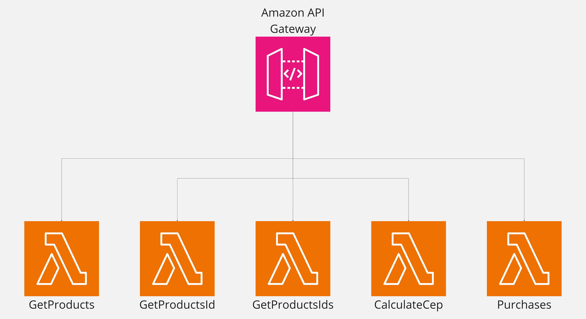

# Serverless

&emsp;O Serverless é um paradigma de desenvolvimento de _software_ que permite aos desenvolvedores focarem exclusivamente na escrita de código, sem se preocupar com a infraestrutura subjacente, como servidores, escalabilidade e gerenciamento de recursos. Isso é possível graças às plataformas de nuvem que automatizam a execução das aplicações, ajustando automaticamente os recursos conforme a demanda, o que elimina a necessidade de gerenciamento manual de servidores. No AWS Lambda, por exemplo, que é um dos serviços mais conhecidos nessa área, as funções são executadas de forma independente, disparadas por eventos, conforme o necessário.

&emsp;As principais características que tornam o Serverless uma abordagem atrativa incluem a execução sob demanda, na qual os recursos são alocados apenas quando uma função é invocada. Isso significa que não há custos associados à manutenção de servidores ociosos, ou seja, todo o modelo de cobrança é baseado no uso efetivo das funções. Outro ponto é a escalabilidade automática, que permite que a plataforma ajuste os recursos dinamicamente à medida que a carga de trabalho aumenta, sem a necessidade de intervenção humana. Ainda vale mencionar a simplicidade operacional, já que as responsabilidades de gerenciamento de infraestrutura, como atualizações de sistema, balanceamento de carga e monitoramento, são delegadas ao provedor da nuvem.

&emsp;Por outro lado, o Serverless também apresenta algumas desvantagens. Uma delas é a latência em funções frias, que ocorre quando uma função não é executada com frequência. Isso resulta em uma latência adicional durante sua inicialização, pois o ambiente de execução precisa ser configurado antes que a função seja executada. Há também as limitações de tempo de execução. Em plataformas como AWS Lambda, as funções têm um tempo limite de execução, o que pode restringir a realização de processos mais demorados. Outro desafio é o monitoramento. Enquanto uma aplicação monolítica é relativamente simples de monitorar como um todo, o Serverless distribui as responsabilidades em várias funções menores, o que exige ferramentas e abordagens mais avançadas para rastrear e monitorar de maneira eficiente.

&emsp;Quando comparamos o Serverless com outras abordagens, alguns pontos importantes merecem destaque. Na arquitetura monolítica, por exemplo, todo o código da aplicação é executado em um único servidor ou grupo de servidores. Embora isso torne a integração e o monitoramento mais simples, a escalabilidade pode ser um desafio, e falhas em uma parte do sistema podem comprometer toda a aplicação. Em contraste, a abordagem "sem servidor" isola as funções em ambientes independentes, o que melhora a resiliência e facilita a escalabilidade. Já na arquitetura de _microservices_, a aplicação também é dividida em pequenos serviços independentes, cada um com uma função específica e capacidade de escalar de forma autônoma. O Serverless pode ser considerado uma versão ainda mais modularizada em comparação com os serviços distribuídos, uma vez que está no nível das funções do código, além de ter a camada de infraestrutura completamente gerenciada e abstraída pelo provedor de nuvem.

Figura 01: Diagrama da infraestrutura Serverless

Fonte: Material produzido pelos próprios autores (2024).

&emsp;No contexto do projeto em questão, representado no diagrama da Figura 01, vemos uma arquitetura composta por várias funções AWS Lambda. Cada função desempenha um papel bem definido relacionado com as regras de negócio estabelecidas pelo parceiro e com o problema a ser resolvido, como GetProducts, GetProductsId, GetProductsIds, CalculateCep e Purchases, todas integradas e gerenciadas pelo Amazon API Gateway. Essa abordagem foi escolhida pela equipe para garantir escalabilidade, redução de custos com servidores e uma maior agilidade no desenvolvimento. Tal infraestrutura permitiu à equipe concentrar seus esforços na criação das funcionalidades, sem precisar se preocupar com a manutenção ou gerenciamento da infraestrutura subjacente.

